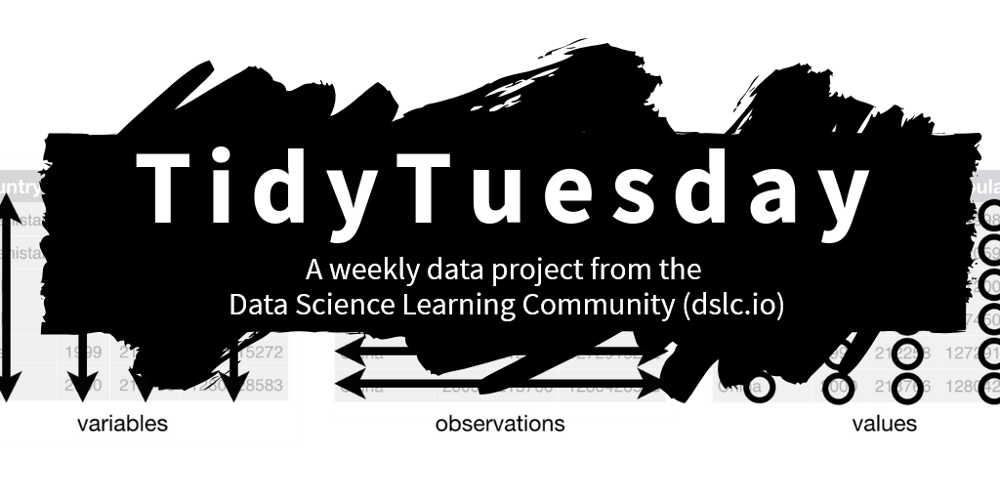

## A weekly social data project in R

A weekly data project aimed at the R ecosystem. As this project was borne out of the `R4DS Online Learning Community` and the `R for Data Science` textbook, an emphasis was placed on understanding how to summarize and arrange data to make meaningful charts with `ggplot2`, `tidyr`, `dplyr`, and other tools in the `tidyverse` ecosystem. However, any code-based methodology is welcome - just please remember to share the code used to generate the results.

***

Join the `R4DS Online Learning Community` in the weekly `#TidyTuesday` event! Every week we post a raw dataset, a chart or article related to that dataset, and ask you to explore the data. While the dataset will be “tamed”, it will not always be tidy! As such you might need to apply various `R for Data Science` techniques to wrangle the data into a true tidy format. The goal of `TidyTuesday` is to apply your R skills, get feedback, explore other’s work, and connect with the greater `#RStats` community! As such we encourage everyone of all skills to participate! 

We will have many sources of data and want to emphasize that **no causation** is implied. There are various moderating variables that affect all data, many of which might not have been captured in these datasets. As such, our guidelines are to use the data provided to practice your data tidying and plotting techniques. Participants are invited to consider for themselves what nuancing factors might underlie these relationships. 

The intent of Tidy Tuesday is to provide a safe and supportive forum for individuals to practice their **wrangling** and **data visualization** skills independent of drawing conclusions. While we understand that the two are related, the focus of this practice is purely on building skills with real-world data.

All data will be posted on the data sets page on Monday. It will include the link to the original article (for context) and to the data set. 

We welcome all newcomers, enthusiasts, and experts to participate, but be mindful of a few things:

1. The data set comes from the source article or the source that the article credits. Be mindful that the data is what it is and Tidy Tuesday is designed to help you practice **data visualization** and **basic data wrangling** in R.  
2. Again, the data is what it is! You are welcome to explore beyond the provided dataset, but the data is provided as a "toy" dataset to practice techniques on.  
3. This is NOT about criticizing the original article or graph. Real people made the graphs, collected or acquired the data! Focus on the provided dataset, learning, and improving your techniques in R.  
4. This is NOT about criticizing or tearing down your fellow `#RStats` practitioners or their code! Be supportive and kind to each other! Like other's posts and help promote the `#RStats` community!  
4. Use the hashtags #TidyTuesday and #RStats on Twitter if you create your own version and would like to share it.
5. Include a picture of the visualisation when you post to Twitter.  
6. Include a copy of the code used to create your visualization when you post to Twitter. Comment your code wherever possible to help yourself and others understand your process!  
7. Focus on improving your craft, even if you end up with something simple!  
8. Give credit to the original data source whenever possible.  

***

## Submitting Datasets

`TidyTuesday` is built around open datasets that are found in the "wild" or submitted as [Issues](https://github.com/rfordatascience/tidytuesday/issues) on our GitHub.

If you find a dataset that you think would be interesting, you can approach it through two ways:

## Two Ways to Contribute

1. **Submit the dataset as an [Issue](https://github.com/rfordatascience/tidytuesday/issues)**  
a. Find an interesting dataset  
b. Find a report, blog post, article etc relevant to the data   
c. Submit the dataset as an [Issue](https://github.com/rfordatascience/tidytuesday/issues) along with a link to the article  

2. **Create an entire TidyTuesday challenge!**  
a. Find an interesting dataset  
b. Find a report, blog post, article etc relevant to the data (or create one yourself!)  
c. Let us know you've found something interesting and are working on it by filing an [Issue](https://github.com/rfordatascience/tidytuesday/issues) on our GitHub  
d. Provide a link or the raw data and a cleaning script for the data  
e. Write a basic `readme.md` file using the minimal template below and make sure to give yourself credit! 

#### `readme.md` template

```
# INPUT THE SUBJECT TITLE OF THE DATASET

The data this week comes from [SOURCE_OF_DATA](URL_TO_DATA). 

This [ARTICLE_SOURCE](LINK_TO_ARTICLE) talks about SUBJECT TITLE in greater detail.

Credit: [YOUR NAME](Twitter handle or other social media profile)
```

## Submitting Code Chunks
Want to submit a useful code-chunk? Please submit as a [Pull Request](https://github.com/rfordatascience/tidytuesday/tree/master/community_resources/code_chunks) and follow the [guide](https://github.com/rfordatascience/tidytuesday/blob/master/community_resources/code_chunks/readme.md).

## Citing TidyTuesday

To cite the TidyTuesday repo/project in publications use:

  Thomas Mock (2022). Tidy Tuesday: A weekly data project aimed at the R ecosystem.
  https://github.com/rfordatascience/tidytuesday.

A BibTeX entry for LaTeX users is

```
  @misc{tidytuesday, 
    title = {Tidy Tuesday: A weekly data project aimed at the R ecosystem}, 
    author = {Mock, Thomas}, 
    url = {https://github.com/rfordatascience/tidytuesday}, 
    
    year = {2022} 
  }
```

Note: If you would like to cite the [tidytuesdayR](https://thebioengineer.github.io/tidytuesdayR/) package, you should use `citation("tidytuesdayR")` instead.

***

### Please add alt text to your posts

Please add alt text (alternative text) to all of your posted graphics for `#TidyTuesday`. 

Twitter provides [guidelines](https://help.twitter.com/en/using-twitter/picture-descriptions) for how to add alt text to your images.

The DataViz Society/Nightingale has an [article](https://medium.com/nightingale/writing-alt-text-for-data-visualization-2a218ef43f81) on writing _good_ alt text for plots/graphs.
> Here’s a simple formula for writing alt text for data visualization:
> ### Chart type
> It’s helpful for people with partial sight to know what chart type it is and gives context for understanding the rest of the visual.
> Example: Line graph
> ### Type of data
> What data is included in the chart? The x and y axis labels may help you figure this out.
> Example: number of bananas sold per day in the last year
> ### Reason for including the chart
> Think about why you’re including this visual. What does it show that’s meaningful. There should be a point to every visual and you should tell people what to look for.
> Example: the winter months have more banana sales
> ### Link to data or source
> Don’t include this in your alt text, but it should be included somewhere in the surrounding text. People should be able to click on a link to view the source data or dig further into the visual. This provides transparency about your source and lets people explore the data.
> Example: Data from the USDA

Penn State has an [article](https://accessibility.psu.edu/images/charts/) on writing alt text descriptions for charts and tables.

> Charts, graphs and maps use visuals to convey complex images to users. But since they are images, these media provide serious accessibility issues to colorblind users and users of screen readers. See the [examples on this page](https://accessibility.psu.edu/images/charts/) for details on how to make charts more accessible.

The `{rtweet}` package includes the [ability to post tweets](https://docs.ropensci.org/rtweet/reference/post_tweet.html) with alt text programmatically.

Need a **reminder**? There are [extensions](https://chrome.google.com/webstore/detail/twitter-required-alt-text/fpjlpckbikddocimpfcgaldjghimjiik/related) that force you to remember to add Alt Text to Tweets with media.

***

# DataSets
## [2018](data/2018) | [2019](data/2019) | [2020](data/2020)  | [2021](data/2021) | [2022](data/2022)

| Week | Date | Data | Source | Article
| :---: | :---: | :--- | :--- | :---|
| 1 | `2022-01-04` | Bring your own data to start 2022! | | |
| 2 | `2022-01-11` | [Bee Colony losses](data/2022/2022-01-11/readme.md) | [USDA](https://usda.library.cornell.edu/concern/publications/rn301137d?locale=en) | [Bee Informed](https://beeinformed.org/2021/06/21/united-states-honey-bee-colony-losses-2020-2021-preliminary-results/) |
| 3 | `2022-01-18` | [Chocolate Bar ratings](data/2022/2022-01-18/readme.md) | [Flavors of Cacao](http://flavorsofcacao.com/chocolate_database.html) | [Will Canniford on Kaggle](https://www.kaggle.com/willcanniford/chocolate-bar-ratings-extensive-eda) |
| 4 | `2022-01-25` | [Board games](data/2022/2022-01-25/readme.md) | [Kaggle](https://www.kaggle.com/jvanelteren/boardgamegeek-reviews/version/3?select=2022-01-08.csv) | [Alyssa Goldberg](https://rpubs.com/thewiremonkey/476630) |
| 5 | `2022-02-01` | [Dog breeds](data/2022/2022-02-01/readme.md) | [American Kennel Club](https://github.com/kkakey/dog_traits_AKC) | [Vox](https://www.vox.com/2016/8/31/12715176/most-popular-dog-breeds) |
| 6 | `2022-02-08` | [Tuskegee Airmen](data/2022/2022-02-08/readme.md) | [Commemorative Airforce (CAF) by way of the VA-TUG](https://github.com/lang1023/Tuskegee-Airman-Challenge) | [Wikipedia](https://en.wikipedia.org/wiki/Tuskegee_Airmen) & [Air Force Historical Research Agency](https://github.com/lang1023/Tuskegee-Airman-Challenge/blob/main/112%20Victories_%20Aerial%20Victories%20of%20hte%20Tuskegee%20Airmen%20(1).pdf) |
| 7 | `2022-02-15` | [`#DuBoisChallenge2022`](data/2022/2022-02-15/readme.md) | [Anthony Starks](https://github.com/ajstarks/dubois-data-portraits/tree/master/challenge/2022) | [Nightingale by DVS](https://nightingaledvs.com/the-dubois-challenge/) |
| 8 | `2022-02-22` | [World Freedom index](data/2022/2022-02-22/readme.md) | [UN and Freedom House](https://github.com/ArthurCheib/analytical-politics-project/blob/main/data/tidy-data-fh-un.csv) | [Freedom House](https://freedomhouse.org/report/freedom-world/2018/democracy-crisis) |
| 9 | `2022-03-01` | [Alternative Fuel Stations](data/2022/2022-03-01/readme.md) | [US DOT](https://data-usdot.opendata.arcgis.com/datasets/usdot::alternative-fueling-stations/about) | [EIA](https://www.eia.gov/todayinenergy/detail.php?id=6050) |
| 10 | `2022-03-08` | [Erasmus student mobility](data/2022/2022-03-08/readme.md) | [Data.Europa.eu](https://data.europa.eu/data/datasets/erasmus-mobility-statistics-2014-2019-v2?locale=en) | [Wimdu.co](https://www.wimdu.co.uk/blog/discover-popular-erasmus-destinations) |
| 11 | `2022-03-15` | [CRAN/BIOC Vignettes](data/2022/2022-03-15/readme.md) | [Robert Flight GitHub](https://github.com/rmflight/vignette_analysis) | [Robert Flight GitHub](https://github.com/rmflight/vignette_analysis)|
| 12 | `2022-03-22` | [Baby names](data/2022/2022-03-22/readme.md) | [US `babynames`](http://hadley.github.io/babynames/) &  [`nzbabynames`](https://ekothe.github.io/nzbabynames/)  | [Emily Kothe's `nzbabynames` vignette](https://ekothe.github.io/nzbabynames/articles/guess_the_age.html) |
| 13 | `2022-03-29` | [Collegiate Sports Budgets](data/2022/2022-03-29/readme.md) | [Equity in Athletics Data Analysis](https://ope.ed.gov/athletics/#/datafile/list) | [NPR](https://www.npr.org/2021/10/27/1049530975/ncaa-spends-more-on-mens-sports-report-reveals) |
| 14 | `2022-04-05` | [Digital Publications](data/2022/2022-04-05/readme.md) | [Project Oasis](https://www.projectnewsoasis.com/publications) | [Project Oasis Report](https://www.projectnewsoasis.com/sites/default/files/2022-02/project-oasis-report-2021-1.pdf) |
| 15 | `2022-04-12` | [Indoor Air Pollution](data/2022/2022-04-12/readme.md) | [OurWorldInData.org](https://ourworldindata.org/indoor-air-pollution) | [OurWorldInData.org](https://ourworldindata.org/indoor-air-pollution) |
| 16 | `2022-04-19` | [Crossword Puzzles and Clues](data/2022/2022-04-19/readme.md) | [Cryptics.georgeho.org](https://cryptics.georgeho.org/) | [Towards Data Science](https://towardsdatascience.com/the-wild-world-of-crossword-data-71d560e222f5) |
| 17 | `2022-04-26` | [Kaggle Hidden Gems](data/2022/2022-04-26/readme.md) | [Kaggle](https://www.kaggle.com/code/headsortails/hidden-gems-a-collection-of-underrated-notebooks/report) | [Kaggle - Notebooks of the Week](https://www.kaggle.com/datasets/headsortails/notebooks-of-the-week-hidden-gems/discussion/317098) |
| 18 | `2022-05-03` | [Solar/Wind utilities](data/2022/2022-05-03/readme.md) | [Berkeley Lab](https://emp.lbl.gov/utility-scale-solar) | [Berkeley Lab report](https://emp.lbl.gov/sites/default/files/utility-scale_solar_2021_technical_brief.pdf) |
| 19 | `2022-05-10` | [NYTimes best sellers](data/2022/2022-05-10/readme.md) | [Post45 Data](https://data.post45.org/our-data/) | [Finding Trends in NY Times Best Sellers - Kailey Smith ](https://towardsdatascience.com/finding-trends-in-ny-times-best-sellers-55cdd891c8aa) |
| 20 | `2022-05-17` | [Eurovision](data/2022/2022-05-17/readme.md) | [Eurovision](https://eurovision.tv/) | [Tanya Shapiro](https://github.com/tashapiro/eurovision-contest) |
| 21 | `2022-05-24` | [Women's Rugby](data/2022/2022-05-24/readme.md) | [Women's Rugby - ScrumQueens](https://www.scrumqueens.com/page/results-dashboard) | [ScrumQueens](https://www.scrumqueens.com/blogs/jbirch/story-behind-our-data-hub) |
| 22 | `2022-05-31` | [Company reputation poll](data/2022/2022-05-31) | [Axios and Harris Poll](https://www.axios.com/2022/05/24/2022-axios-harris-poll-100-rankings) | [The Harris Poll](https://theharrispoll.com/partners/media/axios-harrispoll-100/) |
| 23 | `2022-06-07` | [Pride Corporate Accountability Project](data/2022/2022-06-07) | [Data For Progress](https://www.dataforprogress.org/accountable-allies) | [Data For Progress](https://www.dataforprogress.org/accountable-allies) |
| 24 | `2022-06-14` | [US Drought](data/2022/2022-06-14) | [Drought.gov](https://www.drought.gov/) | [Drought.gov report](https://www.drought.gov/historical-information?dataset=1&selectedDateUSDM=20110301&selectedDateSpi=19580901) |
| 25 | `2022-06-21` | [Juneteenth](data/2022/2022-06-21) | [WEB DuBois style by Anthony Starks](https://dataliteracy.com/anthony-starks-on-recreating-du-boiss-iconic-style/) | [Isabella Benabaye's blog on Juneteenth](https://isabella-b.com/blog/juneteenth-2020/) |
| 26 | `2022-06-28` | [UK Gender pay gap](data/2022/2022-06-28) | [gender-pay-gap.service.gov.uk](https://gender-pay-gap.service.gov.uk/) | [ons.gov.uk](https://www.ons.gov.uk/employmentandlabourmarket/peopleinwork/earningsandworkinghours/articles/findoutthegenderpaygapforyourjob/2016-12-09) |
| 27 | `2022-07-05` | [San Francisco Rentals](data/2022/2022-07-05) | [Kate Pennington](https://www.katepennington.org/data) | [Matrix-Berkeley](https://matrix.berkeley.edu/research-article/kate-pennington-on-gentrification-and-displacement-in-san-francisco/) |
| 28 | `2022-07-12` | [European flights](data/2022/2022-07-12) | [Eurocontrol](https://ansperformance.eu/data/) | [ec.europa.eu](https://ec.europa.eu/eurostat/web/products-eurostat-news/-/ddn-20210914-1) |
| 29 | `2022-07-19` | [Technology Adoption](data/2022/2022-07-19) | [data.nber.org](https://data.nber.org/data-appendix/w15319/) | [www.cgdev.org](https://www.cgdev.org/sites/default/files/technology-and-development-exploration-data.pdf) |
| 30 | `2022-07-26` | Bring your own data | None | None |
| 31 | `2022-08-02` | [Oregon Spotted Frog](data/2022/2022-08-02) |  [usgs.gov spotted frog data](https://www.sciencebase.gov/catalog/item/60ba5a00d34e86b9388d86bc) | [usgs.gov spotted-frog-article](https://www.usgs.gov/centers/forest-and-rangeland-ecosystem-science-center/science/oregon-spotted-frog) |
| 32 | `2022-08-09` | [Ferris Wheels](data/2022/2022-08-09) |  [`ferriswheels`](https://github.com/EmilHvitfeldt/ferriswheels) | [`ferriswheels`](https://github.com/EmilHvitfeldt/ferriswheels) |
| 33 | `2022-08-16` | [Open Source Psychometrics](data/2022/2022-08-16) |  [Open-Source Psychometrics Project](https://openpsychometrics.org/) | [Character Personality](https://openpsychometrics.org/tests/characters/documentation/) |
| 34 | `2022-08-23` | [CHIP dataset](data/2022/2022-08-23) |  [CHIP Dataset](https://chip-dataset.vercel.app/) | [arxiv paper](https://arxiv.org/abs/1911.11313) |
| 35 | `2022-08-30` | [Pell Grants](data/2022/2022-08-30) |  [US Dept of Education](https://www2.ed.gov/finaid/prof/resources/data/pell-institution.html) | [`pell` R package](https://curious-joe.github.io/pell/articles/intro.html) |
| 36 | `2022-09-06` | [LEGO database](data/2022/2022-09-06) |  [`rebrickable`](https://rebrickable.com/downloads/) | [`rebrickable`](https://rebrickable.com/downloads/) |
| 37 | `2022-09-13` | [Bigfoot](data/2022/2022-09-13) |  [Data.World](https://data.world/timothyrenner/bfro-sightings-data) | [Finding Bigfoot
](https://timothyrenner.github.io/datascience/2017/06/30/finding-bigfoot.html) |
***  

# Useful links

| Link | Description |
| --- | --- |
| [Link](https://www.rfordatasci.com) | The R4DS Online Learning Community Website|
| [Link](http://r4ds.had.co.nz/) | The R for Data Science textbook |
| [Link](https://carbon.now.sh/) | Carbon for sharing beautiful code pics |
| [Link](https://github.com/MilesMcBain/gistfo) | Post gist to Carbon from RStudio |
| [Link](https://github.com/yonicd/carbonate) | Post to Carbon from RStudio |
| [Link](https://github.com/join) | Join GitHub! |
| [Link](https://guides.github.com/activities/hello-world/) | Basics of GitHub |
| [Link](https://happygitwithr.com/) | Learn how to use GitHub with R |
| [Link](http://ggplot2.tidyverse.org/reference/ggsave.html) | Save high-rez `ggplot2` images |

# Useful data sources

| Link | Description |
| --- | --- |
| [Link](https://docs.google.com/spreadsheets/d/1wZhPLMCHKJvwOkP4juclhjFgqIY8fQFMemwKL2c64vk/edit#gid=0) | Data is Plural collection |
| [Link](https://github.com/BuzzFeedNews/everything/blob/master/README.md) | BuzzFeedNews GitHub |
| [Link](https://github.com/theeconomist/) | The Economist GitHub |
| [Link](https://cran.r-project.org/web/packages/fivethirtyeight/fivethirtyeight.pdf) | The `fivethirtyeight` data package 
| [Link](https://github.com/TheUpshot) | The Upshot by NY Times |
| [Link](https://github.com/baltimore-sun-data) | The Baltimore Sun Data Desk |
| [Link](https://github.com/datadesk) | The LA Times Data Desk |
| [Link](https://github.com/OpenNewsLabs/news-graphics-team) | Open News Labs |
| [Link](https://t.co/BMvJO2dT1o) | BBC Data Journalism team |

***

# Data Viz/Science Books

Only books available freely online are sourced here. Feel free to add to the list

| Link | Description |
| --- | --- |
| [Link](https://serialmentor.com/dataviz/) | Fundamentals of Data Viz by Claus Wilke |
| [Link](https://bookdown.org/rdpeng/artofdatascience/) | The Art of Data Science by Roger D. Peng & Elizabeth Matsui |
| [Link](https://www.tidytextmining.com/) | Tidy Text Mining by Julia Silge & David Robinson |
| [Link](https://geocompr.robinlovelace.net/) | Geocomputation with R by Robin Lovelace, Jakub Nowosad, Jannes Muenchow |
| [Link](https://socviz.co/index.html#preface) | Data Visualization by Kieran Healy |
| [Link](http://www.cookbook-r.com/Graphs/) | `ggplot2` cookbook by Winston Chang |
 [Link](https://medium.com/bbc-visual-and-data-journalism/how-the-bbc-visual-and-data-journalism-team-works-with-graphics-in-r-ed0b35693535) | BBC Data Journalism team |
