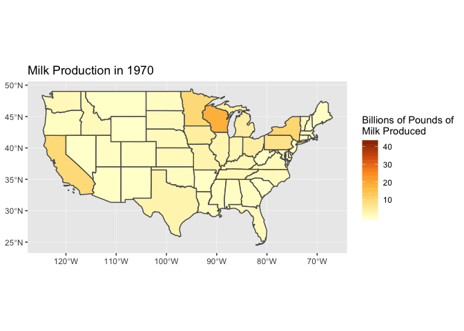

Milk Production in the US
================
R-Ladies Ames
2/5/2019

For our first foray into \#TidyTuesday, we went back in time. We felt
cows were more appropos for R-Ladies Ames than mortgage
    data.

``` r
library(tidyverse)
```

    ## ── Attaching packages ───────────────────────────────────────────────────────────────────────────────────────────────────────────────────────────────────── tidyverse 1.2.1 ──

    ## ✔ ggplot2 3.1.0     ✔ purrr   0.3.0
    ## ✔ tibble  2.0.1     ✔ dplyr   0.7.8
    ## ✔ tidyr   0.8.2     ✔ stringr 1.4.0
    ## ✔ readr   1.3.0     ✔ forcats 0.3.0

    ## ── Conflicts ──────────────────────────────────────────────────────────────────────────────────────────────────────────────────────────────────────── tidyverse_conflicts() ──
    ## ✖ dplyr::filter() masks stats::filter()
    ## ✖ dplyr::lag()    masks stats::lag()

``` r
library(janitor)
library(visdat)
library(sf)
```

    ## Linking to GEOS 3.6.1, GDAL 2.1.3, PROJ 4.9.3

``` r
library(USAboundaries)
# devtools::install_github('thomasp85/gganimate')
library(gganimate)
```

``` r
cheese <- read_csv("clean_cheese.csv")
```

    ## Parsed with column specification:
    ## cols(
    ##   Year = col_double(),
    ##   Cheddar = col_double(),
    ##   `American Other` = col_double(),
    ##   Mozzarella = col_double(),
    ##   `Italian other` = col_double(),
    ##   Swiss = col_double(),
    ##   Brick = col_double(),
    ##   Muenster = col_double(),
    ##   `Cream and Neufchatel` = col_double(),
    ##   Blue = col_double(),
    ##   `Other Dairy Cheese` = col_double(),
    ##   `Processed Cheese` = col_double(),
    ##   `Foods and spreads` = col_double(),
    ##   `Total American Chese` = col_double(),
    ##   `Total Italian Cheese` = col_double(),
    ##   `Total Natural Cheese` = col_double(),
    ##   `Total Processed Cheese Products` = col_double()
    ## )

``` r
fluid_milk <- read_csv("fluid_milk_sales.csv")
```

    ## Parsed with column specification:
    ## cols(
    ##   year = col_double(),
    ##   milk_type = col_character(),
    ##   pounds = col_double()
    ## )

``` r
milkfacts <- read_csv("milk_products_facts.csv")
```

    ## Parsed with column specification:
    ## cols(
    ##   year = col_double(),
    ##   fluid_milk = col_double(),
    ##   fluid_yogurt = col_double(),
    ##   butter = col_double(),
    ##   cheese_american = col_double(),
    ##   cheese_other = col_double(),
    ##   cheese_cottage = col_double(),
    ##   evap_cnd_canned_whole_milk = col_double(),
    ##   evap_cnd_bulk_whole_milk = col_double(),
    ##   evap_cnd_bulk_and_can_skim_milk = col_double(),
    ##   frozen_ice_cream_regular = col_double(),
    ##   frozen_ice_cream_reduced_fat = col_double(),
    ##   frozen_sherbet = col_double(),
    ##   frozen_other = col_double(),
    ##   dry_whole_milk = col_double(),
    ##   dry_nonfat_milk = col_double(),
    ##   dry_buttermilk = col_double(),
    ##   dry_whey = col_double()
    ## )

``` r
cowfacts <- read_csv("milkcow_facts.csv")
```

    ## Parsed with column specification:
    ## cols(
    ##   year = col_double(),
    ##   avg_milk_cow_number = col_double(),
    ##   milk_per_cow = col_double(),
    ##   milk_production_lbs = col_double(),
    ##   avg_price_milk = col_double(),
    ##   dairy_ration = col_double(),
    ##   milk_feed_price_ratio = col_double(),
    ##   milk_cow_cost_per_animal = col_double(),
    ##   milk_volume_to_buy_cow_in_lbs = col_double(),
    ##   alfalfa_hay_price = col_double(),
    ##   slaughter_cow_price = col_double()
    ## )

``` r
state_milk <- read_csv("state_milk_production.csv")
```

    ## Parsed with column specification:
    ## cols(
    ##   region = col_character(),
    ##   state = col_character(),
    ##   year = col_double(),
    ##   milk_produced = col_double()
    ## )

``` r
glimpse(cheese)
```

    ## Observations: 48
    ## Variables: 17
    ## $ Year                              <dbl> 1970, 1971, 1972, 1973, 1974, …
    ## $ Cheddar                           <dbl> 5.79, 5.91, 6.01, 6.07, 6.31, …
    ## $ `American Other`                  <dbl> 1.20, 1.42, 1.67, 1.76, 2.16, …
    ## $ Mozzarella                        <dbl> 1.19, 1.38, 1.57, 1.76, 1.86, …
    ## $ `Italian other`                   <dbl> 0.87, 0.92, 1.02, 1.03, 1.09, …
    ## $ Swiss                             <dbl> 0.88, 0.94, 1.06, 1.06, 1.18, …
    ## $ Brick                             <dbl> 0.10, 0.11, 0.10, 0.11, 0.11, …
    ## $ Muenster                          <dbl> 0.17, 0.19, 0.22, 0.21, 0.23, …
    ## $ `Cream and Neufchatel`            <dbl> 0.61, 0.62, 0.63, 0.66, 0.70, …
    ## $ Blue                              <dbl> 0.15, 0.15, 0.17, 0.18, 0.16, …
    ## $ `Other Dairy Cheese`              <dbl> 0.41, 0.41, 0.56, 0.65, 0.61, …
    ## $ `Processed Cheese`                <dbl> 3.32, 3.55, 3.51, 3.31, 3.42, …
    ## $ `Foods and spreads`               <dbl> 2.20, 2.31, 2.62, 2.68, 2.92, …
    ## $ `Total American Chese`            <dbl> 7.00, 7.32, 7.68, 7.83, 8.47, …
    ## $ `Total Italian Cheese`            <dbl> 2.05, 2.29, 2.59, 2.80, 2.95, …
    ## $ `Total Natural Cheese`            <dbl> 11.37, 12.03, 13.01, 13.49, 14…
    ## $ `Total Processed Cheese Products` <dbl> 5.53, 5.86, 6.13, 5.99, 6.34, …

``` r
glimpse(fluid_milk)
```

    ## Observations: 387
    ## Variables: 3
    ## $ year      <dbl> 1975, 1976, 1977, 1978, 1979, 1980, 1981, 1982, 1983, …
    ## $ milk_type <chr> "Whole", "Whole", "Whole", "Whole", "Whole", "Whole", …
    ## $ pounds    <dbl> 3.6188e+10, 3.5241e+10, 3.4036e+10, 3.3235e+10, 3.2480…

``` r
glimpse(cowfacts)
```

    ## Observations: 35
    ## Variables: 11
    ## $ year                          <dbl> 1980, 1981, 1982, 1983, 1984, 1985…
    ## $ avg_milk_cow_number           <dbl> 10799000, 10898000, 11011000, 1105…
    ## $ milk_per_cow                  <dbl> 11891, 12183, 12306, 12622, 12541,…
    ## $ milk_production_lbs           <dbl> 1.28406e+11, 1.32770e+11, 1.35505e…
    ## $ avg_price_milk                <dbl> 0.130, 0.138, 0.136, 0.136, 0.135,…
    ## $ dairy_ration                  <dbl> 0.04837357, 0.05035243, 0.04422102…
    ## $ milk_feed_price_ratio         <dbl> 2.717149, 2.759031, 3.088127, 2.60…
    ## $ milk_cow_cost_per_animal      <dbl> 1190, 1200, 1110, 1030, 895, 860, …
    ## $ milk_volume_to_buy_cow_in_lbs <dbl> 9153.846, 8695.652, 8161.765, 7573…
    ## $ alfalfa_hay_price             <dbl> 72.00000, 70.90000, 72.73333, 78.7…
    ## $ slaughter_cow_price           <dbl> 0.4573000, 0.4193000, 0.3996000, 0…

``` r
glimpse(milkfacts)
```

    ## Observations: 43
    ## Variables: 18
    ## $ year                            <dbl> 1975, 1976, 1977, 1978, 1979, 19…
    ## $ fluid_milk                      <dbl> 247, 247, 244, 241, 238, 234, 23…
    ## $ fluid_yogurt                    <dbl> 1.967839, 2.132685, 2.338369, 2.…
    ## $ butter                          <dbl> 4.728193, 4.313202, 4.294180, 4.…
    ## $ cheese_american                 <dbl> 8.147222, 8.883106, 9.213005, 9.…
    ## $ cheese_other                    <dbl> 6.126409, 6.627872, 6.781846, 7.…
    ## $ cheese_cottage                  <dbl> 4.588537, 4.632284, 4.617711, 4.…
    ## $ evap_cnd_canned_whole_milk      <dbl> 3.949932, 3.791703, 3.265569, 3.…
    ## $ evap_cnd_bulk_whole_milk        <dbl> 1.2385962, 1.1008644, 1.0038023,…
    ## $ evap_cnd_bulk_and_can_skim_milk <dbl> 3.525306, 3.590506, 3.879376, 3.…
    ## $ frozen_ice_cream_regular        <dbl> 18.20505, 17.63845, 17.28895, 17…
    ## $ frozen_ice_cream_reduced_fat    <dbl> 6.502202, 6.169193, 6.574222, 6.…
    ## $ frozen_sherbet                  <dbl> 1.348780, 1.364460, 1.356254, 1.…
    ## $ frozen_other                    <dbl> 1.816894, 1.678171, 1.627777, 1.…
    ## $ dry_whole_milk                  <dbl> 0.1000000, 0.2000000, 0.2000000,…
    ## $ dry_nonfat_milk                 <dbl> 3.261769, 3.504864, 3.308311, 3.…
    ## $ dry_buttermilk                  <dbl> 0.2000000, 0.2000000, 0.3000000,…
    ## $ dry_whey                        <dbl> 2.200000, 2.400000, 2.400000, 2.…

``` r
glimpse(state_milk)
```

    ## Observations: 2,400
    ## Variables: 4
    ## $ region        <chr> "Northeast", "Northeast", "Northeast", "Northeast"…
    ## $ state         <chr> "Maine", "New Hampshire", "Vermont", "Massachusett…
    ## $ year          <dbl> 1970, 1970, 1970, 1970, 1970, 1970, 1970, 1970, 19…
    ## $ milk_produced <dbl> 6.1900e+08, 3.5600e+08, 1.9700e+09, 6.5800e+08, 7.…

## Make a map of milk

``` r
usa <- us_states()
usa <- usa %>% filter(name != "Alaska", name != "Hawaii", jurisdiction_type != "territory")

usa <- usa %>% filter(name != "District of Columbia")

usa_milk <- usa %>% left_join(state_milk, by = c("name" = "state"))
# usa_milk %>% filter(year == 1970) %>% 
# ggplot() + 
#   geom_sf(aes(fill = milk_produced)) + 
#   scale_fill_distiller(name = paste("Pounds of Milk Year", i), palette = "YlOrBr", direction = 2) + 
#   coord_sf() + 
#   theme_void() + 
#   theme(panel.grid = element_line(color = 'white'))
```

# Now we animate over years

``` r
usa_milk %>% mutate(year = as.integer(year), milk_produced = milk_produced/10^9) %>% 
ggplot() +
  geom_sf(aes(fill = milk_produced)) +
  scale_fill_distiller(name = "Billions of Pounds of\nMilk Produced", palette = "YlOrBr", direction = 2) + 
  #facet_wrap(~year)
  labs(title = "Milk Production in {frame_time}") + 
   # Here comes the gganimate specific bits
  transition_time(year) 
```

<!-- -->

``` r
# anim_save(filename = "milk.gif", animation = last_animation())
```
