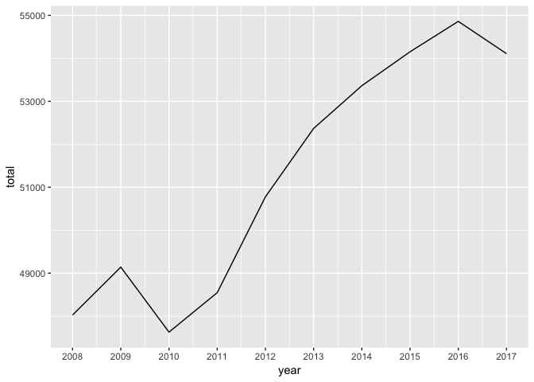
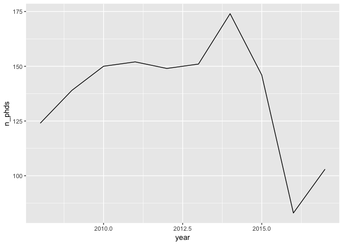
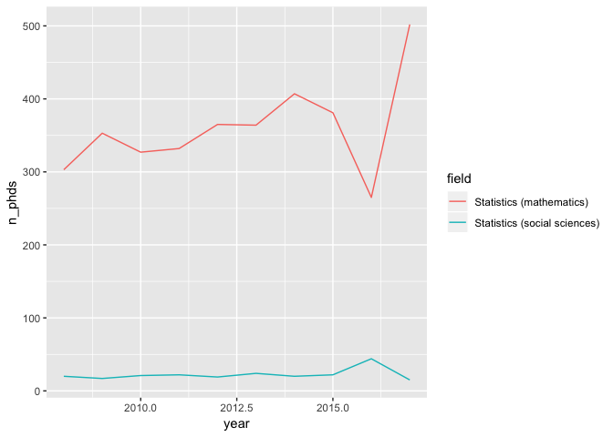
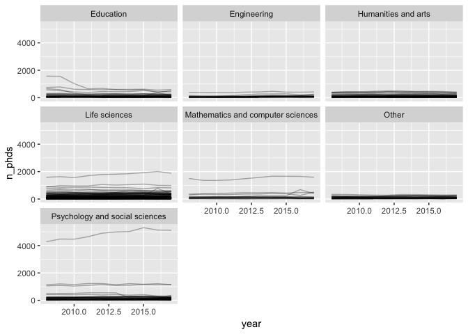
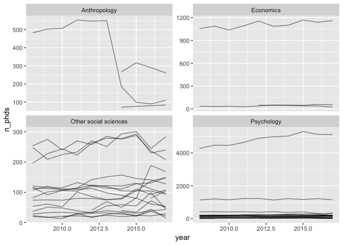
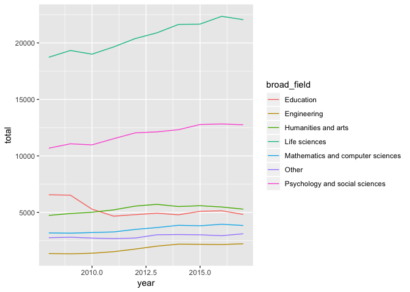
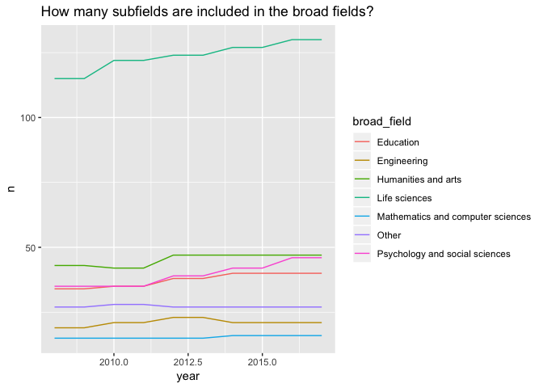
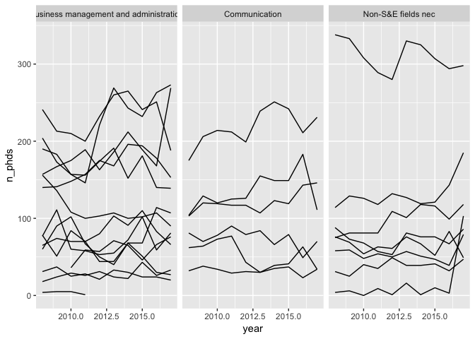

R Ladies Ames Solution
================
Sam Tyner, Kat Goode, Jing Zhao
2/19/2019

# Get data

``` r
library(tidyverse)
library(plotly)
phd_field <- read_csv("https://raw.githubusercontent.com/rfordatascience/tidytuesday/master/data/2019/2019-02-19/phd_by_field.csv")
phd_field %>% count(year)
```

    ## # A tibble: 10 x 2
    ##     year     n
    ##    <dbl> <int>
    ##  1  2008   337
    ##  2  2009   337
    ##  3  2010   337
    ##  4  2011   337
    ##  5  2012   337
    ##  6  2013   337
    ##  7  2014   337
    ##  8  2015   337
    ##  9  2016   337
    ## 10  2017   337

``` r
head(phd_field)
```

    ## # A tibble: 6 x 5
    ##   broad_field  major_field               field                  year n_phds
    ##   <chr>        <chr>                     <chr>                 <dbl>  <dbl>
    ## 1 Life scienc… Agricultural sciences an… Agricultural economi…  2008    111
    ## 2 Life scienc… Agricultural sciences an… Agricultural and hor…  2008     28
    ## 3 Life scienc… Agricultural sciences an… Agricultural animal …  2008      3
    ## 4 Life scienc… Agricultural sciences an… Agronomy and crop sc…  2008     68
    ## 5 Life scienc… Agricultural sciences an… Animal nutrition       2008     41
    ## 6 Life scienc… Agricultural sciences an… Animal science, poul…  2008     18

## All PhDs

``` r
phd_field %>% group_by(year) %>% summarise(total = sum(n_phds, na.rm = T)) %>% 
  ggplot(aes(x = year,y = total)) + 
  geom_line() + 
  scale_x_continuous(breaks = 2008:2017)
```

<!-- -->

## Most popular

``` r
phd_field %>% group_by(broad_field) %>% 
  summarize(total = sum(n_phds, na.rm = T)) %>% 
  arrange(desc(total))
```

    ## # A tibble: 7 x 2
    ##   broad_field                        total
    ##   <chr>                              <dbl>
    ## 1 Life sciences                     205703
    ## 2 Psychology and social sciences    119116
    ## 3 Humanities and arts                53045
    ## 4 Education                          52639
    ## 5 Mathematics and computer sciences  35481
    ## 6 Other                              28855
    ## 7 Engineering                        18139

``` r
phd_field %>% group_by(major_field) %>% 
  summarize(total = sum(n_phds, na.rm = T)) %>% 
  arrange(desc(total))
```

    ## # A tibble: 25 x 2
    ##    major_field                                           total
    ##    <chr>                                                 <dbl>
    ##  1 Biological and biomedical sciences                    85637
    ##  2 Psychology                                            84730
    ##  3 Physics and astronomy                                 41176
    ##  4 Education research                                    25577
    ##  5 Chemistry                                             25015
    ##  6 Health sciences                                       20882
    ##  7 Other humanities and arts                             20535
    ##  8 Geosciences, atmospheric sciences, and ocean sciences 19868
    ##  9 Computer and information sciences                     18395
    ## 10 Other engineering                                     18139
    ## # … with 15 more rows

``` r
phd_field %>%group_by(field) %>% 
  summarize(total = sum(n_phds, na.rm = T)) %>% 
  arrange(desc(total))
```

    ## # A tibble: 336 x 2
    ##    field                              total
    ##    <chr>                              <dbl>
    ##  1 Social sciences                    48322
    ##  2 Physics                            17740
    ##  3 Computer science                   15219
    ##  4 Clinical psychology                11849
    ##  5 Other economics                    11083
    ##  6 Neurosciences, neurobiologye        9968
    ##  7 Educational leadership              8456
    ##  8 Biochemistry (biological sciences)  8375
    ##  9 Molecular biology                   6703
    ## 10 Organic chemistry                   6215
    ## # … with 326 more rows

``` r
phd_field %>% filter(field == "Algebra") %>% 
  ggplot(aes(year, n_phds)) + 
  geom_line()
```

<!-- -->

``` r
phd_field %>% filter(str_detect(field, "Statistics"))  %>% 
  ggplot(aes(year, n_phds, color = field)) + 
  geom_line()
```

<!-- -->

``` r
p <- phd_field %>% 
  ggplot(aes(year, n_phds, group = field)) + 
  geom_line(alpha = .3) + 
  facet_wrap(~broad_field)
p
```

<!-- -->

``` r
#ggplotly(p)
```

``` r
p <- phd_field %>% filter(broad_field == "Psychology and social sciences") %>% 
  ggplot(aes(year, n_phds, group = field)) + 
  geom_line(alpha = .5) + 
  facet_wrap(~major_field, scales = "free_y")
p
```

<!-- -->

``` r
#ggplotly(p)
```

``` r
phd_field %>% group_by(year, broad_field) %>% summarise(total = sum(n_phds, na.rm = T)) %>% 
  ggplot(aes(x = year, y = total, color = broad_field)) +
  geom_line()
```

<!-- -->

``` r
phd_field %>% group_by(year, broad_field) %>% filter(!is.na(n_phds)) %>% count() %>% 
  ggplot(aes(year, n, color = broad_field)) + 
  geom_line() + 
  ggtitle("How many subfields are included in the broad fields?")
```

<!-- -->

``` r
p <- phd_field %>% filter(broad_field == "Other") %>% 
  ggplot(aes(year, n_phds, group = field)) + 
  geom_line() + 
  facet_wrap(~major_field)
p
```

<!-- -->

``` r
#ggplotly(p)
```
