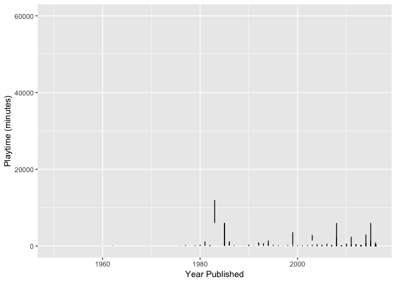
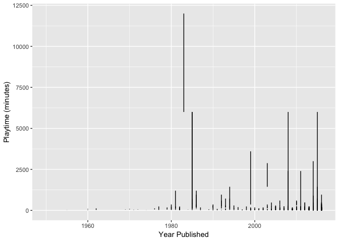
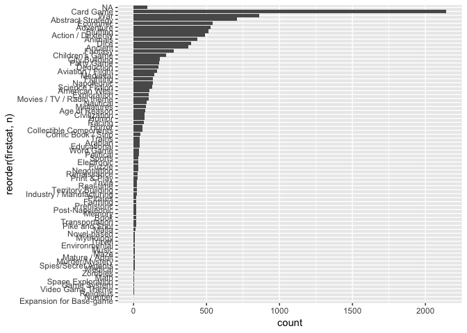
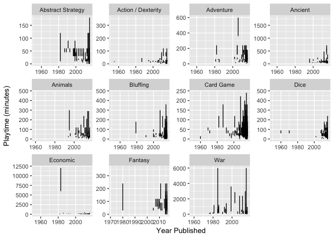
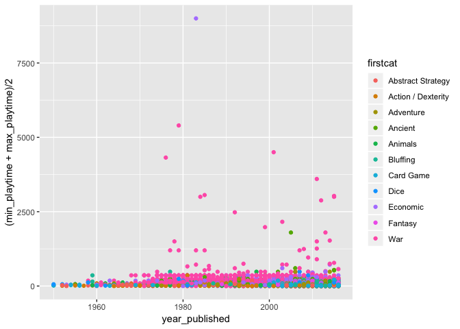
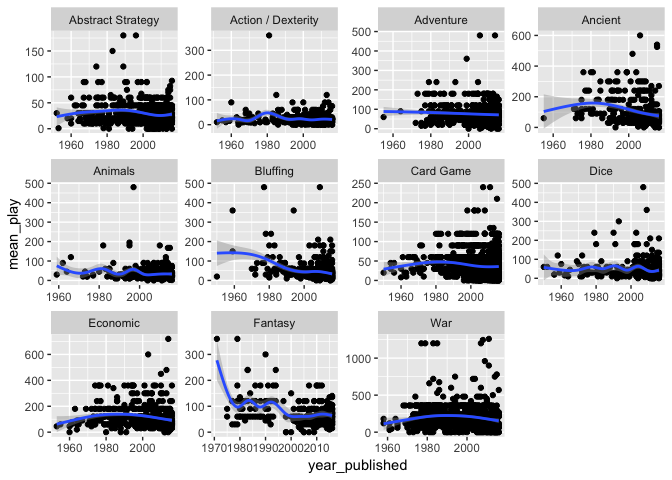

R Ladies Ames’ Solution
================
Sam Tyner
3/12/2019

``` r
library(tidyverse)
bgdat <- read_csv("board_games.csv")
glimpse(bgdat)
```

    ## Observations: 10,532
    ## Variables: 22
    ## $ game_id        <dbl> 1, 2, 3, 4, 5, 6, 7, 8, 9, 10, 11, 12, 13, 14, 15…
    ## $ description    <chr> "Die Macher is a game about seven sequential poli…
    ## $ image          <chr> "//cf.geekdo-images.com/images/pic159509.jpg", "/…
    ## $ max_players    <dbl> 5, 4, 4, 4, 6, 6, 2, 5, 4, 6, 7, 5, 4, 4, 6, 4, 2…
    ## $ max_playtime   <dbl> 240, 30, 60, 60, 90, 240, 20, 120, 90, 60, 45, 60…
    ## $ min_age        <dbl> 14, 12, 10, 12, 12, 12, 8, 12, 13, 10, 13, 12, 10…
    ## $ min_players    <dbl> 3, 3, 2, 2, 3, 2, 2, 2, 2, 2, 2, 2, 3, 3, 2, 3, 2…
    ## $ min_playtime   <dbl> 240, 30, 30, 60, 90, 240, 20, 120, 90, 60, 45, 45…
    ## $ name           <chr> "Die Macher", "Dragonmaster", "Samurai", "Tal der…
    ## $ playing_time   <dbl> 240, 30, 60, 60, 90, 240, 20, 120, 90, 60, 45, 60…
    ## $ thumbnail      <chr> "//cf.geekdo-images.com/images/pic159509_t.jpg", …
    ## $ year_published <dbl> 1986, 1981, 1998, 1992, 1964, 1989, 1978, 1993, 1…
    ## $ artist         <chr> "Marcus Gschwendtner", "Bob Pepper", "Franz Vohwi…
    ## $ category       <chr> "Economic,Negotiation,Political", "Card Game,Fant…
    ## $ compilation    <chr> NA, NA, NA, NA, NA, NA, NA, NA, NA, NA, NA, NA, "…
    ## $ designer       <chr> "Karl-Heinz Schmiel", "G. W. \"Jerry\" D'Arcey", …
    ## $ expansion      <chr> NA, NA, NA, NA, NA, NA, NA, NA, NA, "Elfengold,El…
    ## $ family         <chr> "Country: Germany,Valley Games Classic Line", "An…
    ## $ mechanic       <chr> "Area Control / Area Influence,Auction/Bidding,Di…
    ## $ publisher      <chr> "Hans im Glück Verlags-GmbH,Moskito Spiele,Valley…
    ## $ average_rating <dbl> 7.66508, 6.60815, 7.44119, 6.60675, 7.35830, 6.52…
    ## $ users_rated    <dbl> 4498, 478, 12019, 314, 15195, 73, 2751, 186, 1263…

What is the relationship between year and playing time?

``` r
ggplot(data = bgdat) + 
  geom_linerange(aes(x = year_published, y = (min_playtime + max_playtime)/2, ymin = min_playtime, ymax = max_playtime, group = game_id)) + 
  labs(x = "Year Published", y = "Playtime (minutes)")
```



Which games have playtime more than 20,000 minutes (about two weeks)?\!?

``` r
bgdat %>% filter(min_playtime > 10000) %>% glimpse()
```

    ## Observations: 3
    ## Variables: 22
    ## $ game_id        <dbl> 4815, 6942, 46669
    ## $ description    <chr> "This is a war game like no other.  Although the …
    ## $ image          <chr> "//cf.geekdo-images.com/images/pic339497.jpg", "/…
    ## $ max_players    <dbl> 10, 4, 4
    ## $ max_playtime   <dbl> 60000, 12000, 17280
    ## $ min_age        <dbl> 14, 12, 0
    ## $ min_players    <dbl> 8, 2, 2
    ## $ min_playtime   <dbl> 60000, 12000, 17280
    ## $ name           <chr> "The Campaign for North Africa", "Drang Nach Oste…
    ## $ playing_time   <dbl> 60000, 12000, 17280
    ## $ thumbnail      <chr> "//cf.geekdo-images.com/images/pic339497_t.jpg", …
    ## $ year_published <dbl> 1979, 1973, 2013
    ## $ artist         <chr> "Redmond A. Simonsen", NA, "Rodger B. MacGowan,Mi…
    ## $ category       <chr> "Wargame,World War II", "Wargame,World War II", "…
    ## $ compilation    <chr> NA, NA, NA
    ## $ designer       <chr> "Richard H. Berg", "Rich Banner,Frank Chadwick", …
    ## $ expansion      <chr> NA, "Unentschieden", NA
    ## $ family         <chr> NA, "Europa Series", "1914  series,Country: Belgi…
    ## $ mechanic       <chr> "Hex-and-Counter", "Dice Rolling,Hex-and-Counter,…
    ## $ publisher      <chr> "SPI (Simulations Publications, Inc.)", "GDW Game…
    ## $ average_rating <dbl> 5.62887, 6.86429, 7.99855
    ## $ users_rated    <dbl> 97, 56, 69

Wow, that’s dedication. Let’s remove those extremes.

``` r
bgdat <- bgdat %>% filter(min_playtime < 10000)
ggplot(data = bgdat) + 
  geom_linerange(aes(x = year_published, y = (min_playtime + max_playtime)/2, ymin = min_playtime, ymax = max_playtime, group = game_id)) + 
  labs(x = "Year Published", y = "Playtime (minutes)")
```



It would be nice to facet this by category, but the category variable is
strange:

``` r
bgdat$category %>% head()
```

    ## [1] "Economic,Negotiation,Political" "Card Game,Fantasy"             
    ## [3] "Abstract Strategy,Medieval"     "Ancient"                       
    ## [5] "Economic"                       "Civilization,Nautical"

Let’s clean this up a bit.

``` r
bgdat$category %>% str_count(",") %>% max(na.rm=T)
```

    ## [1] 13

One game has 14 categories\!

``` r
bgdat %>% mutate(ncat = str_count(category, ",") + 1) %>% 
  arrange(desc(ncat)) %>% select(name, category, ncat) %>% head
```

    ## # A tibble: 6 x 3
    ##   name             category                                            ncat
    ##   <chr>            <chr>                                              <dbl>
    ## 1 Top Trumps       American West,Aviation / Flight,Card Game,Fantasy…    14
    ## 2 Emperor's New C… Bluffing,Book,Card Game,Deduction,Dice,Educationa…    11
    ## 3 504              Abstract Strategy,Animals,City Building,Economic,…    11
    ## 4 Memory           Animals,Card Game,Children's Game,Comic Book / St…    10
    ## 5 Strategy I       American Civil War,Korean War,Medieval,Modern War…    10
    ## 6 Sleeping Queens  Bluffing,Card Game,Children's Game,Deduction,Educ…    10

Now, we’ll split category up and only keep the first 2 categories for
simplicity.

``` r
bgdat2 <- bgdat %>% separate(category, into = c("firstcat", "secondcat"), sep = ",")
bgdat2 %>% count(firstcat)
```

    ## # A tibble: 84 x 2
    ##    firstcat                       n
    ##    <chr>                      <int>
    ##  1 <NA>                          94
    ##  2 Abstract Strategy            710
    ##  3 Action / Dexterity           492
    ##  4 Adventure                    527
    ##  5 Age of Reason                 81
    ##  6 American Civil War           130
    ##  7 American Indian Wars           6
    ##  8 American Revolutionary War     7
    ##  9 American West                107
    ## 10 Ancient                      374
    ## # … with 74 more rows

There are still a lot of categories, but there are many different
categories of war games. Let’s make all of them just
“War”.

``` r
bgdat2 <- bgdat2 %>% mutate(firstcat = ifelse(str_detect(firstcat, "War"), "War", firstcat), secondcat = ifelse(str_detect(secondcat, "War"), "War", secondcat))
bgdat2 %>% count(firstcat)
```

    ## # A tibble: 75 x 2
    ##    firstcat               n
    ##    <chr>              <int>
    ##  1 <NA>                  94
    ##  2 Abstract Strategy    710
    ##  3 Action / Dexterity   492
    ##  4 Adventure            527
    ##  5 Age of Reason         81
    ##  6 American West        107
    ##  7 Ancient              374
    ##  8 Animals              436
    ##  9 Arabian               44
    ## 10 Aviation / Flight    159
    ## # … with 65 more rows

``` r
bgdatcats <- bgdat2 %>% count(firstcat)
bgdatcats %>%  
  ggplot(aes(x = reorder(firstcat, n), weight = n)) + 
  geom_bar() + 
  coord_flip()
```



``` r
# only use categories with > 250 games (at least 2.5% of the games but have the category to be used)
bgdatcats2 <- bgdatcats %>% filter(n > 250)
bgdat3 <- bgdat2 %>% filter(firstcat %in% bgdatcats2$firstcat)
# facet by firstcat
ggplot(data = bgdat3) + 
  geom_linerange(aes(x = year_published, ymin = min_playtime, ymax = max_playtime, group = game_id)) + 
  labs(x = "Year Published", y = "Playtime (minutes)") + 
  facet_wrap(~firstcat, scales = "free")
```



``` r
# what about the mean of the min & max? 
ggplot(data = bgdat3) + 
  geom_point(aes(x=year_published , y = (min_playtime + max_playtime)/2, color = firstcat))
```



``` r
bgdat3 %>% mutate(mean_play = (min_playtime + max_playtime)/2) %>% 
  filter(mean_play < 1440) %>% # only look at games with less than a day of play time 
ggplot(aes(x = year_published, y = mean_play)) + 
  geom_point() + 
  geom_smooth() + 
  facet_wrap(~firstcat, scales = "free")
```



In the most popular games, it looks like the average game play has
remained fairly stable over time.
