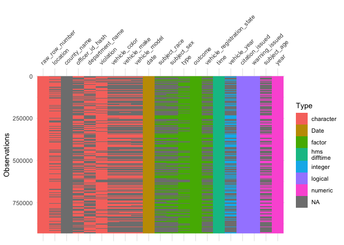

R-Ladies Ames Solution
================
Sam Tyner, Amanda Rae
3/19/2019

``` r
library(tidyverse)
combined_data <- read_csv("https://raw.githubusercontent.com/5harad/openpolicing/master/results/data_for_figures/combined_data.csv")
head(combined_data)
```

    ## # A tibble: 6 x 11
    ##   location state driver_race stops_per_year stop_rate search_rate
    ##   <chr>    <chr> <chr>                <dbl>     <dbl>       <dbl>
    ## 1 APACHE … AZ    Black                  266     0.995       0.077
    ## 2 APACHE … AZ    Hispanic              1008     0.262       0.053
    ## 3 APACHE … AZ    White                 6322     0.431       0.017
    ## 4 COCHISE… AZ    Black                 1169     0.23        0.047
    ## 5 COCHISE… AZ    Hispanic              9453     0.259       0.037
    ## 6 COCHISE… AZ    White                10826     0.145       0.024
    ## # … with 5 more variables: consent_search_rate <dbl>, arrest_rate <dbl>,
    ## #   citation_rate_speeding_stops <dbl>, hit_rate <dbl>,
    ## #   inferred_threshold <dbl>

Since we’re in Iowa, let’s isolate the Iowa data

``` r
iowa <- filter(combined_data, state == "IA")
iowa
```

    ## # A tibble: 0 x 11
    ## # … with 11 variables: location <chr>, state <chr>, driver_race <chr>,
    ## #   stops_per_year <dbl>, stop_rate <dbl>, search_rate <dbl>,
    ## #   consent_search_rate <dbl>, arrest_rate <dbl>,
    ## #   citation_rate_speeding_stops <dbl>, hit_rate <dbl>,
    ## #   inferred_threshold <dbl>

No Iowa. 😿.

Dowload Iowa data directly from [the SOPP
website](https://openpolicing.stanford.edu/data/). (Not on Gitub because
it’s too large.)

``` r
iowa <- read_rds("iowa.rds")
glimpse(iowa)
```

    ## Observations: 2,441,335
    ## Variables: 20
    ## $ raw_row_number             <chr> "80621", "113124|1643473", "1565824|1…
    ## $ date                       <date> 2006-10-07, 2007-01-09, 2006-04-28, …
    ## $ time                       <time> 18:33:00,       NA, 22:21:00, 22:52:…
    ## $ location                   <chr> "HWY 9 WEST OF I35", "WB HWY 78 W OF …
    ## $ county_name                <chr> NA, "Des Moines County|NA", NA, NA, N…
    ## $ subject_age                <dbl> 18, NA, NA, NA, NA, 59, 16, 18, 46, N…
    ## $ subject_race               <fct> NA, NA, NA, NA, NA, other/unknown, ot…
    ## $ subject_sex                <fct> female, NA, NA, NA, NA, male, male, m…
    ## $ officer_id_hash            <chr> "8f20eb8c8e", "023753f627", NA, NA, "…
    ## $ department_name            <chr> NA, "NA|Iowa State Patrol - Dist 13",…
    ## $ type                       <fct> vehicular, vehicular, vehicular, vehi…
    ## $ violation                  <chr> "321.285-B: SPEEDING 55 OR < (6 THRU …
    ## $ citation_issued            <lgl> TRUE, NA, FALSE, FALSE, NA, TRUE, TRU…
    ## $ warning_issued             <lgl> FALSE, NA, TRUE, TRUE, NA, FALSE, FAL…
    ## $ outcome                    <fct> citation, NA, warning, warning, NA, c…
    ## $ vehicle_color              <chr> "BLU", "TAN|NA", NA, NA, "GRN|NA", "W…
    ## $ vehicle_make               <chr> "CHEV", "FORD|NA", NA, NA, "CHEV|NA",…
    ## $ vehicle_model              <chr> "IMP", "XXX|NA", NA, NA, "MOC|NA", "S…
    ## $ vehicle_registration_state <fct> IA, NA, NA, NA, NA, IA, IA, MO, MO, N…
    ## $ vehicle_year               <int> 2002, NA, NA, NA, NA, 2007, 1998, NA,…

``` r
summary(iowa$date)
```

    ##         Min.      1st Qu.       Median         Mean      3rd Qu. 
    ## "2006-01-01" "2009-02-26" "2011-09-23" "2011-08-01" "2014-02-23" 
    ##         Max. 
    ## "2016-04-25"

``` r
dim(iowa)
```

    ## [1] 2441335      20

Lets only get the last 3 or so years in the data since there are over 2
million rows.

``` r
library(lubridate)
iowa %>% mutate(year = year(date)) %>% 
  filter(year >= 2013, !is.na(date)) -> iowa
head(iowa)
```

    ## # A tibble: 6 x 21
    ##   raw_row_number date       time  location county_name subject_age
    ##   <chr>          <date>     <tim> <chr>    <chr>             <dbl>
    ## 1 1240026        2014-02-24 09:00 <NA>     <NA>                 NA
    ## 2 1320161        2014-10-02 15:59 <NA>     <NA>                 NA
    ## 3 1349092        2014-12-15 14:56 <NA>     <NA>                 NA
    ## 4 1149092        2013-06-11 18:51 42ND, W… <NA>                 20
    ## 5 1497710        2016-01-03 15:57 <NA>     <NA>                 NA
    ## 6 1497794        2016-01-03 16:20 <NA>     <NA>                 NA
    ## # … with 15 more variables: subject_race <fct>, subject_sex <fct>,
    ## #   officer_id_hash <chr>, department_name <chr>, type <fct>,
    ## #   violation <chr>, citation_issued <lgl>, warning_issued <lgl>,
    ## #   outcome <fct>, vehicle_color <chr>, vehicle_make <chr>,
    ## #   vehicle_model <chr>, vehicle_registration_state <fct>,
    ## #   vehicle_year <int>, year <dbl>

``` r
dim(iowa)
```

    ## [1] 932689     21

View the missingness with
[`visdat`](http://dx.doi.org/10.21105/joss.00355).

``` r
library(visdat)
vis_dat(iowa, warn_large_data = FALSE)
```

<!-- -->

``` r
count(iowa, location)
```

    ## # A tibble: 227,904 x 2
    ##    location                                 n
    ##    <chr>                                <int>
    ##  1 <NA>                                262169
    ##  2 -1 M E OF HWY 59 ON A22 EB               1
    ##  3 -1 M E OF HWY 86 ON HWY 9 WB (TO SB      2
    ##  4 -1 M N OF A34 ON M56                     1
    ##  5 -1 M W OF HWY 86 ON HWY 9 EB             1
    ##  6 -1 M W OF LITTLE ROCK ON HWY 9 EB        1
    ##  7 -1 M W OF M18 ON HWY 9 EB                1
    ##  8 -1 M W OF M44 ON HWY 18 EB               1
    ##  9 -1 M W OF MILFORD ON A34 EB              2
    ## 10 -1 M WEST OF HWY 71 ON HWY 18 EB         2
    ## # … with 227,894 more rows

``` r
count(iowa, department_name)
```

    ## # A tibble: 17 x 2
    ##    department_name                  n
    ##    <chr>                        <int>
    ##  1 <NA>                        453895
    ##  2 Iowa State Patrol - Dist 01  42640
    ##  3 Iowa State Patrol - Dist 02  32409
    ##  4 Iowa State Patrol - Dist 03  34110
    ##  5 Iowa State Patrol - Dist 04  31867
    ##  6 Iowa State Patrol - Dist 05   9364
    ##  7 Iowa State Patrol - Dist 06  36148
    ##  8 Iowa State Patrol - Dist 07  35532
    ##  9 Iowa State Patrol - Dist 08  29657
    ## 10 Iowa State Patrol - Dist 09  32870
    ## 11 Iowa State Patrol - Dist 10  46771
    ## 12 Iowa State Patrol - Dist 11  51129
    ## 13 Iowa State Patrol - Dist 12  32967
    ## 14 Iowa State Patrol - Dist 13  45299
    ## 15 Iowa State Patrol - Dist 15  11698
    ## 16 Iowa State Patrol - Dist 16   6224
    ## 17 Iowa State Patrol - Dist 21    109
