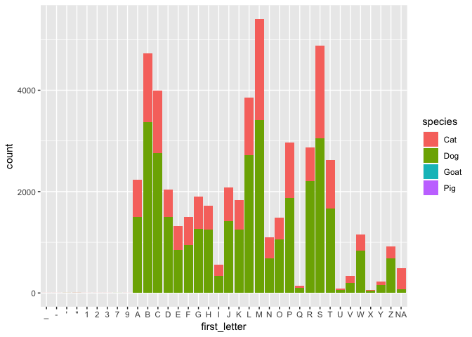
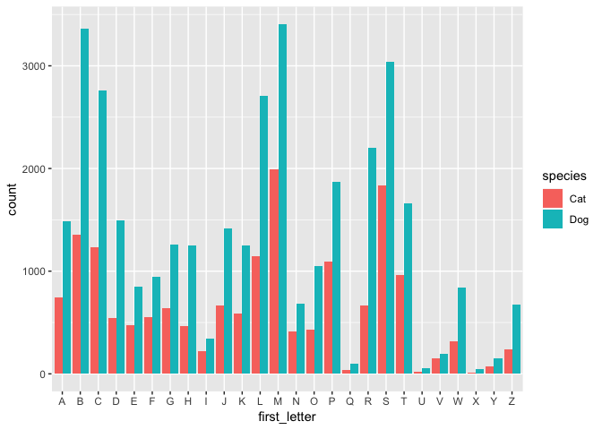
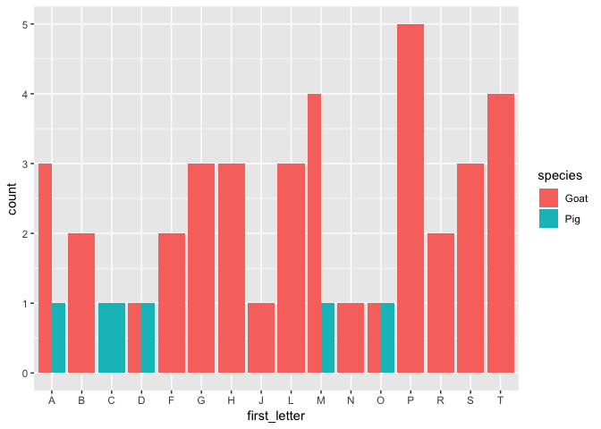

R-Ladies Ames Solution
================
Sam Tyner, Stephanie Reinders
March 26, 2019

# Read the data in

``` r
library(tidyverse)
```

    ## ── Attaching packages ────────────────────────────────────────────────────────────── tidyverse 1.2.1 ──

    ## ✔ ggplot2 3.1.0       ✔ purrr   0.3.2  
    ## ✔ tibble  2.1.1       ✔ dplyr   0.8.0.1
    ## ✔ tidyr   0.8.3       ✔ stringr 1.4.0  
    ## ✔ readr   1.3.1       ✔ forcats 0.4.0

    ## ── Conflicts ───────────────────────────────────────────────────────────────── tidyverse_conflicts() ──
    ## ✖ dplyr::filter() masks stats::filter()
    ## ✖ dplyr::lag()    masks stats::lag()

``` r
pets <- read_csv("seattle_pets.csv")
```

    ## Parsed with column specification:
    ## cols(
    ##   license_issue_date = col_character(),
    ##   license_number = col_character(),
    ##   animals_name = col_character(),
    ##   species = col_character(),
    ##   primary_breed = col_character(),
    ##   secondary_breed = col_character(),
    ##   zip_code = col_character()
    ## )

``` r
head(pets)
```

    ## # A tibble: 6 x 7
    ##   license_issue_d… license_number animals_name species primary_breed
    ##   <chr>            <chr>          <chr>        <chr>   <chr>        
    ## 1 November 16 2018 8002756        Wall-E       Dog     Mixed Breed,…
    ## 2 November 11 2018 S124529        Andre        Dog     Terrier, Jac…
    ## 3 November 21 2018 903793         Mac          Dog     Retriever, L…
    ## 4 November 23 2018 824666         Melb         Cat     Domestic Sho…
    ## 5 December 30 2018 S119138        Gingersnap   Cat     Domestic Sho…
    ## 6 December 16 2018 S138529        Cody         Dog     Retriever, L…
    ## # … with 2 more variables: secondary_breed <chr>, zip_code <chr>

Parsing dates & zip codes:

``` r
library(lubridate)
```

    ## 
    ## Attaching package: 'lubridate'

    ## The following object is masked from 'package:base':
    ## 
    ##     date

``` r
pets %>% 
  mutate(date = parse_date(license_issue_date, format = "%B %d %Y"), 
         zip = parse_integer(zip_code)) -> pets
```

    ## Warning: 71 parsing failures.
    ##  row col               expected actual
    ##  309  -- no trailing characters  -4820
    ## 1570  -- no trailing characters  -4729
    ## 3332  -- no trailing characters  -1067
    ## 4679  -- no trailing characters  -2920
    ## 5175  -- no trailing characters  -3147
    ## .... ... ...................... ......
    ## See problems(...) for more details.

``` r
# check for missings 
pets %>% filter(is.na(date))
```

    ## # A tibble: 0 x 9
    ## # … with 9 variables: license_issue_date <chr>, license_number <chr>,
    ## #   animals_name <chr>, species <chr>, primary_breed <chr>,
    ## #   secondary_breed <chr>, zip_code <chr>, date <date>, zip <int>

``` r
pets %>% filter(is.na(zip))
```

    ## # A tibble: 468 x 9
    ##    license_issue_d… license_number animals_name species primary_breed
    ##    <chr>            <chr>          <chr>        <chr>   <chr>        
    ##  1 October 22 2018  S152153        Lola         Cat     Domestic Sho…
    ##  2 September 28 20… S142612        Flynn        Cat     Domestic Sho…
    ##  3 December 20 2016 S125486        Kola         Dog     Chihuahua, S…
    ##  4 December 01 2016 S121008        Neil         Dog     Terrier, Bor…
    ##  5 November 25 2018 S123160        Fozzie       Dog     Poodle, Stan…
    ##  6 April 21 2017    960061         Gwennie      Dog     Maltese      
    ##  7 February 23 2017 962460         Pepper       Cat     Domestic Sho…
    ##  8 December 29 2017 S139164        Maximilian   Dog     Maltese      
    ##  9 December 16 2017 962020         Precious     Dog     Terrier, Yor…
    ## 10 December 13 2016 952188         Danny        Cat     Domestic Sho…
    ## # … with 458 more rows, and 4 more variables: secondary_breed <chr>,
    ## #   zip_code <chr>, date <date>, zip <int>

``` r
pets %>% filter(is.na(zip), !is.na(zip_code))
```

    ## # A tibble: 71 x 9
    ##    license_issue_d… license_number animals_name species primary_breed
    ##    <chr>            <chr>          <chr>        <chr>   <chr>        
    ##  1 November 25 2018 S123160        Fozzie       Dog     Poodle, Stan…
    ##  2 November 27 2018 892002         Jellie       Cat     Russian Blue 
    ##  3 November 03 2018 832528         Oliver       Cat     Domestic Sho…
    ##  4 October 20 2018  830690         Stella       Dog     Shepherd     
    ##  5 October 18 2018  S121923        Bernie       Dog     Terrier      
    ##  6 October 18 2018  8002006        Tulip        Dog     Schnauzer, M…
    ##  7 November 13 2018 904676         Gigi         Dog     Bulldog, Fre…
    ##  8 July 24 2018     433254         Sam          Cat     Domestic Sho…
    ##  9 November 17 2015 283053         Cooper       Dog     Retriever, G…
    ## 10 October 17 2017  S137360        Finnegan     Dog     Irish Wolfho…
    ## # … with 61 more rows, and 4 more variables: secondary_breed <chr>,
    ## #   zip_code <chr>, date <date>, zip <int>

``` r
# if zip_code is not NA, only take the first 5 digits 
pets <- pets %>% 
  mutate(zip = ifelse((!is.na(zip_code) & is.na(zip)), parse_integer(str_sub(zip_code, 1, 5)), zip))
head(pets)
```

    ## # A tibble: 6 x 9
    ##   license_issue_d… license_number animals_name species primary_breed
    ##   <chr>            <chr>          <chr>        <chr>   <chr>        
    ## 1 November 16 2018 8002756        Wall-E       Dog     Mixed Breed,…
    ## 2 November 11 2018 S124529        Andre        Dog     Terrier, Jac…
    ## 3 November 21 2018 903793         Mac          Dog     Retriever, L…
    ## 4 November 23 2018 824666         Melb         Cat     Domestic Sho…
    ## 5 December 30 2018 S119138        Gingersnap   Cat     Domestic Sho…
    ## 6 December 16 2018 S138529        Cody         Dog     Retriever, L…
    ## # … with 4 more variables: secondary_breed <chr>, zip_code <chr>,
    ## #   date <date>, zip <int>

First letter of the animals’ names by species.

``` r
pets %>% 
  mutate(first_letter = toupper(str_sub(animals_name, 1,1))) -> pets 
pets %>% 
  ggplot() + 
  geom_bar(aes(x = first_letter, fill = species)) 
```



``` r
pets %>% filter(!(first_letter %in% LETTERS) , !(is.na(animals_name)))
```

    ## # A tibble: 12 x 10
    ##    license_issue_d… license_number animals_name species primary_breed
    ##    <chr>            <chr>          <chr>        <chr>   <chr>        
    ##  1 December 26 2016 S126230        2            Cat     Domestic Lon…
    ##  2 July 27 2018     573725         __           Cat     Domestic Med…
    ##  3 June 20 2018     S142492        7's          Dog     Doberman Pin…
    ##  4 April 19 2018    S143106        'Murca       Dog     Bernese Moun…
    ##  5 July 18 2018     S147119        "\"Mo\""     Cat     Domestic Sho…
    ##  6 February 16 2018 69328          99           Cat     Domestic Med…
    ##  7 November 21 2017 896557         "\"Mama\" M… Cat     Domestic Sho…
    ##  8 August 08 2017   353597         'Alani       Cat     Domestic Sho…
    ##  9 July 27 2018     573722         -            Cat     Domestic Sho…
    ## 10 December 26 2016 S126229        1            Cat     Domestic Lon…
    ## 11 July 03 2018     133239         30 Weight    Cat     Domestic Med…
    ## 12 October 08 2018  8001665        "\"Luci\" L… Dog     Retriever, G…
    ## # … with 5 more variables: secondary_breed <chr>, zip_code <chr>,
    ## #   date <date>, zip <int>, first_letter <chr>

``` r
# only 12 that are non-alpha
```

``` r
pets %>% filter(first_letter %in% LETTERS, species %in% c("Cat", "Dog")) %>% 
  ggplot() + 
  geom_bar(aes(x = first_letter, fill = species), position = "dodge")
```



``` r
pets %>% filter(first_letter %in% LETTERS, species %in% c("Goat", "Pig")) %>% 
  ggplot() + 
  geom_bar(aes(x = first_letter, fill = species), position = "dodge")
```



``` r
filter(pets, species == "Goat") %>% 
  select(animals_name) %>% count(animals_name) %>% arrange(desc(n))
```

    ## # A tibble: 37 x 2
    ##    animals_name        n
    ##    <chr>           <int>
    ##  1 Heidi               2
    ##  2 Abelard             1
    ##  3 Aggie               1
    ##  4 Arya                1
    ##  5 Beans               1
    ##  6 Brussels Sprout     1
    ##  7 Darcy               1
    ##  8 Fawn                1
    ##  9 Fiona               1
    ## 10 Gavin               1
    ## # … with 27 more rows

``` r
filter(pets, species == "Pig") %>% 
  select(animals_name) %>% count(animals_name) %>% arrange(desc(n))
```

    ## # A tibble: 6 x 2
    ##   animals_name     n
    ##   <chr>        <int>
    ## 1 <NA>             1
    ## 2 Atticus          1
    ## 3 Coconut          1
    ## 4 Darla            1
    ## 5 Millie           1
    ## 6 Othello          1

Distribution of letters in Cats vs
Dogs

``` r
pets %>% filter(species %in% c("Cat", "Dog"), first_letter %in% LETTERS) %>% 
  group_by(species, first_letter) %>% count() -> test

# ?chisq.test

cats <- (test %>% filter(species == "Cat"))$n
dogs <- (test %>% filter(species == "Dog"))$n

chisq.test(cats, dogs, correct = FALSE)
```

    ## Warning in chisq.test(cats, dogs, correct = FALSE): Chi-squared
    ## approximation may be incorrect

    ## 
    ##  Pearson's Chi-squared test
    ## 
    ## data:  cats and dogs
    ## X-squared = 650, df = 625, p-value = 0.2368
