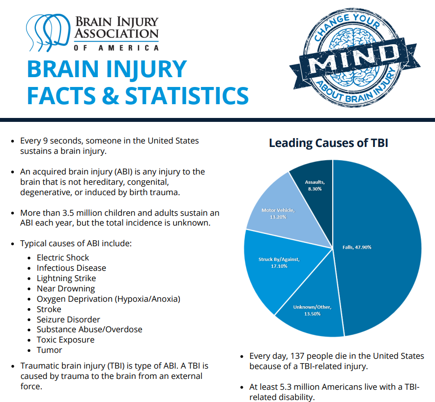

# Traumatic Brain Injury (TBI)

> Brain Injury Awareness Month, observed each March, was established 3 decades ago to educate the public about the incidence of brain injury and the needs of persons with brain injuries and their families (1). Caused by a bump, blow, or jolt to the head, or penetrating head injury, a traumatic brain injury (TBI) can lead to short- or long-term changes affecting thinking, sensation, language, or emotion.
- [CDC](https://www.cdc.gov/mmwr/volumes/68/wr/mm6810a1.htm)

The goal of this week's `#TidyTuesday` is to spread awareness for just how common TBIs are - both in civilian and military populations. 

> One of every 60 people in the U.S. lives with a TBI related disability. Moderate and severe traumatic brain injury (TBI) can lead to a lifetime of physical, cognitive, emotional, and behavioral changes. 

If you want to share an infographic or summary graphic from this data - please consider using the awareness hashtag: `#ChangeYourMind`, `#braininjuryawarenessmonth`, or tagging the [Brain Injury Association](https://twitter.com/biaamerica). More details can be found at the [Brain Injury Association Website](https://www.biausa.org/public-affairs/public-awareness/brain-injury-awareness).

The data this week comes from the [CDC](https://www.cdc.gov/traumaticbraininjury/pdf/TBI-Surveillance-Report-FINAL_508.pdf) and [Veterans Brain Injury Center](https://dvbic.dcoe.mil/dod-worldwide-numbers-tbi). Additional stats can be found at [CDC.gov](https://www.cdc.gov/traumaticbraininjury/data/index.html).

This data and cleaning script are primarily from scraping tables out of a PDF. This would be a good example of trying to clean and organize tables from PDFs, using the [`pdftools` package](https://docs.ropensci.org/pdftools/) from `ropensci`. I have included the PDFs this data was scraped from, and there are lots of examples of potential graphs to recreate or improve upon. Try your hand at improving or otherwise learning how to use packages like `stringr` or `tidyr` to extract data from messy PDF tables.

### Get the data here

```{r}
# Get the Data

tbi_age <- readr::read_csv('https://raw.githubusercontent.com/rfordatascience/tidytuesday/master/data/2020/2020-03-24/tbi_age.csv')
tbi_year <- readr::read_csv('https://raw.githubusercontent.com/rfordatascience/tidytuesday/master/data/2020/2020-03-24/tbi_year.csv')
tbi_military <- readr::read_csv('https://raw.githubusercontent.com/rfordatascience/tidytuesday/master/data/2020/2020-03-24/tbi_military.csv')

# Or read in with tidytuesdayR package (https://github.com/thebioengineer/tidytuesdayR)
# PLEASE NOTE TO USE 2020 DATA YOU NEED TO USE tidytuesdayR version ? from GitHub

# Either ISO-8601 date or year/week works!

# Install via devtools::install_github("thebioengineer/tidytuesdayR")

tuesdata <- tidytuesdayR::tt_load('2020-03-24')
tuesdata <- tidytuesdayR::tt_load(2020, week = 13)


tbi_age <- tuesdata$tbi_age
```
### Data Dictionary

# `tbi_age.csv`

|variable         |class     |description |
|:----------------|:---------|:-----------|
|age_group        |character | Age group |
|type             |character | Type of measure |
|injury_mechanism |character | Injury mechanism |
|number_est       |double    | Estimated observed cases in 2014 |
|rate_est         |double    | Rate/100,000 in 2014 |

# `tbi_year.csv`

|variable         |class     |description |
|:----------------|:---------|:-----------|
|injury_mechanism |character | Injury mechanism |
|type             |character | Type of measure |
|year             |character | Year |
|rate_est         |double    | Rate/100,000 in 2014 |
|number_est       |integer   | Estimated observed cases in each year |

# `tbi_military.csv`

|variable  |class     |description |
|:---------|:---------|:-----------|
|service   |character | Military branch |
|component |character | Military component (active, guard, reserve) |
|severity  |character | Severity/type of TBI |
|diagnosed |double    | Number diagnosed |
|year      |integer   | Year for observation|

### Cleaning Script

```{r}
library(tidyverse)
library(rvest)


# Hospital TBI data -------------------------------------------------------

all_years <- read_html("https://www.cdc.gov/traumaticbraininjury/data/tbi-edhd.html") %>% 
  html_node(xpath = '//*[@id="acc-panel-1"]/div/div/table/thead/tr') %>% 
  html_text() %>% 
  str_split("\\\n") %>% 
  str_extract_all("[0-9]+") %>% 
  simplify()

hospital_url <- "https://www.cdc.gov/traumaticbraininjury/data/tbi-edhd.html"
  
raw_html_hospital <- read_html(url) 

get_table_row <- function(input_html, tab_num){
  
  node <- html_node(input_html, xpath = glue::glue('//*[@id="acc-panel-1"]/div/div/table/tbody/tr[{tab_num}]'))
  
  html_text(node)
}

tbi_hospital <- tibble(
  input_html = list(raw_html_hospital),
  tab_num = 1:4
) %>% 
  mutate(raw_data = map2_chr(input_html, tab_num, get_table_row)) %>% 
  separate(raw_data, into = c("type", all_years), sep = "\\\n") %>% 
  select(-tab_num,-input_html) %>% 
  pivot_longer(cols = -type, values_to = "value", names_to = "year") %>% 
  mutate(value = parse_number(value),
         year = as.double(year))


# TBI Deaths --------------------------------------------------------------


url_deaths <- "https://www.cdc.gov/traumaticbraininjury/data/tbi-deaths.html"

raw_html_deaths <- read_html(url_deaths)

tbi_deaths <- tibble(
  tab_num = 1:7,
  input_html = list(raw_html_deaths)
) %>% 
  mutate(raw_data = map2_chr(input_html, tab_num, get_table_row)) %>% 
  separate(raw_data, into = c("type", all_years), sep = "\\\n") %>% 
  select(-tab_num,-input_html) %>% 
  mutate(type = str_remove(type, "††|‡‡|§§")) %>% 
  pivot_longer(cols = -type, values_to = "value", names_to = "year") %>% 
  mutate(value = parse_number(value),
         year = as.double(year))


# ED Visits ---------------------------------------------------------------

url_ed <- "https://www.cdc.gov/traumaticbraininjury/data/tbi-ed-visits.html"

raw_html_ed <- read_html(url_ed)

tbi_ed_visits <- tibble(
  tab_num = 1:7,
  input_html = list(raw_html_ed)
) %>% 
  mutate(raw_data = map2_chr(input_html, tab_num, get_table_row)) %>% 
  separate(raw_data, into = c("type", all_years), sep = "\\\n") %>% 
  select(-tab_num,-input_html) %>% 
  mutate(type = str_remove(type, "††|‡‡|§§")) %>% 
  pivot_longer(cols = -type, values_to = "value", names_to = "year") %>% 
  mutate(value = parse_number(value),
         year = as.double(year))


# Hospitalizations --------------------------------------------------------

url_hosp <- "https://www.cdc.gov/traumaticbraininjury/data/tbi-hospitalizations.html"

raw_html_hosp <- read_html(url_hosp)

tbi_hosp <- tibble(
  tab_num = 1:7,
  input_html = list(raw_html_hosp)
) %>% 
  mutate(raw_data = map2_chr(input_html, tab_num, get_table_row)) %>% 
  separate(raw_data, into = c("type", all_years), sep = "\\\n") %>% 
  select(-tab_num,-input_html) %>% 
  mutate(type = str_remove(type, "††|‡‡|§§")) %>% 
  pivot_longer(cols = -type, values_to = "value", names_to = "year") %>% 
  mutate(value = parse_number(value),
         year = as.double(year))


# PDF report --------------------------------------------------------------

pdf_url <- "https://www.cdc.gov/traumaticbraininjury/pdf/TBI-Surveillance-Report-FINAL_508.pdf"

raw_pdf_text <- pdftools::pdf_text(pdf_url)


# General table scraping function -----------------------------------------

clean_pdf_table <- function(table_number){
  
  input_text <- chuck(raw_pdf_text, table_number)
  
  raw_table_text <- str_split(raw_pdf_text[[table_number]], 
                              "\\)\\\n|\\*\\\n", simplify = TRUE)
  
  vec_length <- c("0-1", "0-4", "5-1", "15-", "25-", "35-", "45-", "55-", "65-",
                  "75+", "Tot") %>% paste(collapse = "|")
  
  vec_subset <- str_detect(str_sub(raw_table_text, 1, 4), vec_length)
  
  small_tab <- raw_table_text[vec_subset]
  
  if(length(small_tab) <= 2) stop("No table found!")
  
  pre_tab <- small_tab %>% 
    str_squish() %>% 
    str_replace_all(" \\(", "_(") %>% 
    str_replace_all("\\s", "|") %>% 
    str_replace_all(",", "")
  
  text_con <- textConnection(pre_tab)
  
  output_df <- read.csv(text_con, header = FALSE, sep = "|", stringsAsFactors = FALSE)
  
  tibble_df <- output_df %>% 
    as_tibble() %>% 
    mutate_all(str_replace, "##|¶¶", "")
  
  tibble_fixed <- tibble_df %>% 
    mutate_at(.vars = vars(2:last_col()),
              str_extract, "[^_]+")
  
  tibble_typed <- suppressMessages(type_convert(tibble_fixed))
  
  tibble_typed
}

# PDF Tab 1 ---------------------------------------------------------------

# This was a first attempt before moving to a function

raw_pdf_text[[9]]

raw_table_text <- str_split(raw_pdf_text[[9]], "\\\n", simplify = TRUE)

pre_table <- raw_table %>% 
  .[9:19] %>% 
  str_squish() %>% 
  str_replace_all(" \\(", "_(") %>% 
  str_replace_all("\\s", "|")

text_con <- textConnection(pre_table)
data_table <- read.csv(text_con, sep = "|", header = FALSE, stringsAsFactors = FALSE)

tab_1 <- data_table %>% 
  set_names(nm = c("age_group", "ed_visit", "ed_visit_rate", "hospitilizations",
                   "hospitilization_rate", "death_no", "death_rate", "total_edhd", 
                   "total_edhd_rate")) %>%
  as_tibble() %>% 
  mutate_all(as.character) %>% 
  mutate_at(vars(contains("rate")), str_extract, "[^_]+") %>% 
  mutate_at(vars(ed_visit:total_edhd_rate), parse_number) %>% 
  add_column(type = "ED Visits, Hospitalizations, and deaths", .after = "age_group")

tab_1


# PDF Tab 2 ---------------------------------------------------------------

clean_pdf_table(10)

tab_2 <- clean_pdf_table(10) %>% 
  set_names(nm = c("age_group", "num_crash", "rate_crash", "num_falls",
                   "rate_falls", "num_struck", "rate_struck", "num_inj_unspecified", 
                   "rate_inj_unspecified", "num_self_harm", "rate_self_harm",
                   "num_assault", "rate_assault", "num_other", "rate_other")) %>% 
  add_column(type = "Emergency Department Visit", .after = "age_group")

tab_2
  

# PDF Tab 3 ---------------------------------------------------------------

tab_3 <- clean_pdf_table(11) %>% 
  set_names(nm = c("age_group", "num_crash", "rate_crash", "num_falls",
                   "rate_falls", "num_struck", "rate_struck", "num_inj_unspecified", 
                   "rate_inj_unspecified", "num_self_harm", "rate_self_harm",
                   "num_assault", "rate_assault", "num_other", "rate_other")) %>% 
  add_column(type = "Hospitalizations", .after = "age_group")

tab_3


# PDF Tab 4 ---------------------------------------------------------------

tab_4 <- clean_pdf_table(12) %>% 
  set_names(nm = c("age_group", "num_crash", "rate_crash", "num_falls",
                   "rate_falls", "num_struck", "rate_struck", "num_inj_unspecified", 
                   "rate_inj_unspecified", "num_self_harm", "rate_self_harm",
                   "num_assault", "rate_assault", "num_other", "rate_other")) %>% 
  add_column(type = "Deaths", .after = "age_group")

tab_4


# PDF Combo Table ---------------------------------------------------------

combo_tab <- bind_rows(tab_2, tab_3, tab_4)

view(combo_tab)

combo_tab

num_df <- combo_tab %>% 
  pivot_longer(cols = contains("num"), names_to = "injury_mechanism",
               values_to = "number_est") %>% 
  select(-contains("rate")) %>% 
  separate(injury_mechanism, into = c("count_type", "injury_mechanism"), 
           sep = "_", extra = "merge")

rate_df <- combo_tab %>% 
  pivot_longer(cols = contains("rate"), names_to = "injury_mechanism",
               values_to = "rate_est") %>% 
  select(-contains("num")) %>% 
  separate(injury_mechanism, into = c("count_type", "injury_mechanism"), 
           sep = "_", extra = "merge")

long_combo_df <- left_join(num_df, rate_df, 
                           by = c("age_group", "type", "injury_mechanism")) %>% 
  select(-contains("count_type")) %>% 
  mutate(
    injury_mechanism = factor(
      injury_mechanism,
      levels = c( "crash", "falls", "struck", "inj_unspecified","self_harm",
                  "assault", "other"),
      labels = c("Motor Vehicle Crashes", "Unintentional Falls", 
                 "Unintentionally struck by or against an object",
                 "Other unintentional injury, mechanism unspecified",
                 "Intentional self-harm", "Assault", "Other or no mechanism specified"
                 )
      ),
    injury_mechanism = as.character(injury_mechanism)
    )


# Other PDF Tables --------------------------------------------------------


get_graph_table <- function(page_number){
  
  titles <- c(
    "Motor vehicle crashes", "Unintentional falls", "Unintentionally struck by or against an object",
    "Other unintentional injury, mechanism unspecified","Intentional self-harm",
    "Assault", "Other or no mechanism specified", "Total"
  ) 
  
  titles_collapse <- titles %>% paste0(collapse = "|")

  
  raw_table_text <- raw_pdf_text[[page_number]] %>% 
    str_remove_all("††\\\n|§§|‡‡\\\n|††|‡‡") %>% 
    str_split("\\\n", simplify = TRUE) %>% 
    str_squish() %>% 
    str_replace_all(titles_collapse, "type") %>% 
    str_remove_all(",") %>% 
    str_squish() %>% 
    str_replace_all("\\s", "|")
  
  vec_subset <- str_detect(str_sub(raw_table_text, 1, 4), "type")
  
  
  small_tab <- raw_table_text[vec_subset]
  
  if(length(small_tab) <= 2) stop("No table found!")
  
  text_con <- textConnection(small_tab)
  
  output_df <- read.csv(text_con, header = FALSE, sep = "|", stringsAsFactors = FALSE)
  
  tibble_df <- output_df %>% 
    as_tibble()
  
  tibble_typed <- suppressMessages(type_convert(tibble_df))
  
  type_measure <- raw_table_text[str_detect(str_sub(raw_table_text, 1, 6), "FIGURE")] %>% 
    str_detect("RATE")
  
  measure_label <- if_else(type_measure == TRUE, "rate_est", "number_est")
  
  tibble_typed %>% 
    set_names(nm = c("injury_mechanism", as.character(2006:2014))) %>% 
    mutate(injury_mechanism = titles[1:nrow(tibble_typed)],
           type = case_when(
             page_number %in% c(15,16) ~ "Emergency Department Visit",
             page_number %in% c(17,18) ~ "Hospitalizations",
             page_number %in% c(19,20) ~ "Deaths",
           )) %>% 
    pivot_longer(cols = c(-type, -injury_mechanism), 
                 names_to = "year", values_to = measure_label)
}

ed_time <- 15:16 %>% 
  map(get_graph_table) %>% 
  reduce(left_join, by = c("injury_mechanism", "type", "year"))

hosp_time <- 17:18 %>% 
  map(get_graph_table) %>% 
  reduce(left_join, by = c("injury_mechanism", "type", "year"))

death_time <- 19:20 %>% 
  map(get_graph_table) %>% 
  reduce(left_join, by = c("injury_mechanism", "type", "year"))

long_time_df <- bind_rows(ed_time, hosp_time, death_time)


# Saving Tables -----------------------------------------------------------

long_combo_df %>% write_csv(here::here("2020", "2020-03-24", "tbi_age.csv"))

long_time_df %>% write_csv(here::here("2020", "2020-03-24", "tbi_year.csv"))


# Military TBI ------------------------------------------------------------

url <- "https://dvbic.dcoe.mil/dod-worldwide-numbers-tbi"

download_pdf <- function(year){
  url <- glue::glue("https://dvbic.dcoe.mil/sites/default/files/tbi-numbers/worldwide-totals-{year}_jun-21-2018_v1.0_2018-07-26_0.pdf")
  download.file(url = url, destfile = here::here("2020","2020-03-24", glue::glue("dod_tbi_{year}.pdf")))
}

2006:2014 %>% 
  walk(download_pdf)


get_dod_tbi <- function(year, page_number){
  
  dod_file <- here::here("2020","2020-03-24", glue::glue("dod_tbi_{year}.pdf"))
  
  raw_dod_text <- pdftools::pdf_text(dod_file)
  
  text_df <- raw_dod_text[[page_number]] %>% 
    str_remove_all(",") %>% 
    str_split("\\\n", simplify = F) %>% 
    as.data.frame()
  
  service_lab <- case_when(
    page_number == 2 ~ "Army",
    page_number == 3 ~ "Navy",
    page_number == 4 ~ "Air Force",
    page_number == 5 ~ "Marines"
    
  )
  
  text_df %>% 
    rename("col1" = 1) %>% 
    as_tibble() %>% 
    separate(col1, sep = "              ", into = c("service", "component", "severity", "diagnosed", "count", "count2")) %>% 
    mutate_all(str_squish) %>% 
    slice(-1) %>% 
    mutate(count = if_else(str_length(count) < 2, count2, count),
           severity = if_else(str_length(severity) < 2, diagnosed, severity),
           diagnosed = as.double(count),
           service = if_else(str_length(service) == 0, NA_character_, service),
           component = if_else(str_length(component) == 0, NA_character_, component),
           year = year,
           service = if_else(is.na(service), service_lab, service)) %>% 
    select(-count2, -count) %>% 
    filter(!is.na(diagnosed)) %>% 
    fill(service, .direction = "downup") %>% 
    fill(component, .direction = "downup")
  
  
}

test_df <- get_dod_tbi(2006, 2)

test_df

all_years <- crossing(
  year = 2006:2014, 
  page_number = 2:5
) %>% 
  mutate(data = map2(.x = year, .y = page_number, .f = get_dod_tbi)) %>% 
  select(data) %>% 
  unnest()
   
all_years %>% 
  ggplot(aes(x = year, y = diagnosed, color = severity)) +
  geom_point() +
  geom_line() + 
  facet_grid(service ~ component)

all_years %>% 
  write_csv(here::here("2020", "2020-03-24", "tbi_military.csv"))
```

