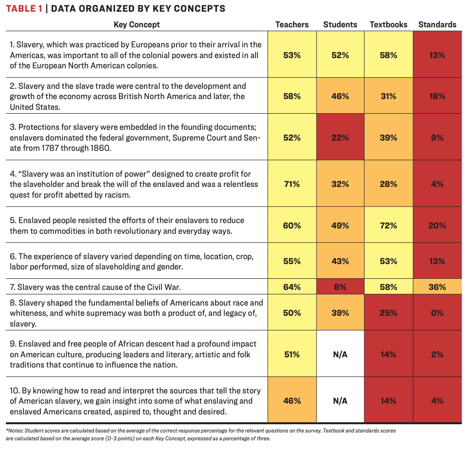

# American Slavery and Juneteenth

The data this week comes from [US Census's Archives](https://www.census.gov/content/dam/Census/library/working-papers/2002/demo/POP-twps0056.pdf), [Slave Voyages](https://slavevoyages.org/), and [Black Past](https://www.blackpast.org/african-american-history-timeline/). 

Additional details can be found via [Wikipedia's Article on Slavery in the US](https://en.wikipedia.org/wiki/Slavery_in_the_United_States), [BlackPast.org](https://www.blackpast.org/), and a [Guardian article on Slavery](https://www.theguardian.com/news/2019/aug/15/400-years-since-slavery-timeline).

Lastly, [BlackPast.org](https://www.blackpast.org/african-american-history/juneteenth-birth-african-american-holiday-2/) and  [Vox](https://www.vox.com/identities/2018/6/19/17476482/juneteenth-holiday-emancipation-african-american-celebration-history) has an article about the importance of Juneteenth as a moment and what the holiday commemorates.

## Suggested Reading Material

Please use your best judgement when working with this data. There is a lot of pain and suffering that we cannot fully capture in simple numbers and charts. We believe that it is important to understand how wide-spread slavery was, how many people were affected then, and how this continually impacts the world.

[Teaching Hard History - American Slavery](https://www.tolerance.org/sites/default/files/2018-02/TT-Teaching-Hard-History-American-Slavery-Report-WEB-February2018.pdf)
> The consequences of slavery continue to distort and stunt lives in America, so it’s quite right that we should engage in what can be an agonizing conversation about this history. Only when our history is faced squarely can removing Confederate monuments be properly understood, as a small but significant step toward ending the celebration of treason and white supremacy, if not toward ameliorating their effects.

We are influenced by the ["Teaching Hard History" resources](https://www.tolerance.org/magazine/publications/teaching-hard-history-american-slavery). Please take the time to review these materials, examine some of the quick [Summary Videos](https://www.tolerance.org/frameworks/teaching-hard-history/american-slavery/key-concept-videos#keyconcept7)

The full article around these education materials can be found [here](https://www.tolerance.org/sites/default/files/2018-02/TT-Teaching-Hard-History-American-Slavery-Report-WEB-February2018.pdf).



# Goals of this Week

The goal of this week's TidyTuesday is to share data related to just how widespread slavery was in the history of the United States (and the rest of the world), highlight the ongoing suppression and violence against Black Lives across hundreds of years and continuing into the present, and celebrate the end of slavery via `Juneteenth` (June 19th) which falls on Thursday of this week. While the [Emancipation Proclamation](https://www.archives.gov/exhibits/featured-documents/emancipation-proclamation) was made law as of 1863-01-01, slave owners in the South - and specifically within Texas - still maintained slavery through 1865 when Union soldiers were able to enforce the law abolishing slavery in the region.

With the provided datasets we can piece together a grim picture of the kidnapping, forced transport, and enslavement of MILLIONS of African people into the Americas and throughout the world across hundreds of years. Additional focus is given across the data for those enslaved into British America or the United States of America itself from 1600-1865. The Black Past dataset adds additional details around the slow granting of various rights to African-Americans, post-slavery brutality, violence and racism, as well as celebrations of achievements across many different categories. The Census data highlights the total slave populations across the United States during the slavery era. This included children born into slavery or additional details around slaves who were not kidnapped and transported by ship.

The last dataset, `african_names.csv` records a history of freed slaves. These slaves were mostly freed during ship transport, had their names and ages recorded and were returned to free ports. Please note that while the data is accurate as historical records can be, often the rescuers and the Africans did not speak the same language, so names and ages are approximate.

The Guardian put together a [detailed article](https://www.theguardian.com/news/2019/aug/15/400-years-since-slavery-timeline) with many graphs highlighting the widespread practice of slavery and subsequent post-slavery racism against Black people in the United States across 400 years (1619 to 2019).

H/t to [Sean Clements](https://twitter.com/SeanfromSeabeck/status/1232363570312036352?s=20) for pointing out the Slave Voyages database and for creating a small [Shiny app](https://seanfromseabeck.shinyapps.io/slave_trade/) using that data.

## Juneteenth details


[Texas Historical Commission Juneteenth Inscription](https://www.thc.texas.gov/public/upload/Juneteenth%20%2814GV08%29%20inscription.pdf)

> COMMEMORATED ANNUALLY ON JUNE 19TH, JUNETEENTH IS THE OLDEST KNOWN CELEBRATION OF THE END OF SLAVERY IN THE U.S. THE EMANCIPATION PROCLAMATION, ISSUED BY PRESIDENT ABRAHAM LINCOLN ON SEP. 22, 1862, ANNOUNCED, “THAT ON THE 1ST DAY OF JANUARY, A.D. 1863, ALL PERSONS HELD AS SLAVES WITHIN ANY STATE…IN REBELLION AGAINST THE U.S. SHALL BE THEN, THENCEFORWARD AND FOREVER FREE.” HOWEVER, IT WOULD TAKE THE CIVIL WAR AND PASSAGE OF THE 13TH AMENDMENT TO THE CONSTITUTION TO END THE BRUTAL INSTITUTION OF AFRICAN AMERICAN SLAVERY.  AFTER THE CIVIL WAR ENDED IN APRIL 1865 MOST SLAVES IN TEXAS WERE STILL UNAWARE OF THEIR FREEDOM. THIS BEGAN TO CHANGE WHEN UNION TROOPS ARRIVED IN GALVESTON. MAJ. GEN. GORDON GRANGER, COMMANDING OFFICER, DISTRICT OF TEXAS, FROM HIS HEADQUARTERS IN THE OSTERMAN BUILDING (STRAND AND 22ND ST.), READ ‘GENERAL ORDER NO. 3’ ON JUNE 19, 1865. THE ORDER STATED “THE PEOPLE OF TEXAS ARE INFORMED THAT, IN ACCORDANCE WITH A PROCLAMATION FROM THE EXECUTIVE OF THE UNITED STATES, ALL SLAVES ARE FREE. THIS INVOLVES AN ABSOLUTE EQUALITY OF PERSONAL RIGHTS AND RIGHTS OF PROPERTY BETWEEN FORMER MASTERS AND SLAVES.” WITH THIS NOTICE, RECONSTRUCTION ERA TEXAS BEGAN.  FREED AFRICAN AMERICANS OBSERVED “EMANCIPATION DAY,” AS IT WAS FIRST KNOWN, AS EARLY AS 1866 IN GALVESTON. AS COMMUNITY GATHERINGS GREW ACROSS TEXAS, CELEBRATIONS INCLUDED PARADES, PRAYER, SINGING, AND READINGS OF THE PROCLAMATION. IN THE MID-20TH CENTURY, COMMUNITY CELEBRATIONS GAVE WAY TO MORE PRIVATE COMMEMORATIONS. A RE-EMERGENCE OF PUBLIC OBSERVANCE HELPED JUNETEENTH BECOME A STATE HOLIDAY IN 1979. INITIALLY OBSERVED IN TEXAS, THIS LANDMARK EVENT’S LEGACY IS EVIDENT TODAY BY WORLDWIDE COMMEMORATIONS THAT CELEBRATE FREEDOM AND THE TRIUMPH OF THE HUMAN SPIRIT.

# Donations

* [Donate to Blackpast.org](https://www.blackpast.org/donate/)  
* [Donate to Teaching Tolerance](https://www.tolerance.org/)  

# Dataset Summary

[`slave_routes.csv`](https://slavevoyages.org/voyage/about#methodology/introduction/0/en/) with methodology and details can be found [here](https://slavevoyages.org/voyage/about#methodology/introduction/0/en/).

> The 36,000 trans-Atlantic voyages contained in the database allows us to infer the total number of voyages carrying slaves from Africa. The Estimates page suggests that 12 ½ million captives (12,520,000) departed Africa for the Americas. Dividing this total by the average number of people embarked per voyage, 304 individuals, yields 41,190 voyages. Similarly, the Estimates pages suggests that 10.7 million enslaved Africans disembarked,mainly in the Americas. Dividing by the average number disembarked per voyage, 265 people, yields an estimated 40,380 voyages arriving. Not all 36,000 voyages in the database carried slaves from Africa. A total of 633 voyages (1.8%) never reached the African coast because they were lost at sea, captured or suffered some other misfortune. After removing these voyages, the database contains some trace of 85 percent of voyages that embarked captives. The database also contains records of 34,106 voyages that disembarked slaves, or could have done so (in other words, for some of these we do not know the outcome of the voyage). A total of 668 of these disembarked their slaves inthe Old World. The latter group comprised mainly ships captured in the nineteenth century which were taken to Sierra Leone and St. Helena as part of the attempt to suppress the trade.

`census.csv`

[Census regions/divisions](https://www2.census.gov/geo/pdfs/maps-data/maps/reference/us_regdiv.pdf)

> HISTORICAL CENSUS STATISTICS ON POPULATION TOTALS BY RACE, 1790 TO 1990

> As noted earlier, the racial categories used in the decennial census have reflected social usage rather than an attempt to define race biologically or genetically. From 1790 to 1850, the only categories recorded were White and Black (Negro), with Black designated as free and slave. 

[`african_names.csv`](https://slavevoyages.org/resources/about#african-names-database/0/en/)

This is essentially a record of slaves who were freed during their forced transport.

> During the last 60 years of the trans-Atlantic slave trade, courts around the Atlantic basins condemned over two thousand vessels for engaging in the traffic and recorded the details of captives found on board including their African names. The African Names Database was created from these records, now located in the Registers of Liberated Africans at the Sierra Leone National Archives, Freetown, as well as Series FO84, FO313, CO247 and CO267 held at the British National Archives in London. Links are provided to the ships in the Voyages Database from which the liberated Africans were rescued, as well as to the African Origins site where users can hear the names pronounced and help us identify the languages in which they think the names are used.

[`blackpast.csv`](https://www.blackpast.org/african-american-history-timeline/)

> BlackPast is dedicated to providing a global audience with reliable and accurate information on the history of African America and of people of African ancestry around the world. We aim to promote greater understanding through this knowledge to generate constructive change in our society.

There are additional full text of [perspectives](https://www.blackpast.org/african-american-history/perspectives-african-american-history/) and [speeches](https://www.blackpast.org/african-american-history/speeches-african-american-history/) that are worth reading through.

### Get the data here

```{r}
# Get the Data

blackpast <- readr::read_csv('https://raw.githubusercontent.com/rfordatascience/tidytuesday/master/data/2020/2020-06-16/blackpast.csv')
census <- readr::read_csv('https://raw.githubusercontent.com/rfordatascience/tidytuesday/master/data/2020/2020-06-16/census.csv')
slave_routes <- readr::read_csv('https://raw.githubusercontent.com/rfordatascience/tidytuesday/master/data/2020/2020-06-16/slave_routes.csv')
african_names <- readr::read_csv('https://raw.githubusercontent.com/rfordatascience/tidytuesday/master/data/2020/2020-06-16/african_names.csv')

# Or read in with tidytuesdayR package (https://github.com/thebioengineer/tidytuesdayR)

# Either ISO-8601 date or year/week works

# Install via devtools::install_github("thebioengineer/tidytuesdayR")

tuesdata <- tidytuesdayR::tt_load('2020-06-16')
tuesdata <- tidytuesdayR::tt_load(2020, week = 25)


blackpast <- tuesdata$blackpast
```
### Data Dictionary

# `blackpast.csv`

|variable |class     |description |
|:--------|:---------|:-----------|
|year     |character | Year of event |
|events   |character | Details of events |
|subject  |character | Subject category |
|country  |character | Country where event occurred or affected |
|state    |character | State within a country |
|era      |character | Era when event occurred |

# `slave_routes.csv`

Please note that there is missing data for many of the voyages, where this database only contains details for approximately 5 million enslaved Africans who arrived alive at the final port. Many slaves died in transport, or the details around the slave voyage were not fully recorded.

|variable          |class     |description |
|:-----------------|:---------|:-----------|
|voyage_id         |double    | Unique id for the slave voyage |
|ship_name         |character | Name of Ship|
|port_origin       |character | Port of Origin |
|place_of_purchase |character | Place where slaves were enslaved and purchased |
|port_arrival      |character | Port where the slave ship arrived |
|year_arrival      |double    | Year of arrival |
|n_slaves_arrived  |double    | Number of slaves that arrived at final destination |
|captains_name     |character | Name of the captain of the slave ship |

# `census.csv`

|variable     |class     |description |
|:------------|:---------|:-----------|
|region       |character | Census region |
|division     |character | Census division |
|year         |double    | Census year |
|total        |double    | Census total population by region/division |
|white        |double    | White population |
|black        |double    | Black population |
|black_free   |double    | Free black population |
|black_slaves |double    | Enslaved black population |

### Cleaning Script

```{r}
library(pdftools) # reading in the PDF tables
library(tidyverse) # requires tidy 1.0 and dplyr 1.0 for below example

# black past, african names & slave routes database
# Just cleaned up the names

routes <- read_csv("2020/2020-06-16/slave_routes.csv")

# test plot
cleaned_routes %>%
  mutate(decade = 10 * (year_arrival %/% 10)) %>% 
  group_by(decade) %>% 
  summarize(n = sum(n_slaves_arrived, na.rm = TRUE)) %>% 
  ggplot(aes(x = decade, y = n)) + 
  geom_col() +
  scale_y_continuous(labels = scales::label_number())


 -----------------------------------------------------------

raw_names <- read_csv("2020/2020-06-16/african_names.csv")

raw_names %>% 
  ggplot(aes(x = age)) +
  geom_density() + facet_wrap(~gender, ncol = 1)

# Census Populations ------------------------------------------------------

# Read in the raw PDF
raw_pdf <- pdftools::pdf_text("2020/2020-06-16/POP-twps0056.pdf")

# test on one page
raw_text <- raw_pdf[[31]] %>% 
  str_split("\n")

# Some attempts at cleaning the data
mw_test <- raw_text %>%
  unlist() %>% 
  .[7:38] %>% 
  .[str_detect(., ".......")] %>% 
  .[str_which(str_sub(., 1), "1")] %>% 
  str_remove_all("\\.") %>% 
  .[c(1,3,5,9:26)] %>% 
  str_replace_all("([0-9])(\\s)([0-9])", "\\1\\3") %>% 
  str_squish() 

midwest <- mw_test %>% 
  read_table(col_names = FALSE) %>% 
  separate(X2, into = c("total", "white", "black", "native",
                        "asian", "other", "hispanic", "white_other"
  )) %>% 
  select(year = X1, total:black) %>% 
  filter(year <= 1870) %>% 
  mutate(across(c(total:black), parse_number)) %>% 
  add_column(black_free = c(273080, 69291, 48185, 30743, 15664, 6931, 3630, 500)) %>% 
  mutate(black_slaves = black - black_free, 
         region = "Midwest") %>% 
  select(region, everything())


# trying for the US Total
us_raw <- raw_pdf[[29]] %>% 
  str_split("\n") %>% 
  unlist()

str_subset(us_raw, all_years) %>% 
  str_subset("Table", negate = TRUE) %>% 
  .[c(1:9)]

all_years <- seq(1790, 1870, by = 10) %>% 
  paste0(collapse = "|")

us_raw[str_detect(us_raw, all_years)] %>% 
  .[2:10]

# Create a robust function to get tables
get_population <- function(page_number, division, free_blacks){
  
  # match regions and divisions
  regions <- case_when(
    division %in% c("New England","Middle Atlantic") ~ "Northeast",
    division %in% c("East North Central", "West North Central") ~ "Midwest",
    division %in% c("South Atlantic", "East South Central", "West South Central") ~ "South",
    division %in% c("Mountain", "Pacific") ~ "West",
    division %in% c("Northeast", "Midwest", "South", "West") ~ division,
    TRUE ~ "USA Total"
  )
  
  # years to filter down to
  all_years <- seq(1790, 1870, by = 10) %>% 
    paste0(collapse = "|")
  
  # get specific page and separate into lines
  raw_pdf_text <- raw_pdf[[page_number]] %>% 
    str_split("\n") %>% 
    unlist()
  
  # filter down to matching years and exclude table row
  raw_table <- str_subset(raw_pdf_text, all_years) %>% 
    str_subset("Table", negate = TRUE)
  
  clean_table <-  raw_table %>% 
    str_remove_all("\\.") %>% 
    # find space in between digits and drop the space
    str_replace_all("([0-9])(\\s)([0-9])", "\\1\\3") %>% 
    str_squish() %>% 
    # couldn't get this to work nicely, but this works fine w/ separate
    read_table(col_names = FALSE) %>% 
    separate(X2, into = c("total", "white", "black", "native",
                          "asian", "other", "hispanic", "white_other"
    )) %>% 
    select(year = X1, total:black) %>% 
    # parse character numbers
    mutate(across(c(total:black), parse_number)) %>% 
    # exclude percentage
    filter(total > 1000) %>% 
    # add in the free black people
    add_column(black_free = free_blacks) %>%
    # assign region/division
    mutate(black_slaves = black - black_free,
           division = division,
           region = regions,
           division = if_else(division == region, NA_character_, division)) %>%
    select(region, division, everything())
  
  # return table
  clean_table
  
}

# Testing for Midwest
get_population(31, "Midwest", c(273080, 69291, 48185, 30743, 15664, 6931, 3630, 500))

# Testing for US
get_population(29, "USA", c(273080, 69291, 48185, 30743, 15664, 6931, 3630, 500, 0))

# Apply the function at scale
total_census <- tibble(
  page_number = c(29:42),
  division = c("USA Total", "Northeast", "Midwest", "South", "West", 
             "New England", "Middle Atlantic", "East North Central",
             "West North Central", "South Atlantic", 
             "East South Central", "West South Central",
             "Mountain", "Pacific"
             ),
  # manually aggregated
  free_blacks = list(
    c(4880009, 488070, 434495,386293,619599,233634,186446,108435,59527),
    c(179738,155983,149526,141559,122434,92723,75156,46696,27070),
    c(273080, 69291, 48185, 30743, 15664, 6931, 3630, 500),
    c(4420811, 258346,235569,213991,181501,133980,107660,61239,32457),
    c(6380,4450,1215),
    c(31705, 24711,23021,22634,21331,20782,19488,17313,13117),
    c(148033,131272,126505,118925,101103,71941,55668,29383,13953),
    c(130497,63699,45195,28997,15095,6584,3025,500),
    c(142583,5592,2990,1746,569,347,605),
    c(2216705, 217753,197474,171778,153087,116920,96803,60009,31982),
    c(1464252, 21447,19628,16246,11563,6525,3270,1230,475),
    c(739854, 19146,18467,25967,16851,10535,7587),
    c(1555,206,46),
    c(4825,4244,1169)
  )
) %>% 
  mutate(data = pmap(., get_population)) %>% 
  select(data) %>% 
  unnest(data) %>% 
  mutate(region)

# test plot
total_census %>% 
  mutate(percent_slaves = black_slaves/black * 100) %>% 
  filter(is.na(division), region != "USA Total")%>% 
  ggplot(aes(x = year, y = percent_slaves, color = region)) +
  geom_line() +
  facet_wrap(~region)

total_census %>% 
  mutate(percent_slaves = black_slaves/black * 100) %>% 
  filter(is.na(division), region != "USA Total") %>% 
  group_by(region) %>% 
  filter(year != 1870) %>% 
  summarize(mean_slavery = mean(percent_slaves),
            sd = sd(percent_slaves)) %>% 
  arrange(desc(mean_slavery))

total_census %>% 
  mutate(percent_slaves = black_slaves/black * 100) %>% 
  filter(is.na(division), region != "USA Total") %>% 
  filter(year != 1870) %>% 
  arrange(desc(percent_slaves)) %>% 
  ggplot(aes(x = fct_inorder(region), y = percent_slaves, color = year)) +
  viridis::scale_color_viridis() +
  geom_jitter(size = 3, width = 0.1) +
  geom_boxplot(width = 0.75, alpha = 0.5) +
  labs(x = "", y = "Blacks enslaved as a percentage of the region's total black population  (%)",
       
       subtitle = "Years between 1790 and 1860") +
  scale_y_continuous(breaks = c(0, 25, 50, 75, 90, 100)) +
  geom_hline(yintercept = 90)

total_census %>% write_csv("2020/2020-06-16/census.csv")

```
