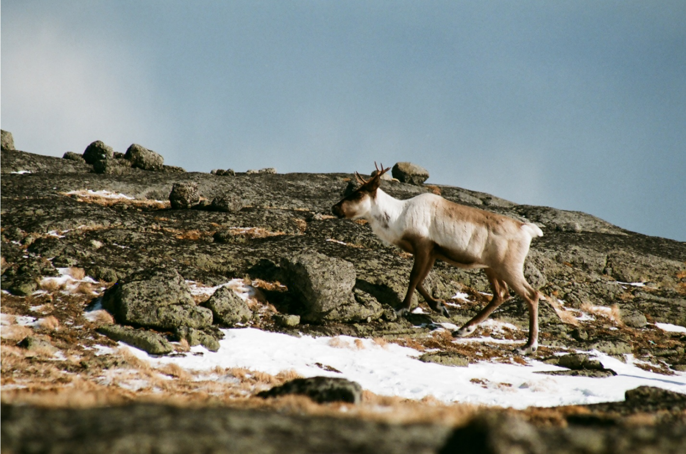

# Caribou Location Tracking

This data tracks [woodland caribou](https://en.wikipedia.org/wiki/Boreal_woodland_caribou) in northern British Columbia, a Canadian province. It consists of almost 250,000 location tags of 260 caribou, from 1988 to 2016.

h/t to [Alex Cookson](https://twitter.com/alexcookson) for preparing this week's data!

The tracking was part of a study prepared in 2014 by the [B.C. Ministry of Environment & Climate Change](https://gov.bc.ca/env) to inform the management and recovery of the species, which is [classified as "Vulnerable"](https://www.iucnredlist.org/species/29742/22167140) on the International Union for the Conservation of Nature's (IUCN) [Red List](https://www.iucnredlist.org/).

The caribou range in North America/Canada is visualized courtesy of [Wikipedia](https://en.wikipedia.org/wiki/Boreal_woodland_caribou).


Data was accessed through [Movebank](https://www.movebank.org/cms/movebank-content/about-movebank), "a free online platform that helps researchers manage, share, analyze and archive animal movement data."

**Original article citation**

> BC Ministry of Environment (2014) Science update for the South Peace Northern Caribou (Rangifer tarandus caribou pop. 15) in British Columbia. Victoria, BC. 43 p. url:https://www2.gov.bc.ca/assets/gov/environment/plants-animals-and-ecosystems/wildlife-wildlife-habitat/caribou/science_update_final_from_web_jan_2014.pdf

**Data package citation**

> Seip DR, Price E (2019) Data from: Science update for the South Peace Northern Caribou (Rangifer tarandus caribou pop. 15) in British Columbia. Movebank Data Repository. https://doi.org/10.5441/001/1.p5bn656k

### Get the data here

```{r}
# Get the Data

individuals <- readr::read_csv('https://raw.githubusercontent.com/rfordatascience/tidytuesday/master/data/2020/2020-06-23/individuals.csv')
locations <- readr::read_csv('https://raw.githubusercontent.com/rfordatascience/tidytuesday/master/data/2020/2020-06-23/locations.csv')

# Or read in with tidytuesdayR package (https://github.com/dslc-io/tidytuesdayR)

# Either ISO-8601 date or year/week works!

# Install via pak::pak("dslc-io/tidytuesdayR")

tuesdata <- tidytuesdayR::tt_load('2020-06-23')
tuesdata <- tidytuesdayR::tt_load(2020, week = 26)


individuals <- tuesdata$individuals
```

# Data Dictionary

"Deployment" refers to when the animal was fitted with a location-tracking tag.


### `individuals.csv`

| variable             | class     | description                                                  |
| :------------------- | :-------- | :----------------------------------------------------------- |
| animal_id            | character | Individual identifier for animal                             |
| sex                  | character | Sex of animal                                                |
| life_stage           | character | Age class (in years) at beginning of deployment              |
| pregnant             | logical   | Whether animal was pregnant at beginning of deployment       |
| with_calf            | logical   | Whether animal had a calf at time of deployment              |
| death_cause          | character | Cause of death                                               |
| study_site           | character | Deployment site or colony, or a location-related group such as the herd or pack name |
| deploy_on_longitude  | double    | Longitude where animal was released at beginning of deployment |
| deploy_on_latitude   | double    | Latitude where animal was released at beginning of deployment |
| deploy_on_comments   | character | Additional information about tag deployment                  |
| deploy_off_longitude | double    | Longitude where deployment ended                             |
| deploy_off_latitude  | double    | Latitude where deployment ended                              |
| deploy_off_type      | character | Classification of tag deployment end (see table below for full description) |
| deploy_off_comments  | character | Additional information about tag deployment end              |


**`deploy_off_type` classifications**

| deploy_off_type   | description                                                  |
| :---------------- | :----------------------------------------------------------- |
| captured          | Tag remained on the animal but the animal was captured or confined |
| dead              | Deployment ended with the death of the animal that was carrying the tag |
| equipment failure | Tag stopped working                                          |
| fall off          | Attachment of the tag to the animal failed, and it fell of accidentally |
| other             | Catch-all category for other deployment end types            |
| released          | Tag remained on the animal but the animal was released from captivity or confinement |
| removal           | Tag was purposefully removed from the animal                 |
| unknown           | Deployment ended by an unknown cause                         |


### `locations.csv`

| variable   | class     | description                                                  |
| :--------- | :-------- | :----------------------------------------------------------- |
| event_id   | double    | Identifier for an individual measurement                     |
| animal_id  | character | Individual identifier for animal                             |
| study_site | character | Deployment site or colony, or a location-related group such as the herd or pack name |
| season     | character | Season (Summer/Winter) at time of measurement                |
| timestamp  | datetime  | Date and time of measurement                                 |
| longitude  | double    | Longitude of measurement                                     |
| latitude   | double    | Latitude of measurement                                      |

### Cleaning Script

```{r}
# Load libraries
library(tidyverse)
library(janitor)

# Import data
individuals_raw <- read_csv("./caribou-location-tracking/raw/Mountain caribou in British Columbia-reference-data.csv")
locations_raw <- read_csv("./caribou-location-tracking/raw/Mountain caribou in British Columbia-gps.csv")

# Clean individuals
individuals <- individuals_raw %>%
  clean_names() %>%
  transmute(animal_id,
            sex = animal_sex,
            # Getting rid of whitespace to address inconsistent spacing
            # NOTE: life stage is as of the beginning of deployment
            life_stage = str_remove_all(animal_life_stage, " "),
            reproductive_condition = animal_reproductive_condition,
            # Cause of death "cod" is embedded in a comment field
            death_cause = str_remove(animal_death_comments, ".*cod "),
            study_site,
            deploy_on_longitude,
            deploy_on_latitude,
            # Renaming to maintain consistency "deploy_on_FIELD" and "deploy_off_FIELD"
            deploy_on_comments = deployment_comments,
            deploy_off_longitude,
            deploy_off_latitude,
            deploy_off_type = deployment_end_type,
            deploy_off_comments = deployment_end_comments) %>%
  # reproductive_condition actually has two dimensions
  separate(reproductive_condition, into = c("pregnant", "with_calf"), sep = ";", fill = "left") %>%
  mutate(pregnant = str_remove(pregnant, "pregnant: ?"),
         with_calf = str_remove(with_calf, "with calf: ?")) %>%
  # TRUE and FALSE are indicated by Yes/No or Y/N
  mutate_at(vars(pregnant:with_calf), ~ case_when(str_detect(., "Y") ~ TRUE,
                                                   str_detect(., "N") ~ FALSE,
                                                   TRUE ~ NA))

# Clean locations
locations <- locations_raw %>%
  clean_names() %>%
  transmute(event_id,
            animal_id = individual_local_identifier,
            study_site = comments,
            season = study_specific_measurement,
            timestamp,
            longitude = location_long,
            latitude = location_lat)

# Write to CSV
write_csv(individuals, "./caribou-location-tracking/individuals.csv")
write_csv(locations, "./caribou-location-tracking/locations.csv")
```
