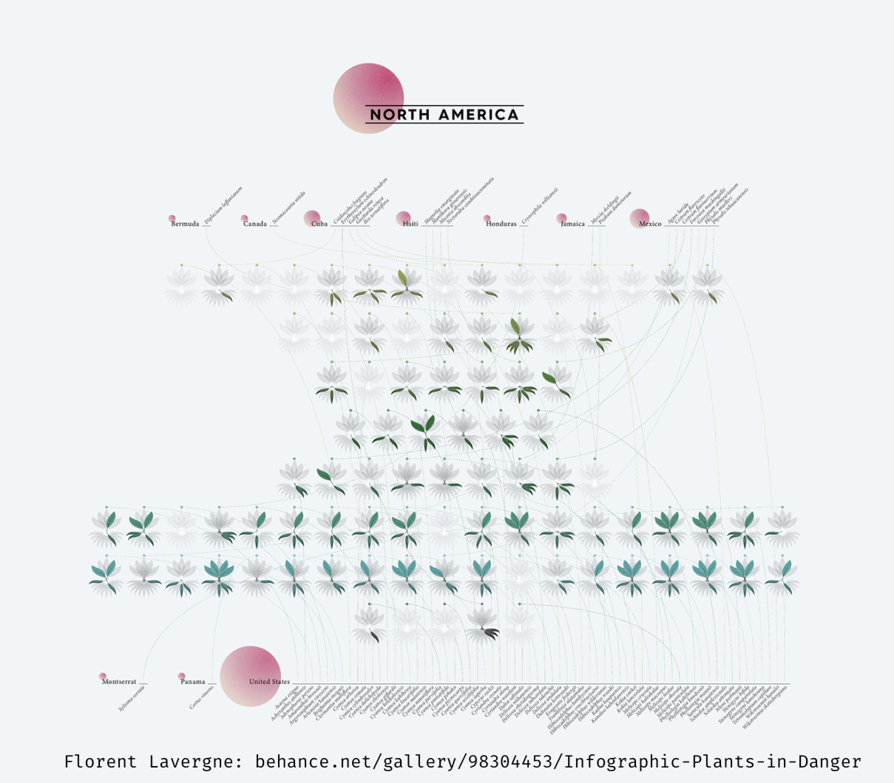

# Plants in Danger

The data this week comes from the [International Union for Conservation of Nature (IUCN) Red list of Threatened Species (Version 2020-1)](https://www.iucnredlist.org) and was scrapped and prepared by [Florent Lavergne](https://www.behance.net/florentlavergne) for his [fantastic and unique infographic](https://www.behance.net/gallery/98304453/Infographic-Plants-in-Danger).

Here is what Florent says about the rationale of this project:

> Just like animals, plants are going through an important biodiversity crisis. Many species from isolated areas are facing extinction due to human activities. Using distribution data from the International Union for Conservation of Nature (IUCN), I designed these network maps to inform on an important yet underrepresented topic.

In total, 500 plant species are considered extinct as of 2020. 19.6% of those were endemic to Madagascar, 12.8% to Hawaiian islands.

Note that simply joining the `threats` and `actions` datasets together is not fully appropriate as the row alignment of threats and actions doesn't correspond. You can do `dplyr::left_join()` without any problem, but again be warned that you shouldn't make any decisions based off threat + action occuring or not occuring in the same `observation`.

### Further reading:

* You can find more details on threatened species, summary statistics, articles, and more on the different Red List categories on the [IUCN main page](https://www.iucnredlist.org/).

* This [study published in Science in 2019](https://advances.sciencemag.org/content/5/11/eaax9444) provides some general information about extinction risks of plants in general and some analyses and visualization about the African flora at risk.

* The IUCN itself shared a [blog post](https://www.iucn.org/news/species/201909/over-half-europes-endemic-trees-face-extinction) on the extinction risk of European endemic trees.

Credit: [Florent Lavergne](https://www.behance.net/florentlavergne) and [Cédric Scherer](twitter.com/@CedScherer)

### Get the data here

```{r}
# Get the Data

# Read in with tidytuesdayR package 
# Install from CRAN via: install.packages("tidytuesdayR")
# This loads the readme and all the datasets for the week of interest

# Either ISO-8601 date or year/week works!

tuesdata <- tidytuesdayR::tt_load('2020-08-18')
tuesdata <- tidytuesdayR::tt_load(2020, week = 34)

plants <- tuesdata$plants

# Or read in the data manually

plants <- readr::read_csv('https://raw.githubusercontent.com/rfordatascience/tidytuesday/master/data/2020/2020-08-18/plants.csv')
actions <- readr::read_csv('https://raw.githubusercontent.com/rfordatascience/tidytuesday/master/data/2020/2020-08-18/actions.csv')
threats <- readr::read_csv('https://raw.githubusercontent.com/rfordatascience/tidytuesday/master/data/2020/2020-08-18/threats.csv')

```
### Data Dictionary

# `plants.csv`

|variable         |class     |description                             |
|:----------------|:---------|:---------------------------------------|
|binomial_name    |character | Species name (Genus + species)         |
|country          |character | Country of origin                      |
|continent        |character | Continent of origin                    |
|group            |character | Taxonomic group                        |
|year_last_seen   |character | Period species was last seen           |
|threat_AA        |double    | Threat: Agriculture & Aquaculture      |
|threat_BRU       |double    | Threat: Biological Resource Use        |
|threat_RCD       |double    | Threat: Commercial Development         |
|threat_ISGD      |double    | Threat: Invasive Species               |
|threat_EPM       |double    | Threat: Energy Production & Mining     |
|threat_CC        |double    | Threat: Climate Change                 |
|threat_HID       |double    | Threat: Human Intrusions               |
|threat_P         |double    | Threat: Pollution                      |
|threat_TS        |double    | Threat: Transportation Corridor        |
|threat_NSM       |double    | Threat: Natural System Modifications   |
|threat_GE        |double    | Threat: Geological Events              |
|threat_NA        |double    | Threat unknown                         |
|action_LWP       |double    | Current action: Land & Water Protection|
|action_SM        |double    | Current action: Species Management     |
|action_LP        |double    | Current action: Law & Policy           |
|action_RM        |double    | Current action: Research & Monitoring  |
|action_EA        |double    | Current action: Education & Awareness  |
|action_NA        |double    | Current action unknown                 |
|red_list_category|character | IUCN Red List category                 |

# `threats.csv`

|variable          |class     |description |
|:-----------------|:---------|:-----------|
|binomial_name    |character | Species name (Genus + species)         |
|country          |character | Country of origin                      |
|continent        |character | Continent of origin                    |
|group            |character | Taxonomic group                        |
|year_last_seen   |character | Period species was last seen           |
|red_list_category|character | IUCN Red List category                 |
|threat_type       |character | Type of threat |
|threatened        |double    | Binary 0 or 1 (not threatened by this), and 1 (threatened) |

# `actions.csv`

|variable          |class     |description |
|:-----------------|:---------|:-----------|
|binomial_name    |character | Species name (Genus + species)         |
|country          |character | Country of origin                      |
|continent        |character | Continent of origin                    |
|group            |character | Taxonomic group                        |
|year_last_seen   |character | Period species was last seen           |
|red_list_category|character | IUCN Red List category                 |
|action_type       |character | Type of action|
|action_taken      |double    | Binary 0 (Action not taken) or 1 (Action Taken) |

### Cleaning Script

```{r}
library(tidyverse)
library(tidytext)

plants_wide <- read_csv("https://raw.githubusercontent.com/Z3tt/TidyTuesday/master/data/raw_plants/plants_extinct_wide.csv")

plants_wide %>% 
  write_csv(here::here("2020", "2020-08-18", "plants.csv"))

threats <- plants_wide %>% 
  select(-contains("action")) %>% 
  pivot_longer(cols = contains("threat"), names_to = "threat_type", 
               values_to = "threatened", names_prefix = "threat_") %>% 
  mutate(threat_type = case_when(
    threat_type == "AA" ~ "Agriculture & Aquaculture",
    threat_type == "BRU" ~ "Biological Resource Use",
    threat_type == "RCD" ~ "Commercial Development",
    threat_type == "ISGD" ~ "Invasive Species",
    threat_type == "EPM" ~ "Energy Production & Mining",
    threat_type == "CC" ~ "Climate Change",
    threat_type == "HID" ~ "Human Intrusions",
    threat_type == "P" ~ "Pollution",
    threat_type == "TS" ~ "Transportation Corridor",
    threat_type == "NSM" ~ "Natural System Modifications",
    threat_type == "GE" ~ "Geological Events",
    threat_type == "NA" ~ "Unknown",
    TRUE ~ NA_character_
  )) 

threats %>% 
  write_csv(here::here("2020", "2020-08-18", "threats.csv"))

threat_filtered <- threats %>% 
  filter(threatened == 1) 

threat_filtered %>% 
  janitor::tabyl(threat_type, threatened)

actions <- plants_wide %>% 
      select(-contains("threat")) %>% 
      pivot_longer(cols = contains("action"), names_to = "action_type", 
                   values_to = "action_taken", names_prefix = "action_") %>% 
      mutate(action_type = case_when(
        action_type == "LWP" ~ "Land & Water Protection",
        action_type == "SM" ~ "Species Management",
        action_type == "LP" ~ "Law & Policy",
        action_type == "RM" ~ "Research & Monitoring",
        action_type == "EA" ~ "Education & Awareness",
        action_type == "NA" ~ "Unknown",
        TRUE ~ NA_character_
      )) 

actions %>% 
  write_csv(here::here("2020", "2020-08-18", "actions.csv"))

action_filtered <- actions %>% 
  filter(action_taken == 1) 

action_filtered %>% 
  janitor::tabyl(action_type, action_taken)

threat_filtered %>% 
  count(continent, group, threat_type) %>% 
  ggplot(aes(y = tidytext::reorder_within(threat_type, n, continent), x = n, fill = group)) +
  geom_col() +
  tidytext::scale_y_reordered() +
  facet_wrap(~continent, scales = "free_y", ncol = 1)
```
