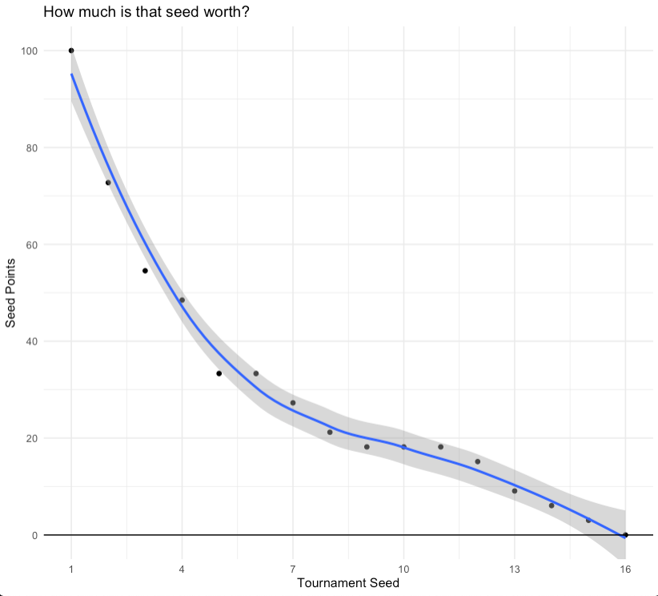

# NCAA Women's Basketball Tournament

The data this week comes from [FiveThirtyEight](https://fivethirtyeight.com/features/louisiana-tech-was-the-uconn-of-the-80s/). The original raw data is on their [GitHub]. More details about the [NCAA Women's Basketball Tournament](https://en.wikipedia.org/wiki/NCAA_Division_I_Women%27s_Basketball_Tournament) which expended to 64 teams in 1994. There are some additional data points at that Wikipedia link if you're curious!

Note that for their dataviz, they converted seed to a [100 point scale based off the average wins/seed](https://fivethirtyeight.com/features/tom-izzo-is-the-best-coach-in-modern-ncaa-tournament-history-by-far/). Note that FiveThirtyEight used Simple Rating System scores from Sports-Reference, but I've simplified it into simply the average per seed.

A quick table of this as seen below:  


> To measure this, we awarded "seed points" in proportion to a given seed number's expected wins in the tournament, calibrated to a 100-point scale where the No. 1 seed gets 100 points, No. 2 gets 70 points, and so forth.

This aligns to (based off the averages):  

|Seed  |Points|
|:-----|:-----|
| 1st | 100 |
| 2nd | 72.7 |
| 3rd | 54.5 |
| 4th | 48.5 |
| 5th | 33.3 |
| 6th | 33.3 |
| 7th | 27.3 |
| 8th | 21.2 |
| 9th | 18.2 |
| 10th | 18.2 |
| 11th | 18.2 |
| 12th | 15.2 |
| 13th | 9.09 |
| 14th | 6.06 |
| 15th | 3.03 |
| 16th | 0 |

Their modeled fit:


You could see the quick plot of these points, but again note that this will vary a bit from the FiveThirtyEight table as they included SRS score in their equation.  

```{r}
tibble(
  seed = c(1:16),
  exp_wins = c(3.3, 2.4, 1.8, 1.6, 1.1, 1.1, 0.9, 0.7, 0.6, 0.6, 0.6, 0.5, 0.3, 0.2, 0.1, 0)
  
) %>% 
  mutate(
    points = exp_wins/3.3 * 100
  ) %>% 
  ggplot(aes(x = seed, y = points)) +
  geom_point() +
  geom_smooth() +
  geom_hline(yintercept = 0, color = "black") +
  scale_y_continuous(breaks = seq(0, 100, by = 20)) +
  coord_cartesian(ylim = c(0, 100)) +
  scale_x_continuous(breaks = seq(1, 16, by = 3)) +
  theme_minimal() +
  labs(
    x = "Tournament Seed", y = "Seed Points",
    title = "How much is that seed worth?"
  )

```



Thus, to get the points for each team/tournament season you can multiply the teams initial seed (1 - 16) by the assigned points as defined in the above table of 100 - 0.

### Get the data here

```{r}
# Get the Data

# Read in with tidytuesdayR package 
# Install from CRAN via: install.packages("tidytuesdayR")
# This loads the readme and all the datasets for the week of interest

# Either ISO-8601 date or year/week works!

tuesdata <- tidytuesdayR::tt_load('2020-10-06')
tuesdata <- tidytuesdayR::tt_load(2020, week = 41)

tournament <- tuesdata$tournament

# Or read in the data manually

tournament <- readr::read_csv('https://raw.githubusercontent.com/rfordatascience/tidytuesday/master/data/2020/2020-10-06/tournament.csv')

```
### Data Dictionary

# Seed Point Value as defined in a separate [FiveThirtyEight Article](https://fivethirtyeight.com/features/tom-izzo-is-the-best-coach-in-modern-ncaa-tournament-history-by-far/)

|Seed  |Points|
|:-----|:-----|
| 1st | 100 |
| 2nd | 72.7 |
| 3rd | 54.5 |
| 4th | 48.5 |
| 5th | 33.3 |
| 6th | 33.3 |
| 7th | 27.3 |
| 8th | 21.2 |
| 9th | 18.2 |
| 10th | 18.2 |
| 11th | 18.2 |
| 12th | 15.2 |
| 13th | 9.09 |
| 14th | 6.06 |
| 15th | 3.03 |
| 16th | 0 |

# `tournament.csv`

To get the points for each team/tournament season you can multiply the teams initial seed (1 - 16) by the assigned points as defined in the above table of 100 - 0.

|variable          |class     |description |
|:-----------------|:---------|:-----------|
|year              |double    | Tournament year |
|school            |character | School name |
|seed              |double    | Seed rank |
|conference        |character | Conference name |
|conf_w            |double    | Conference wins |
|conf_l            |double    | Conference losses |
|conf_percent      |double    | Conference win/loss percent |
|conf_place        |character | Conference placement (ie, 1st, 2nd, etc) |
|reg_w             |double    | Regular season wins |
|reg_l             |double    | Regular season losses |
|reg_percent       |double    | Regular season win/loss percent|
|how_qual          |character | How qualified - Whether the school qualified with an automatic bid (by winning its conference or conference tournament) or an at-large bid |
|x1st_game_at_home |character | Whether the school played its first-round tournament games on its home court. |
|tourney_w         |double    | Tournament wins |
|tourney_l         |double    | Tournament games losses |
|tourney_finish    |character | Tournament finish - The round of the final game for each team. OR=opening-round loss (1983 only); 1st=first-round loss; 2nd=second-round loss; RSF=loss in the Sweet 16; RF=loss in the Elite Eight; NSF=loss in the national semifinals; N2nd=national runner-up; Champ=national champions |
|full_w            |double    | Total sum of wins |
|full_l            |double    | Total sum of losses |
|full_percent      |double    | Total sum win/loss percent |

### Cleaning Script

```{r}
library(tidyverse)

raw_df <- read_csv("https://raw.githubusercontent.com/fivethirtyeight/data/master/ncaa-womens-basketball-tournament/ncaa-womens-basketball-tournament-history.csv")

clean_tourn <- raw_df %>% 
  janitor::clean_names() %>% 
  mutate(across(c(seed, conf_w:conf_percent, full_percent), parse_number))

clean_tourn %>% 
  write_csv("2020/2020-10-06/tournament.csv")

```
