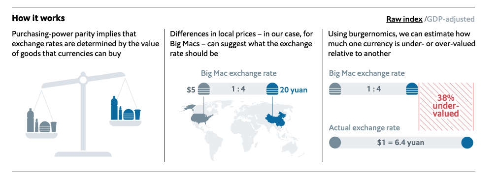

# The Big Mac index

The data this week comes from [TheEconomist](https://github.com/TheEconomist/big-mac-data). Their article about this dataset can be found [here](https://www.economist.com/news/2020/07/15/the-big-mac-index).


> This repository contains the data behind _The Economist’s_ Big Mac index, and code that shows how we calculate it. To download the data, go to the [latest release][latest release], where you can download the index data in a CSV or Excel, or the [code behind it][notebook link].

## Source data

> Our source data are from several places. Big Mac prices are from McDonald’s directly and from reporting around the world; exchange rates are from Thomson Reuters; GDP and population data used to calculate the euro area averages are from Eurostat and GDP per person data are from the IMF World Economic Outlook reports.


### Get the data here

```{r}
# Get the Data

# Read in with tidytuesdayR package 
# Install from CRAN via: install.packages("tidytuesdayR")
# This loads the readme and all the datasets for the week of interest

# Either ISO-8601 date or year/week works!

tuesdata <- tidytuesdayR::tt_load('2020-12-22')
tuesdata <- tidytuesdayR::tt_load(2020, week = 52)

big-mac <- tuesdata$big-mac

# Or read in the data manually

big-mac <- readr::read_csv('https://raw.githubusercontent.com/rfordatascience/tidytuesday/master/data/2020/2020-12-22/big-mac.csv')

```
### Data Dictionary

# `big-mac.csv`

| variable      | definition                                            | source                     |
| ------------- | ----------------------------------------------------- | -------------------------- |
| date          | Date of observation                                   |
| iso_a3        | Three-character [ISO 3166-1 country code][iso 3166-1] |
| currency_code | Three-character [ISO 4217 currency code][iso 4217]    |
| name          | Country name                                          |
| local_price   | Price of a Big Mac in the local currency              | McDonalds; _The Economist_ |
| dollar_ex     | Local currency units per dollar                       | _Reuters_                  |
| dollar_price  | Price of a Big Mac in dollars                         |
| USD_raw       | Raw index, relative to the US dollar                  |
| EUR_raw       | Raw index, relative to the Euro                       |
| GBP_raw       | Raw index, relative to the British pound              |
| JPY_raw       | Raw index, relative to the Japanese yen               |
| CNY_raw       | Raw index, relative to the Chinese yuan               |
| GDP_dollar    | GDP per person, in dollars                            | IMF                        |
| adj_price     | GDP-adjusted price of a Big Mac, in dollars           |
| USD_adjusted  | Adjusted index, relative to the US dollar             |
| EUR_adjusted  | Adjusted index, relative to the Euro                  |
| GBP_adjusted  | Adjusted index, relative to the British pound         |
| JPY_adjusted  | Adjusted index, relative to the Japanese yen          |
| CNY_adjusted  | Adjusted index, relative to the Chinese yuan          |

### Cleaning Script

