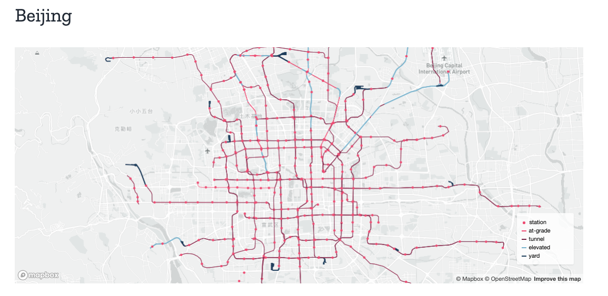

# Transit Costs Project

The data this week comes from [Transit Costs Project](https://transitcosts.com/). 

> Why do transit-infrastructure projects in New York cost 20 times more on a per kilometer basis than in Seoul? We investigate this question across hundreds of transit projects from around the world. We have created a database that spans more than 50 countries and totals more than 11,000 km of urban rail built since the late 1990s. We will also examine this question in greater detail by carrying out six in-depth case studies that take a closer look at unique considerations and variables that aren’t easily quantified, like project management, governance, and site conditions.
> 
> The goal of this work is to figure out how to deliver more high-capacity transit projects for a fraction of the cost in countries like the United States. Additionally, we hope that our site will be a useful resource for elected officials, planners, researchers, journalists, advocates, and others interested in contextualizing transit-infrastructure costs and fighting for better projects.

The first completed Case Study can be found on [Boston's Green Line](https://transitcosts.com/city/boston-case-the-story-of-the-green-line-extension/), although there is data from around the world!

The raw data is available as a [Google Sheet](https://docs.google.com/spreadsheets/d/1nSqMcM660kGZjoe91S44o_9PPZLq6wJwA9LuzVpVfCM/edit#gid=0), although I've downloaded and provided it as a `.csv`.

### Get the data here

```{r}
# Get the Data

# Read in with tidytuesdayR package 
# Install from CRAN via: install.packages("tidytuesdayR")
# This loads the readme and all the datasets for the week of interest

# Either ISO-8601 date or year/week works!

tuesdata <- tidytuesdayR::tt_load('2021-01-05')
tuesdata <- tidytuesdayR::tt_load(2021, week = 2)

transit_cost <- tuesdata$transit_cost

# Or read in the data manually

transit_cost <- readr::read_csv('https://raw.githubusercontent.com/rfordatascience/tidytuesday/master/data/2021/2021-01-05/transit_cost.csv')

```
### Data Dictionary

# `transit_cost.csv`

|variable         |class     |description |
|:----------------|:---------|:-----------|
|e                |double    | ID |
|country          |character | Country Code - can be joined against `countrycode` via `ecb` or `iso2c` |
|city             |character | City where transit tunnel is being created |
|line             |character | Line name or path |
|start_year       |character | Year started |
|end_year         |character | Year ended (predicted or actual) |
|rr               |double    | I think this is Railroad (0 or 1), where 1 == Railroad? |
|length           |double    | Length of proposed line in km |
|tunnel_per       |character | Percent of line length completed |
|tunnel           |double    | Tunnel length of line completed in km (can take this divided by length to get `tunnel_per`) |
|stations         |double    | Number of stations where passengers can board/leave |
|source1          |character | Where was data sourced |
|cost             |double    | Cost in millions of local currency |
|currency         |character | Currency type |
|year             |double    | Midpoint year of construction |
|ppp_rate         |double    | purchasing power parity (PPP), based on the midpoint of construction |
|real_cost        |character | Real cost in Millions of USD |
|cost_km_millions |double    | Cost/km in millions of USD |
|source2          |character | Where was data sourced for cost |
|reference        |character | Reference URL for source |

### Cleaning Script

```
library(tidyverse)

raw_df <- read_csv("2021/2021-01-05/Merged Costs (1.0) - Sheet1.csv") %>% 
  janitor::clean_names() %>% 
  filter(real_cost != "MAX")

raw_df %>% 
  arrange(desc(cost_km_millions))

raw_df %>% 
  write_csv("2021/2021-01-05/transit_cost.csv")

```