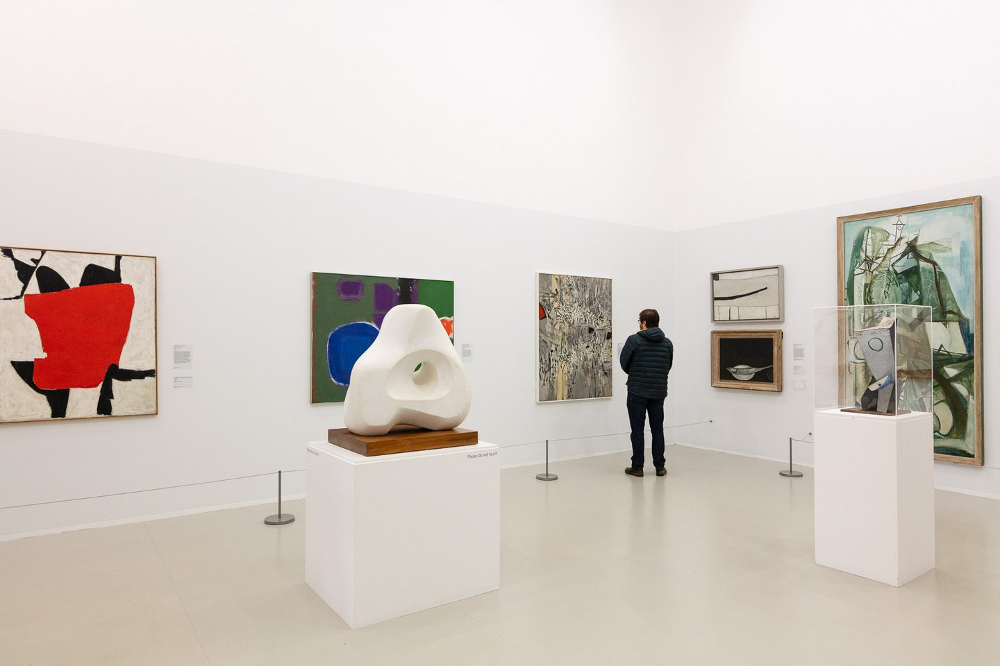

# Art Collections

The data this week comes from the [Tate Art Museum](https://github.com/tategallery/collection).


> **The dataset in this repository was last updated in October 2014. Tate has no plans to resume updating this repository, but we are keeping it available for the time being in case this snapshot of the Tate collection is a useful tool for researchers and developers.**


> Here we present the metadata for around 70,000 artworks that [Tate](http://www.tate.org.uk/) owns or jointly owns with the [National Galleries of Scotland](http://www.nationalgalleries.org) as part of [ARTIST ROOMS](http://www.tate.org.uk/artist-rooms). Metadata for around 3,500 associated artists is also included.

> The metadata here is released under the Creative Commons Public Domain CC0 licence.
> Images are not included and are not part of the dataset. Use of Tate images is covered on the
[Copyright and permissions](http://www.tate.org.uk/about/who-we-are/policies-and-procedures/website-terms-use/copyright-and-permissions) page. You may also [license images](http://tate-images.com) for commercial use.

> Tate requests that you actively acknowledge and give attribution to Tate wherever possible. Attribution supports future efforts to release other data.  It also reduces the amount of ‘orphaned data’, helping retain links to authoritative sources.


> Here are some examples of Tate data usage in the wild. Please submit a pull request with your creation added to this list.


* [Data visualisations](http://research.kraeutli.com/index.php/2013/11/the-tate-collection-on-github/) by [Florian Kräutli](http://www.kraeutli.com/)
* [machine imagined art](http://www.shardcore.org/cgi-bin/getArtwork.pl?id=a_96_19_f_26_b_1a_b_26_47_90_1d3_6_10_2d_) by [Shardcore](http://www.shardcore.org)
* [The Dimensions of Art](http://www.ifweassume.com/2013/11/the-dimensions-of-art.html) by [Jim Davenport](http://www.ifweassume.com)
* [Art as Data as Art](http://blog.ironholds.org/art-as-data-as-art/) and [Part II](http://blog.ironholds.org/art-as-data-as-art-part-ii/) by [Oliver Keyes](https://twitter.com/quominus)
* [Tate Acquisition Data](http://zenlan.com/tate/rickshaw.html) by [Zenlan](http://twitter.com/zenlan)
* [Tate Collection Geolocalized](https://williamdclt.github.io/tate-museum-artworks-geolocalized/) by Corentin Cournac, Mathieu Dauré, William Duclot and Pierre Présent
* [Aspect Ratio of Tate Artworks through Time](https://josephlewis.github.io/aspect.html) by [Joseph Lewis](https://josephlewis.github.io/)

There are JSON files with additional metadata in the original [GitHub](https://github.com/tategallery/collection).

### Some recommendations

This is a dataset has lots of room for cleaning.  

* The place of birth/death can be converted to city/country  
* The medium has many distinct categories, and some of them can be collapsed by overlap  
You could also practice converting the text dates to the actual years of interest (although the already exist in the data).  


### Get the data here

```{r}
# Get the Data

# Read in with tidytuesdayR package 
# Install from CRAN via: install.packages("tidytuesdayR")
# This loads the readme and all the datasets for the week of interest

# Either ISO-8601 date or year/week works!

tuesdata <- tidytuesdayR::tt_load('2021-01-12')
tuesdata <- tidytuesdayR::tt_load(2021, week = 3)

artwork <- tuesdata$artwork

# Or read in the data manually

artwork <- readr::read_csv('https://raw.githubusercontent.com/rfordatascience/tidytuesday/master/data/2021/2021-01-12/artwork.csv')
artists <- readr::read_csv("https://github.com/tategallery/collection/raw/master/artist_data.csv")

```
### Data Dictionary

# `artwork.csv`

|variable           |class     |description |
|:------------------|:---------|:-----------|
|id                 |double    | Unique ID |
|accession_number   |character | Accession number |
|artist             |character | Artist Name |
|artistRole         |character | Artist or other attribution |
|artistId           |double    | Artist ID |
|title              |character | Title of the piece of art |
|dateText           |character | Date as raw text (pretty messy) |
|medium             |character | Medium of art, quite a lot of overlap |
|creditLine         |character | How acquired |
|year               |double    | Year of creation |
|acquisitionYear    |double    | Year acquired |
|dimensions         |character | Dimensions as character |
|width              |double    | Width of art |
|height             |double    | Height of art |
|depth              |double    | Depth of art |
|units              |character | units of measure |
|inscription        |character | inscription if present |
|thumbnailCopyright |logical   | Thumbnail copyright|
|thumbnailUrl       |character | Thumbnail URL |
|url                |character | art URL |

# `artists.csv`

|variable     |class     |description |
|:------------|:---------|:-----------|
|id           |double    | Artist ID |
|name         |character | Artist Name |
|gender       |character | Artist gender|
|dates        |character | Date as a character |
|yearOfBirth  |double    | Year of birth |
|yearOfDeath  |double    | Year of death |
|placeOfBirth |character | Place of birth (typically city, country) |
|placeOfDeath |character | Place of death (typically city, country) |
|url          |character | Artist URL |

### Cleaning Script

There is no cleaning script for today, the data is already "tame".