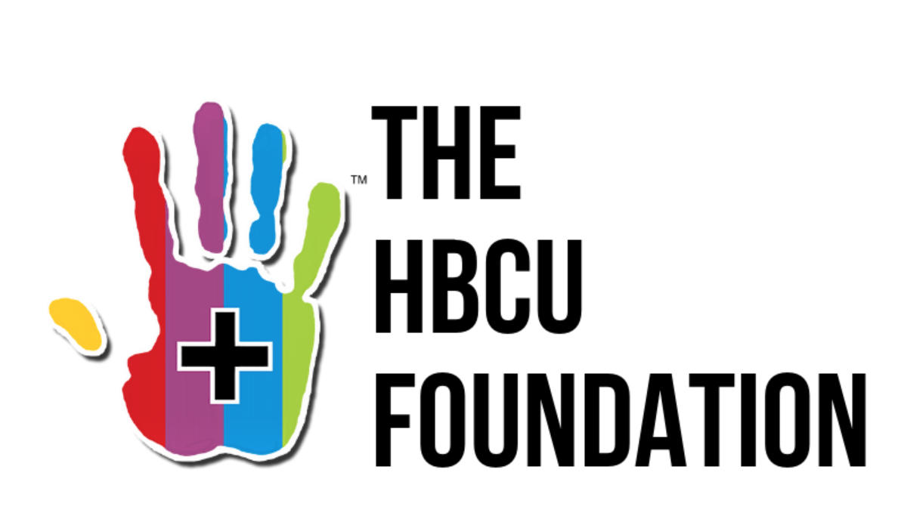

# College Enrollment

The data this week comes from [Data.World](https://data.world/nces/hbcu-fall-enrollment-1976-2015) and [Data.World](https://data.world/nces/high-school-completion-and-bachelors-degree-attainment) and was originally from the [NCES](https://data.world/nces).

> High school completion and bachelor's degree attainment among persons age 25 and over by race/ethnicity & sex 1910-2016

> Fall enrollment in degree-granting historically Black colleges and universities (HBCU)

Consider donating to HBCUs, to help fund student's financial assistance programs.

Donation link: https://thehbcufoundation.org/donate/

There's other additional HBCU datasets at [Data.World](https://data.world/datasets/hbcu-report) as well.

[HBCU Donations Article](https://theundefeated.com/features/how-hbcus-are-using-more-than-250-million-in-donations/)

> ... Donation will be placed in an endowment for students to fund need-based scholarships. President Reynold Verret believes the donation will provide an opportunity for students who don’t have the same financial support as others.

> “Xavier has roughly more than half of our students who are Pell-eligible. Which means they are in the lowest fifth of the socioeconomic ladder in the country. The lowest quintile. So these students really have significant family needs,” said Verret. “They’re often the first generation in their families to attend college, and meeting the gap between what Pell and the small loans provide and making it affordable is where that need-based is, which is not just based on merit, on your highest ACT or GPA, but basically to qualify students who are able who have the talent and the ability to succeed at Xavier.”

I've left the datasets relatively "untidy" this week so you can practice some of the `pivot_longer()` functions from `tidyr`. Note that all of the individual CSVs that are duplicates of the raw Excel files.

### Get the data here

```{r}
# Get the Data

# Read in with tidytuesdayR package 
# Install from CRAN via: install.packages("tidytuesdayR")
# This loads the readme and all the datasets for the week of interest

# Either ISO-8601 date or year/week works!

tuesdata <- tidytuesdayR::tt_load('2021-02-02')
tuesdata <- tidytuesdayR::tt_load(2021, week = 6)

hbcu_all <- tuesdata$hbcu_all

# Or read in the data manually

hbcu_all <- readr::read_csv('https://raw.githubusercontent.com/rfordatascience/tidytuesday/master/data/2021/2021-02-02/hbcu_all.csv')

```
### Data Dictionary

# `hbcu.csv`

# `hs_students.csv` 
- The percentage of students broken down by race/ethnicity, aged 25 and over who have graduated HS.

`bach_students`, `female_bach_students`, `female_hs_students`, `male_bach_students`, `male_hs_students`:

- Same as above, but for specific gender and education combination.

|variable                                                        |class     |description |
|:---------------------------------------------------------------|:---------|:-----------|
|Total                                                           |double    | Year|
|Total, percent of all persons age 25 and over                   |double    | Total combined population, |
|Standard Errors - Total, percent of all persons age 25 and over |character | Standard errors (SE) |
|White1                                                          |character | White students |
|Standard Errors - White1                                        |character | SE |
|Black1                                                          |character | Black students |
|Standard Errors - Black1                                        |character | SE |
|Hispanic                                                        |character | Hispanic students |
|Standard Errors - Hispanic                                      |character | SE|
|Total - Asian/Pacific Islander                                  |character | Asian Pacific Islander  Total students |
|Standard Errors - Total - Asian/Pacific Islander                |character | SE|
|Asian/Pacific Islander - Asian                                  |character | Asian Pacific Islandar - Asian students|
|Standard Errors - Asian/Pacific Islander - Asian                |character | SE |
|Asian/Pacific Islander - Pacific Islander                       |character | Asian/Pacific Islander - Pacific Islander |
|Standard Errors - Asian/Pacific Islander - Pacific Islander     |character | SE |
|American Indian/ Alaska Native                                 |character | American Indian/ Alaska Native Students|
|Standard Errors - American Indian/Alaska Native               |character | SE|
|Two or more race                                                |character | Two or more races students |
|Standard Errors - Two or more race                              |character | SE |

# `hbcu_all.csv`

- Enrollment by year for types of HBCUs
- Note that `hbcu_black.csv` has duplicate information, but specific to black-student enrollment only.

|variable         |class  |description |
|:----------------|:------|:-----------|
|Year             |double | Year|
|Total enrollment |double | Total enrollment |
|Males            |double | Male enrollment |
|Females          |double | Female Enrollment |
|4-year           |double | 4 Year college enrollment |
|2-year           |double | 2 Year college enrollment |
|Total - Public   |double | Total public school enrollment |
|4-year - Public  |double | 4 year public school enrollment |
|2-year - Public  |double |2 Year public college enrollment|
|Total - Private  |double | Total private college enrollment |
|4-year - Private |double |4 year private school enrollment |
|2-year - Private |double |2 Year private college enrollment|


### Cleaning Script

This is an optional cleaning script, but shows examples of how to take the raw data this week and prep it for analysis.

See more expansive walkthroughs of cleaning this data by [Jack Davison](https://twitter.com/JDavison_/status/1356603601020473346?s=20) and [Alex Cookson](https://twitter.com/alexcookson/status/1356628106790985728?s=20).

```
library(tidyverse)
library(readxl)
library(glue)

# student data

hs_students <- read_excel("2021/2021-02-02/104.10.xlsx", sheet = 1)
bach_students <- read_excel("2021/2021-02-02/104.10.xlsx", sheet = 2)
male_hs_students <- read_excel("2021/2021-02-02/104.10.xlsx", sheet = 3)
male_bach_students <- read_excel("2021/2021-02-02/104.10.xlsx", sheet = 4)
female_hs_students <- read_excel("2021/2021-02-02/104.10.xlsx", sheet = 5)
female_bach_students <- read_excel("2021/2021-02-02/104.10.xlsx", sheet = 6)

# HBCU data
hbcu_all <- read_excel("2021/2021-02-02/tabn313.20.xls", sheet = 1)
hbcu_black <- read_excel("2021/2021-02-02/tabn313.20.xls", sheet = 2)


list(
  datasets = list(
    bach_students,
    female_bach_students,
    female_hs_students,
    hbcu_all,
    hbcu_black,
    hs_students,
    male_bach_students,
    male_hs_students
  ),
  names = ls()
) %>%
  pmap(
    .f = function(datasets, names) {
      write_csv(datasets, glue::glue("2021/2021-02-02/{names}.csv"))
    }
  )

# Example 1
hs_students %>% 
  mutate(Total = if_else(Total > 10000, str_sub(Total, 1, 4) %>% as.double(), Total)) %>% 
  rename(year = Total) %>% 
  select(!contains("Standard")) %>% 
  select(!contains("Total")) %>% 
  mutate(across(White1:last_col(), as.double)) %>% 
  pivot_longer(cols = 2:last_col(), names_to = "group", values_to = "percentage") %>% 
  filter(year >= 1980) %>% 
  ggplot(aes(x = year, y = percentage, color = group)) +
  geom_line()

# example 2
hbcu_all %>% 
  select(Year, `4-year`, `2-year`) %>% 
  pivot_longer(cols = `4-year`:`2-year`) %>% 
  ggplot(aes(x = Year, y = value, color = name)) +
  geom_line() +
  scale_x_continuous(breaks = seq(1980, 2020, by = 4))
  
# Alex Cookson Examples

### Load packages -------------------------------------------------------------
library(tidyverse) # General-purpose cleaning
library(janitor) # For the clean_names() function

### Import data ---------------------------------------------------------------
hbcu_all <- readr::read_csv('https://raw.githubusercontent.com/rfordatascience/tidytuesday/master/data/2021/2021-02-02/hbcu_all.csv') %>%
  # clean_names() converts field names to snake_case
  clean_names()


### Clean data ----------------------------------------------------------------
# We can separate by gender OR by program length and public/private, not both

### Gender breakdown
hbcu_by_gender <- hbcu_all %>%
  # We only need year and gender columns
  select(year, males, females) %>%
  # Convert to tidy format, collapsing male/female into one descriptor field
  pivot_longer(males:females,
               names_to = "gender",
               values_to = "students") %>%
  # Convert from plural to singular for cleaner data
  # "s%" specifies an s character at the end of a string
  # ("$" is end of string in regular expressions)
  mutate(gender = str_remove(gender, "s$"))


### Program breakdown
hbcu_by_program <- hbcu_all %>%
  # We need fields with "public" or "private" in the name
  # (They also have 2- vs 4-year)
  # We DON'T need fields with "total" in the name, since this is redundant
  select(year,
         contains(c("public", "private")),
         -contains("total")) %>%
  # names_pattern argument does the heavy lifting
  # It separates names into groups, as specified by parentheses "(group)"
  # Field names are structured so that program length is followed by public/private
  # We also specift "x_" as an optional argument using regular expressions
  pivot_longer(cols = x4_year_public:x2_year_private,
               names_pattern = "[x_]?(.*)_(.*)",
               names_to = c("program_length", "public_private"),
               values_to = "students") %>%
  mutate(program_length = paste(parse_number(program_length), "years"))
```
