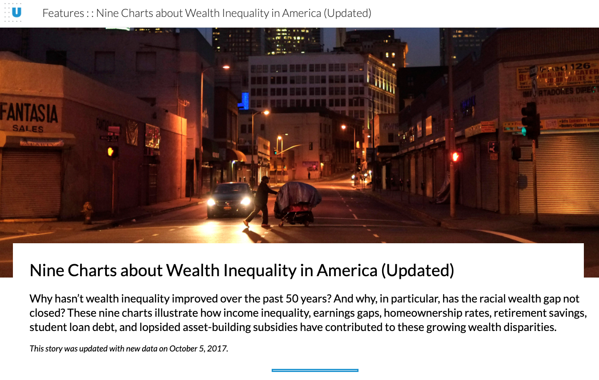

# Wealth and income over time

The data this week comes from the [Urban Institute](https://apps.urban.org/features/wealth-inequality-charts/) and the [US Census](https://www.census.gov/data/tables/time-series/demo/income-poverty/historical-income-households.html).

The Urban Institute lays out nine charts about racial wealth inequality in America in this [article](https://apps.urban.org/features/wealth-inequality-charts/). They include several summary-level datasets that I've included.

> **Nine Charts about Wealth Inequality in America**
> Why hasn't wealth inequality improved over the past 50 years? And why, in particular, has the racial wealth gap not closed? These nine charts illustrate how income inequality, earnings gaps, homeownership rates, retirement savings, student loan debt, and lopsided asset-building subsidies have contributed to these growing wealth disparities.

The US Census provides [Historical Income Tables](https://www.census.gov/data/tables/time-series/demo/income-poverty/historical-income-households.html), of which we have joined several to compare wealth and income over time by race.

The Brookings Institute has another [article](https://www.brookings.edu/blog/up-front/2020/02/27/examining-the-black-white-wealth-gap/) detailing some additional reasons how historically wealth has been difficult to acquire or even institutionally kept away from many Black Americans.

> Efforts by Black Americans to build wealth can be traced back throughout American history. But these efforts have been impeded in a host of ways, beginning with 246 years of chattel slavery and followed by Congressional mismanagement of the Freedman's Savings Bank (which left 61,144 depositors with losses of nearly \$3 million in 1874), the violent massacre decimating Tulsa's Greenwood District in 1921 (a population of 10,000 that thrived as the epicenter of African American business and culture, commonly referred to as "Black Wall Street"), and discriminatory policies throughout the 20th century including the Jim Crow Era's "Black Codes" strictly limiting opportunity in many southern states, the GI bill, the New Deal's Fair Labor Standards Act's exemption of domestic agricultural and service occupations, and redlining. Wealth was taken from these communities before it had the opportunity to grow.

### Reference Articles

- [Freedman's Savings Bank congressional mismanagement](https://www.occ.treas.gov/about/who-we-are/history/1863-1865/1863-1865-freedmans-savings-bank.html)  
- [Tulsa Race Massacre](https://en.wikipedia.org/wiki/Tulsa_race_massacre)  
- [Jim Crow Laws](https://en.wikipedia.org/wiki/Jim_Crow_laws)  

The Pew Research Center also outlines demographic trends and economic well-being in their [article](https://www.pewsocialtrends.org/2016/06/27/1-demographic-trends-and-economic-well-being/) and another [article](https://www.pewresearch.org/fact-tank/2017/11/01/how-wealth-inequality-has-changed-in-the-u-s-since-the-great-recession-by-race-ethnicity-and-income/) on details since the Great Recession (2016). The Federal Reserve has another [article](https://www.federalreserve.gov/econres/notes/feds-notes/disparities-in-wealth-by-race-and-ethnicity-in-the-2019-survey-of-consumer-finances-20200928.htm) on Racial disparities in wealth.

There's a ton of different datasets, all within the scope of wealth, income, or debt over time and by race. The data were fairly tame, but in Excel sheets that weren't ready for analyses. I went ahead and cleaned the data, but feel free to play with the original raw data as well. Many of the datasets could be merged/joined but I would be careful about potential spurious correlations. A good starter dataset is the `income_distribution.csv` as it includes year, race, number of households, income median/mean, income bracket, and income distribution by bracket.

More appropriate for summary plots:  
- student_debt, retirement, home_owner, lifetime_earn, lifetime_wealth, race_wealth, income_time, and wealth_distribution are from the Urban Institute and are more appropriate for summary plots.

More appropriate for comparisons:  
- income_mean, income_distribution, income_limits, and income_aggregate are more appropriate as comparison datasets and have the full racial breakdown across the available years.

### Get the data here

```{r}
# Get the Data

# Read in with tidytuesdayR package 
# Install from CRAN via: install.packages("tidytuesdayR")
# This loads the readme and all the datasets for the week of interest

# Either ISO-8601 date or year/week works!

tuesdata <- tidytuesdayR::tt_load('2021-02-09')
tuesdata <- tidytuesdayR::tt_load(2021, week = 7)

lifetime_earn <- tuesdata$lifetime_earn

# Or read in the data manually

lifetime_earn <- readr::read_csv('https://raw.githubusercontent.com/rfordatascience/tidytuesday/master/data/2021/2021-02-09/lifetime_earn.csv')
student_debt <- readr::read_csv('https://raw.githubusercontent.com/rfordatascience/tidytuesday/master/data/2021/2021-02-09/student_debt.csv')
retirement <- readr::read_csv('https://raw.githubusercontent.com/rfordatascience/tidytuesday/master/data/2021/2021-02-09/retirement.csv')
home_owner <- readr::read_csv('https://raw.githubusercontent.com/rfordatascience/tidytuesday/master/data/2021/2021-02-09/home_owner.csv')
race_wealth <- readr::read_csv('https://raw.githubusercontent.com/rfordatascience/tidytuesday/master/data/2021/2021-02-09/race_wealth.csv')
income_time <- readr::read_csv('https://raw.githubusercontent.com/rfordatascience/tidytuesday/master/data/2021/2021-02-09/income_time.csv')
income_limits <- readr::read_csv('https://raw.githubusercontent.com/rfordatascience/tidytuesday/master/data/2021/2021-02-09/income_limits.csv')
income_aggregate <- readr::read_csv('https://raw.githubusercontent.com/rfordatascience/tidytuesday/master/data/2021/2021-02-09/income_aggregate.csv')
income_distribution <- readr::read_csv('https://raw.githubusercontent.com/rfordatascience/tidytuesday/master/data/2021/2021-02-09/income_distribution.csv')
income_mean <- readr::read_csv('https://raw.githubusercontent.com/rfordatascience/tidytuesday/master/data/2021/2021-02-09/income_mean.csv')

```

### Data Dictionary

# `lifetime_earn.csv`

Average lifetime earning by race/gender

|variable      |class     |description |
|:-------------|:---------|:-----------|
|gender        |character | gender column |
|race          |character | Racial group |
|lifetime_earn |double    | Lifetime earnings |

# `student_debt.csv`

Average family student loan debt for aged 25-55, by race and year normalized to 2016 dollars.

|variable      |class     |description |
|:-------------|:---------|:-----------|
|year          |double    | Year of measure |
|race          |character | Racial group |
|loan_debt     |double    | Loan debt|
|loan_debt_pct |double    | Share of families with student loan debt |

# `retirement.csv`

Average family liquid retirement savings normalized to 2016 dollars.

|variable   |class     |description |
|:----------|:---------|:-----------|
|year       |double    | Year|
|race       |character | Racial group |
|retirement |double    | Retirement dollars |

# `home_owner.csv`

Home ownership percentage for families by 

|variable       |class     |description |
|:--------------|:---------|:-----------|
|year           |double    | Year |
|race           |character | Racial group |
|home_owner_pct |double    | Home ownership by race/ethnicity |


# `race_wealth.csv`

Family wealth by race/year/measure normalized to 2016, with measures of central tendency with mean and median.

|variable      |class     |description |
|:-------------|:---------|:-----------|
|type          |character | Type of measure, either median or mean |
|year          |double    | Year |
|race          |character | Racial group |
|wealth_family |double    | Family wealth by race/year/measure normalized to 2016. |

# `income_time.csv`

Family-level income by percentile and year. 

|variable      |class     |description |
|:-------------|:---------|:-----------|
|year          |integer   | Year |
|percentile    |character | Income percentile (10th, 50th, 90th) |
|income_family |double    | Familial income |

# `income_limits.csv`

Familial income limits for each fifth by year and race.

|variable        |class     |description |
|:---------------|:---------|:-----------|
|year            |double    | Year |
|race            |character | Racial group |
|dollar_type     |character | Dollars in that year or normalized to 2019 |
|number          |double    | Number of households by racial group |
|income_quintile |character | Income quintile as well as top 5% |
|income_dollars  |double    | Income in US dollars, specific to dollar type |

# `income_aggregate.csv`

Share of aggregate income received by each fifth and top 5% of each racial group/household.

|variable        |class     |description |
|:---------------|:---------|:-----------|
|year            |double    | Year |
|race            |character | Racial group |
|number          |double    | Number of households by racial group |
|income_quintile |character | Income quintile and/or top 5% |
|income_share    |double    | Income share as a percentage |

# `income_distribution.csv`

Households by total money income, race, and hispanic origin of householder separated by year and income groups.

|variable            |class     |description |
|:-------------------|:---------|:-----------|
|year                |integer   | Year |
|race                |character | Racial Group |
|number              |double    | Number of households |
|income_median       |integer   | Income median |
|income_med_moe      |integer   | Income median margin of error |
|income_mean         |integer   | Income mean |
|income_mean_moe     |integer   | Income mean margin of error |
|income_bracket      |character | Income bracket (9 total brackets between `<$15,000` and `>$200,000` |
|income_distribution |double    | Income distribution as the percentage of each year/racial group - should add up to 100 for a specific year and race. |

# `income_mean.csv`

Mean income received by each fifth and top 5% of each racial group.

|variable        |class     |description |
|:---------------|:---------|:-----------|
|year            |double    | Year |
|race            |character | Racial group |
|dollar_type     |character | Dollar type, ie dollar relative to that year or normalized to 2019 |
|income_quintile |character | Income quintile and/or top 5% |
|income_dollars  |double    | Income dollar average |

### Cleaning Script

Note this is just how I cleaned the data, you can try to make some of this into functions, or you can work with the raw Excel files as I've uploaded them as well.

```{r}
library(tidyverse)
library(readxl)

### Urban Institute

# Student Debt ------------------------------------------------------------

student_debt_raw <- read_excel("2021/2021-02-09/StudentLoans.xlsx", skip = 1)

student_debt_val <- student_debt_raw %>%
  rename(year = 1) %>%
  slice(1:10) %>%
  arrange(desc(year)) %>%
  pivot_longer(cols = -year, names_to = "race", values_to = "loan_debt") %>%
  mutate(across(c(year, loan_debt), as.double))

student_debt_pct <- student_debt_raw %>%
  rename(year = 1) %>%
  slice(14:23) %>%
  arrange(desc(year)) %>%
  pivot_longer(cols = -year, names_to = "race", values_to = "loan_debt_pct") %>%
  mutate(across(c(year, loan_debt_pct), as.double))

student_debt <- left_join(student_debt_val, student_debt_pct, by = c("year", "race"))

student_debt 

student_debt %>% 
  write_csv("2021/2021-02-09/student_debt.csv")


# Retirement --------------------------------------------------------------


retirement_raw <- read_excel("2021/2021-02-09/Retirement.xlsx", skip = 1)

retirement <- retirement_raw %>%
  rename(year = 1) %>%
  slice(1:10) %>%
  mutate(across(everything(), as.double)) %>%
  pivot_longer(-year, names_to = "race", values_to = "retirement")

retirement %>% 
  write_csv("2021/2021-02-09/retirement.csv")


# Home Ownership ----------------------------------------------------------

home_raw <- read_excel("2021/2021-02-09/Homeownership.xlsx", skip = 1)

home_owner <- home_raw %>%
  rename(year = 1) %>%
  filter(!is.na(Black)) %>%
  mutate(across(everything(), as.double)) %>%
  pivot_longer(-year, names_to = "race", values_to = "home_owner_pct")

home_owner %>% 
  write_csv("2021/2021-02-09/home_owner.csv")


# Lifetime Earnings -------------------------------------------------------

lifetime_raw <- read_excel("2021/2021-02-09/LifetimeEarnings.xlsx")

lifetime_earn <- lifetime_raw %>%
  set_names(nm = c("gender", "race", "lifetime_earn")) %>%
  fill(gender) %>%
  filter(!is.na(race))

lifetime_earn

lifetime_earn %>% 
  write_csv("2021/2021-02-09/lifetime_earn.csv")


# Wealth Lifetime ---------------------------------------------------------

wealth_life_raw <- read_excel("2021/2021-02-09/WealthbyRaceoverLifetime.xlsx", skip = 1)

wealth_life <- wealth_life_raw %>%
  rename(race = 1) %>%
  filter(!is.na(`1983`)) %>%
  filter(!is.na(race)) %>%
  mutate(type = rep(c("Average", "Median"), each = 2), .before = "race") %>%
  pivot_longer(cols = c(`1983`:`2016`), names_to = "year", values_to = "wealth_lifetime")

wealth_life

wealth_life %>% 
  write_csv("2021/2021-02-09/lifetime_wealth.csv")


# Wealth by Race ----------------------------------------------------------

wealth_race_raw <- read_excel("2021/2021-02-09/WealthbyRace.xlsx", skip = 1)

wealth_race <- wealth_race_raw %>%
  rename(year = 1) %>%
  filter(!is.na(White)) %>%
  filter(!is.na(year)) %>%
  mutate(across(everything(), as.double)) %>%
  mutate(type = rep(c("Average", "Median"), each = 12), .before = "year") %>%
  pivot_longer(cols = c(`Non-White`:Hispanic), names_to = "race", values_to = "wealth_family")

wealth_race

wealth_race %>% 
  write_csv("2021/2021-02-09/race_wealth.csv")


# Income Distribution -----------------------------------------------------

income_raw <- read_excel("2021/2021-02-09/IncomeDistribution.xlsx", skip = 1)

income_time <- income_raw %>%
  filter(!is.na(`10th Percentile`)) %>%
  mutate(year = as.integer(Year)) %>%
  pivot_longer(
    cols = 2:4,
    names_to = "percentile",
    values_to = "income_family",
    names_pattern = "([0-9]+[th]+)"
  ) %>%
  select(year, percentile, income_family)

income_time

income_time %>% 
  write_csv("2021/2021-02-09/income_time.csv")


# Wealth Distribution -----------------------------------------------------

wealth_raw <- read_excel("2021/2021-02-09/WealthDistribution.xlsx", skip = 1)

wealth_distribution <- wealth_raw %>%
  rename(percentile = ...1) %>%
  filter(!is.na(`1963`)) %>%
  pivot_longer(
    cols = -percentile,
    names_to = "year",
    values_to = "wealth_family"
  ) %>%
  mutate(across(c(year, percentile), as.integer))

wealth_distribution

wealth_distribution %>% 
  write_csv("2021/2021-02-09/wealth_distribution.csv")

wealth_distribution %>%
  ggplot(aes(x = percentile, y = wealth_family, color = year, group = year)) +
  geom_line() +
  scale_color_viridis_c()

### Census


# H1a----------------------------------------------------------------------

h01a_raw <- read_excel("2021/2021-02-09/h01a.xlsx", skip = 6)

h1_asian <- h01a_raw %>%
  rename(year = 1, number = 2, `Top 5%` = 7) %>%
  filter(str_detect(year, "2017 \\(|\\(38", negate = TRUE)) %>%
  mutate(year = str_sub(year, 1, 4), year = as.integer(year)) %>%
  filter(!is.na(year)) %>%
  filter(!is.na(number)) %>%
  mutate(
    race = rep(c("Asian Alone or in Combination", "Asian Alone"), each = 36),
    dollar_type = rep(c("Current Dollars", "2019 Dollars"), each = 36),
    .after = "year"
  ) %>%
  pivot_longer(
    cols = Lowest:last_col(),
    names_to = "income_quintile",
    values_to = "income_dollars",
    values_transform = list(income_dollars = as.double)
  )

h1_asian


# h1ar --------------------------------------------------------------------

h01ar_raw <- read_excel("2021/2021-02-09/h01ar.xlsx", skip = 5)

h1_all <- h01ar_raw %>%
  rename(year = 1, number = 2, `Top 5%` = 7) %>%
  filter(str_detect(year, "2017 \\(|\\(38", negate = TRUE)) %>%
  mutate(year = str_sub(year, 1, 4), year = as.integer(year)) %>%
  filter(!is.na(year)) %>%
  filter(!is.na(number)) %>%
  mutate(
    race = "All Races",
    dollar_type = rep(c("Current Dollars", "2019 Dollars"), each = 53),
    .after = "year"
  ) %>%
  pivot_longer(
    cols = Lowest:last_col(),
    names_to = "income_quintile",
    values_to = "income_dollars",
    values_transform = list(income_dollars = as.double)
  )

h1_all


# h1b ---------------------------------------------------------------------

h01b_raw <- read_excel("2021/2021-02-09/h01b.xlsx", skip = 6)

h1_black <- h01b_raw %>%
  rename(year = 1, number = 2, `Top 5%` = 7) %>%
  filter(str_detect(year, "2017 \\(|\\(38", negate = TRUE)) %>%
  mutate(year = str_sub(year, 1, 4), year = as.integer(year)) %>%
  filter(!is.na(year)) %>%
  filter(!is.na(number)) %>% 
  mutate(
    race =
      rep(
        c(
          rep("Black Alone or in Combination", 18),
          rep("Black Alone", 53)
        ),
        times = 2
      ),
    dollar_type = rep(c("Current Dollars", "2019 Dollars"), each = 71),
    .after = "year"
  ) %>%
  pivot_longer(
    cols = Lowest:last_col(),
    names_to = "income_quintile",
    values_to = "income_dollars",
    values_transform = list(income_dollars = as.double)
  )

h1_black


# h1h ---------------------------------------------------------------------

h01h_raw <- read_excel("2021/2021-02-09/h01h.xlsx", skip = 5)

h1_hispanic <- h01h_raw %>%
  rename(year = 1, number = 2, `Top 5%` = 7) %>%
  filter(str_detect(year, "2017 \\(|\\(38", negate = TRUE)) %>%
  mutate(year = str_sub(year, 1, 4), year = as.integer(year)) %>%
  filter(!is.na(year)) %>%
  filter(!is.na(number)) %>%
  mutate(
    race = "Hispanic",
    dollar_type = rep(c("Current Dollars", "2019 Dollars"), each = 48),
    .after = "year"
  ) %>%
  pivot_longer(
    cols = Lowest:last_col(),
    names_to = "income_quintile",
    values_to = "income_dollars",
    values_transform = list(income_dollars = as.double)
  )

h1_hispanic


# h1w ---------------------------------------------------------------------

h01w_raw <- read_excel("2021/2021-02-09/h01w.xlsx", skip = 6)

h01w_raw

h1_white <- h01w_raw %>%
  rename(year = 1, number = 2, `Top 5%` = 7) %>%
  filter(str_detect(year, "2017 \\(|\\(38", negate = TRUE)) %>%
  mutate(year = str_sub(year, 1, 4), year = as.integer(year)) %>%
  filter(!is.na(year)) %>%
  filter(!is.na(number)) %>%
  mutate(
    race = "White Alone",
    dollar_type = rep(c("Current Dollars", "2019 Dollars"), each = 53),
    .after = "year"
  ) %>%
  pivot_longer(
    cols = Lowest:last_col(),
    names_to = "income_quintile",
    values_to = "income_dollars",
    values_transform = list(income_dollars = as.double)
  )

h1_white


# h1wnh -------------------------------------------------------------------

h01wnh_raw <- read_excel("2021/2021-02-09/h01wnh.xlsx", skip = 6)

h01wnh_raw

h1_white_nh <- h01wnh_raw %>%
  rename(year = 1, number = 2, `Top 5%` = 7) %>%
  filter(str_detect(year, "2017 \\(|\\(38", negate = TRUE)) %>%
  mutate(year = str_sub(year, 1, 4), year = as.integer(year)) %>%
  filter(!is.na(year)) %>%
  filter(!is.na(number)) %>%
  mutate(
    race = "White, Not Hispanic",
    dollar_type = rep(c("Current Dollars", "2019 Dollars"), each = 48),
    .after = "year"
  ) %>%
  pivot_longer(
    cols = Lowest:last_col(),
    names_to = "income_quintile",
    values_to = "income_dollars",
    values_transform = list(income_dollars = as.double)
  )

h1_white_nh

# h1 combo ----------------------------------------------------------------


all_h1_comb <- bind_rows(
  h1_all,
  h1_asian,
  h1_black,
  h1_hispanic,
  h1_white,
  h1_white_nh
) %>%
  mutate(
    number = as.integer(number),
    number = number * 1000
    )


all_h1_comb %>% 
  write_csv("2021/2021-02-09/income_limits.csv")

## H2


# h2a ---------------------------------------------------------------------


h2a_raw <- read_excel("2021/2021-02-09/h02a.xlsx", skip = 5)

h2a_raw

h2_asian <- h2a_raw %>%
  rename(year = 1, number = 2) %>%
  filter(str_detect(year, "2017 \\(|\\(38", negate = TRUE)) %>%
  mutate(year = str_sub(year, 1, 4), year = as.integer(year)) %>%
  filter(!is.na(year)) %>%
  filter(!is.na(number)) %>%
  mutate(
    race = rep(c("Asian Alone or in Combination", "Asian Alone"), each = 18),
    .after = "year"
  ) %>%
  pivot_longer(
    cols = 4:last_col(),
    names_to = "income_quintile",
    names_pattern = "^(.*?)[\n]",
    values_to = "income_share",
    values_transform = list(income_share = as.double)
  ) %>%
  mutate(
    income_quintile = str_replace(income_quintile, "5", "5%"),
    number = as.integer(number)
  )

h2_asian

# h2ar --------------------------------------------------------------------

h2ar_raw <- read_excel("2021/2021-02-09/h02ar.xlsx", skip = 4)

h2ar_raw

h2_all <- h2ar_raw %>%
  rename(year = 1, number = 2) %>%
  filter(str_detect(year, "2017 \\(|\\(38", negate = TRUE)) %>%
  mutate(year = str_sub(year, 1, 4), year = as.integer(year)) %>%
  filter(!is.na(year)) %>%
  filter(!is.na(number)) %>%
  mutate(
    race = "All Races",
    .after = "year"
  ) %>%
  pivot_longer(
    cols = 4:last_col(),
    names_to = "income_quintile",
    names_pattern = "^(.*?)[\n]",
    values_to = "income_share",
    values_transform = list(income_share = as.double)
  ) %>%
  mutate(
    income_quintile = str_replace(income_quintile, "5", "5%"),
    number = as.integer(number)
  )

h2_all

# h2b ---------------------------------------------------------------------

h2b_raw <- read_excel("2021/2021-02-09/h02b.xlsx", skip = 5)

h2b_raw

h2_black <- h2b_raw %>%
  rename(year = 1, number = 2) %>%
  filter(str_detect(year, "2017 \\(|\\(38", negate = TRUE)) %>%
  mutate(year = str_sub(year, 1, 4), year = as.integer(year)) %>%
  filter(!is.na(year)) %>%
  filter(!is.na(number)) %>%
  mutate(
    race = c(
      rep("Black Alone or in Combination", 18),
      rep("Black Alone", 53)
    ),
    .after = "year"
  ) %>%
  pivot_longer(
    cols = 4:last_col(),
    names_to = "income_quintile",
    names_pattern = "^(.*?)[\n]",
    values_to = "income_share",
    values_transform = list(income_share = as.double)
  ) %>%
  mutate(
    income_quintile = str_replace(income_quintile, "5", "5%"),
    number = as.integer(number)
  )

h2_black


# h2h ---------------------------------------------------------------------

h2h_raw <- read_excel("2021/2021-02-09/h02h.xlsx", skip = 4)

h2h_raw

h2_hispanic <- h2h_raw %>%
  rename(year = 1, number = 2) %>%
  filter(str_detect(year, "2017 \\(|\\(38", negate = TRUE)) %>%
  mutate(year = str_sub(year, 1, 4), year = as.integer(year)) %>%
  filter(!is.na(year)) %>%
  filter(!is.na(number)) %>%
  mutate(
    race = "Hispanic",
    .after = "year"
  ) %>%
  pivot_longer(
    cols = 4:last_col(),
    names_to = "income_quintile",
    names_pattern = "^(.*?)[\n]",
    values_to = "income_share",
    values_transform = list(income_share = as.double)
  ) %>%
  mutate(
    income_quintile = str_replace(income_quintile, "5", "5%"),
    number = as.integer(number)
  )

h2_hispanic

# h2w ---------------------------------------------------------------------

h2w_raw <- read_excel("2021/2021-02-09/h02w.xlsx", skip = 5)

h2w_raw

h2_white <- h2w_raw %>%
  rename(year = 1, number = 2) %>%
  filter(str_detect(year, "2017 \\(|\\(38", negate = TRUE)) %>%
  mutate(year = str_sub(year, 1, 4), year = as.integer(year)) %>%
  filter(!is.na(year)) %>%
  filter(!is.na(number)) %>%
  mutate(
    race = "White Alone",
    .after = "year"
  ) %>%
  pivot_longer(
    cols = 4:last_col(),
    names_to = "income_quintile",
    names_pattern = "^(.*?)[\n]",
    values_to = "income_share",
    values_transform = list(income_share = as.double)
  ) %>%
  mutate(
    income_quintile = str_replace(income_quintile, "5", "5%"),
    number = as.integer(number)
  )

h2_white

# h2wnh -------------------------------------------------------------------

h2wnh_raw <- read_excel("2021/2021-02-09/h02wnh.xlsx", skip = 5)

h2wnh_raw

h2_white_nh <- h2wnh_raw %>%
  rename(year = 1, number = 2) %>%
  filter(str_detect(year, "2017 \\(|\\(38", negate = TRUE)) %>%
  mutate(year = str_sub(year, 1, 4), year = as.integer(year)) %>%
  filter(!is.na(year)) %>%
  filter(!is.na(number)) %>%
  mutate(
    race = "White, Not Hispanic",
    .after = "year"
  ) %>%
  pivot_longer(
    cols = 4:last_col(),
    names_to = "income_quintile",
    names_pattern = "^(.*?)[\n]",
    values_to = "income_share",
    values_transform = list(income_share = as.double)
  ) %>%
  mutate(
    income_quintile = str_replace(income_quintile, "5", "5%"),
    number = as.integer(number)
  )

h2_white_nh

# h2 combo ----------------------------------------------------------------

all_h2_comb <- bind_rows(
  h2_all,
  h2_asian,
  h2_black,
  h2_hispanic,
  h2_white,
  h2_white_nh
) %>%
  mutate(
    number = as.integer(number),
    number = number * 1000
    )

all_h2_comb

all_h2_comb %>% 
  write_csv("2021/2021-02-09/income_aggregate.csv")

## h3 ----

# H3a----------------------------------------------------------------------

h03a_raw <- read_excel("2021/2021-02-09/h03a.xlsx", skip = 5)

h3_asian <- h03a_raw %>%
  rename(year = 1) %>%
  filter(str_detect(year, "2017 \\(|\\(38", negate = TRUE)) %>%
  mutate(year = str_sub(year, 1, 4), year = as.integer(year)) %>%
  filter(!is.na(year)) %>%
  filter(!is.na(`Lowest\nfifth`)) %>%
  mutate(
    race = rep(c("Asian Alone or in Combination", "Asian Alone"), each = 36),
    dollar_type = rep(c("Current Dollars", "2019 Dollars"), each = 36),
    .after = "year"
  ) %>%
  pivot_longer(
    cols = 4:last_col(),
    names_to = "income_quintile",
    names_pattern = "^(.*?)[\n]",
    values_to = "income_dollars",
    values_transform = list(income_dollars = as.double)
  ) %>%
  mutate(
    income_quintile = str_replace(income_quintile, "5", "5%")
  )

h3_asian


# h3ar --------------------------------------------------------------------

h03ar_raw <- read_excel("2021/2021-02-09/h03ar.xlsx", skip = 4)

h03ar_raw

h3_all <- h03ar_raw %>%
  rename(year = 1) %>%
  filter(str_detect(year, "2017 \\(|\\(38", negate = TRUE)) %>%
  mutate(year = str_sub(year, 1, 4), year = as.integer(year)) %>%
  filter(!is.na(year)) %>%
  filter(!is.na(`Lowest\nfifth`)) %>%
  mutate(
    race = "All Races",
    dollar_type = rep(c("Current Dollars", "2019 Dollars"), each = 53),
    .after = "year"
  ) %>%
  pivot_longer(
    cols = 4:last_col(),
    names_to = "income_quintile",
    names_pattern = "^(.*?)[\n]",
    values_to = "income_dollars",
    values_transform = list(income_dollars = as.double)
  ) %>%
  mutate(
    income_quintile = str_replace(income_quintile, "5", "5%")
  )

h3_all


# h3b ---------------------------------------------------------------------

h03b_raw <- read_excel("2021/2021-02-09/h03b.xlsx", skip = 5)

h3_black <- h03b_raw %>%
  rename(year = 1) %>%
  filter(str_detect(year, "2017 \\(|\\(38", negate = TRUE)) %>%
  mutate(year = str_sub(year, 1, 4), year = as.integer(year)) %>%
  filter(!is.na(year)) %>%
  filter(!is.na(`Lowest\nfifth`)) %>%
  mutate(
    race =
      rep(
        c(
          rep("Black Alone or in Combination", 18),
          rep("Black Alone", 53)
        ),
        times = 2
      ),
    dollar_type = rep(c("Current Dollars", "2019 Dollars"), each = 71),
    .after = "year"
  ) %>%
  pivot_longer(
    cols = 4:last_col(),
    names_to = "income_quintile",
    names_pattern = "^(.*?)[\n]",
    values_to = "income_dollars",
    values_transform = list(income_dollars = as.double)
  ) %>%
  mutate(
    income_quintile = str_replace(income_quintile, "5", "5%")
  )

h3_black

########## START HERE ###########

# h3h ---------------------------------------------------------------------

h03h_raw <- read_excel("2021/2021-02-09/h03h.xlsx", skip = 4)

h03h_raw

h3_hispanic <- h03h_raw %>%
  rename(year = 1) %>%
  filter(str_detect(year, "2017 \\(|\\(38", negate = TRUE)) %>%
  mutate(year = str_sub(year, 1, 4), year = as.integer(year)) %>%
  filter(!is.na(year)) %>%
  filter(!is.na(`Lowest\nfifth`)) %>%
  mutate(
    race = "Hispanic",
    dollar_type = rep(c("Current Dollars", "2019 Dollars"), each = 48),
    .after = "year"
  ) %>%
  pivot_longer(
    cols = 4:last_col(),
    names_to = "income_quintile",
    names_pattern = "^(.*?)[\n]",
    values_to = "income_dollars",
    values_transform = list(income_dollars = as.double)
  ) %>%
  mutate(
    income_quintile = str_replace(income_quintile, "5", "5%")
  )

h3_hispanic


# h1w ---------------------------------------------------------------------

h03w_raw <- read_excel("2021/2021-02-09/h03w.xlsx", skip = 5)

h03w_raw

h3_white <- h03w_raw %>%
  rename(year = 1) %>%
  filter(str_detect(year, "2017 \\(|\\(38", negate = TRUE)) %>%
  mutate(year = str_sub(year, 1, 4), year = as.integer(year)) %>%
  filter(!is.na(year)) %>%
  filter(!is.na(`Lowest\nfifth`)) %>%
  mutate(
    race = "White Alone",
    dollar_type = rep(c("Current Dollars", "2019 Dollars"), each = 53),
    .after = "year"
  ) %>%
  pivot_longer(
    cols = 4:last_col(),
    names_to = "income_quintile",
    names_pattern = "^(.*?)[\n]",
    values_to = "income_dollars",
    values_transform = list(income_dollars = as.double)
  ) %>%
  mutate(
    income_quintile = str_replace(income_quintile, "5", "5%")
  )

h3_white


# h3wnh -------------------------------------------------------------------

h03wnh_raw <- read_excel("2021/2021-02-09/h03wnh.xlsx", skip = 5)

h03wnh_raw

h3_white_nh <- h03wnh_raw %>%
  rename(year = 1) %>%
  filter(str_detect(year, "2017 \\(|\\(38", negate = TRUE)) %>%
  mutate(year = str_sub(year, 1, 4), year = as.integer(year)) %>%
  filter(!is.na(year)) %>%
  filter(!is.na(`Lowest\nfifth`)) %>%
  mutate(
    race = "White, Not Hispanic",
    dollar_type = rep(c("Current Dollars", "2019 Dollars"), each = 48),
    .after = "year"
  ) %>%
  pivot_longer(
    cols = 4:last_col(),
    names_to = "income_quintile",
    names_pattern = "^(.*?)[\n]",
    values_to = "income_dollars",
    values_transform = list(income_dollars = as.double)
  ) %>%
  mutate(
    income_quintile = str_replace(income_quintile, "5", "5%")
  )

h3_white_nh

# h1 combo ----------------------------------------------------------------

all_h3_comb <- bind_rows(
  h3_all,
  h3_asian,
  h3_black,
  h3_hispanic,
  h3_white,
  h3_white_nh
)

all_h3_comb 

all_h3_comb %>% 
  count(year, sort = TRUE)

all_h3_comb %>% 
  write_csv("2021/2021-02-09/income_mean.csv")

all_h3_comb %>%
  filter(income_quintile != "Top 5%") %>%
  mutate(income_quintile = factor(income_quintile, levels = c("Lowest", "Second", "Middle", "Fourth", "Highest"))) %>%
  filter(dollar_type == "2019 Dollars") %>%
  filter(race %in% c("White Alone", "Black Alone", "Hispanic")) %>%
  ggplot(aes(x = year, y = income_dollars, color = race, fill = race, group = race)) +
  geom_line() +
  facet_wrap(~income_quintile, scales = "free_y")

#### H17 ####


# H17 ---------------------------------------------------------------------

h17_raw <- read_excel("2021/2021-02-09/h17.xlsx", skip = 5)

income_distribution <- h17_raw %>%
  rename(
    year = 1,
    number = 2,
    income_median = Estimate...13,
    income_mean = Estimate...15,
    income_med_moe = `Margin of error (±)...14`,
    income_mean_moe = `Margin of error (±)...16`
  ) %>%
  filter(str_detect(year, "2017 \\(|\\(38", negate = TRUE)) %>%
  mutate(
    year = str_sub(year, 1, 4),
    year = as.integer(year),
    number = as.integer(number)
  ) %>%
  filter(!is.na(year)) %>%
  filter(!is.na(`Under $15,000`)) %>%
  select(-Total) %>%
  mutate(
    race = c(
      rep("All Races", 53),
      rep("White Alone", 53),
      rep("White Alone, Not Hispanic", 48),
      rep("Black Alone or in Combination", 18),
      rep("Black Alone", 53),
      rep("Asian Alone or in Combination", 18),
      rep("Asian Alone", 33),
      rep("Hispanic (Any Race)", 48)
    ),
    .after = "year"
  ) %>%
  pivot_longer(
    cols = `Under $15,000`:`$200,000 and over`,
    names_to = "income_bracket",
    values_to = "income_distribution",
    values_transform = list(income_distribution = as.double)
  ) %>%
  mutate(
    across(c(income_median:income_mean_moe), as.integer),
    number = number * 1000
    )

income_distribution 

income_distribution %>% 
  write_csv("2021/2021-02-09/income_distribution.csv")

income_levels <- c(
  "Under $15,000",
  "$15,000 to $24,999",
  "$25,000 to $34,999",
  "$35,000 to $49,999",
  "$50,000 to $74,999",
  "$75,000 to $99,999",
  "$100,000 to $149,999",
  "$150,000 to $199,999",
  "$200,000 and over"
)

# test the plot
income_distribution %>%
  filter(race %in% c("Black Alone", "White Alone", "Hispanic (Any Race)")) %>%
  filter(year >= 1980) %>%
  mutate(income_bracket = factor(income_bracket, levels = income_levels)) %>%
  ggplot(aes(x = year, y = income_distribution, color = race, fill = race)) +
  geom_col(position = "fill") +
  facet_wrap(~income_bracket)


```
