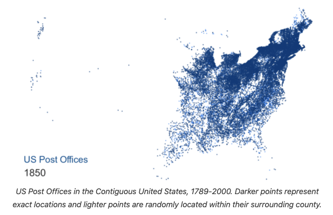

# US Post Offices

The data this week comes from [Cameron Blevins and Richard W. Helbock](https://dataverse.harvard.edu/dataset.xhtml?persistentId=doi:10.7910/DVN/NUKCNA). Their website has more details:  

- [US Post Offices](https://cblevins.github.io/us-post-offices/)

Please Cite them when using this data:

"Blevins, Cameron; Helbock, Richard W., 2021, "US Post Offices", https://doi.org/10.7910/DVN/NUKCNA, Harvard Dataverse, V1, UNF:6:8ROmiI5/4qA8jHrt62PpyA== [fileUNF]"

> US Post Offices is a spatial-historical dataset containing records for 166,140 post offices that operated in the United States between 1639 and 2000. The dataset provides a year-by-year snapshot of the national postal system over multiple centuries, making it one of the most fine-grained and expansive datasets currently available for studying the historical geography of the United States

H/t to [Bob Rudis](https://twitter.com/hrbrmstr/status/1377345728574496769) for sharing.

### Get the data here

```{r}
# Get the Data

# Read in with tidytuesdayR package 
# Install from CRAN via: install.packages("tidytuesdayR")
# This loads the readme and all the datasets for the week of interest

# Either ISO-8601 date or year/week works!

tuesdata <- tidytuesdayR::tt_load('2021-04-13')
tuesdata <- tidytuesdayR::tt_load(2021, week = 16)

post_offices <- tuesdata$post_offices

# Or read in the data manually

post_offices <- readr::read_csv('https://raw.githubusercontent.com/rfordatascience/tidytuesday/master/data/2021/2021-04-13/post_offices.csv')

```
### Data Dictionary

# `post_offices.csv`

|field_name         |field_example    |field_type |field_description                                                                                                                                                                                                                                                                                                                                                                                                                                                                                                                                                                             |
|:------------------|:----------------|:----------|:---------------------------------------------------------------------------------------------------------------------------------------------------------------------------------------------------------------------------------------------------------------------------------------------------------------------------------------------------------------------------------------------------------------------------------------------------------------------------------------------------------------------------------------------------------------------------------------------|
|name               |HINES CORNER     |character  |The modified name of a post office based on Helbock's original transcription, optimized for finding matches within the GNIS database (often this means punctuation has been removed from the original transcription).                                                                                                                                                                                                                                                                                                                                                                         |
|alt_name           |HINES'S CORNER   |character  |Alternative name formats for Helbock's original transcription of a post office name.                                                                                                                                                                                                                                                                                                                                                                                                                                                                                                          |
|orig_name          |HINES('S) CORNER |character  |The original name of a post office transcribed by Richard Helbock.                                                                                                                                                                                                                                                                                                                                                                                                                                                                                                                            |
|state              |PA               |character  |State in which the post office was located.                                                                                                                                                                                                                                                                                                                                                                                                                                                                                                                                                   |
|county1            |WAYNE            |character  |Primary county in which the post office was located                                                                                                                                                                                                                                                                                                                                                                                                                                                                                                                                           |
|county2            |NA               |character  |Helbock sometimes recorded multiple counties for a single post office - ex. "Piscataquia/Somerset" - so I divided those into multiple fields                                                                                                                                                                                                                                                                                                                                                                                                                                                  |
|county3            |NA               |character  |Helbock sometimes recorded multiple counties for a single post office - ex. "Piscataquia/Somerset" - so I divided those into multiple fields                                                                                                                                                                                                                                                                                                                                                                                                                                                  |
|orig_county        |Wayne            |character  |The original county in which the post office was located as transcribed by Richard Helbock                                                                                                                                                                                                                                                                                                                                                                                                                                                                                                    |
|established        |1873             |integer    |The year in which a post office was established. Sometimes this can represent the year in which a post office re-opened after being closed for ten years or more, or the year in which the same post office started operating under a new name. See Data Biography for more information.                                                                                                                                                                                                                                                                                                      |
|discontinued       |1896             |numeric    |The year in which a post office was discontinued. Sometimes this can represent the year in which a post office stopped operating under a particular name and started operating under a new name. See Data Biography for more information.                                                                                                                                                                                                                                                                                                                                                     |
|continuous         |TRUE             |logical    |Did the post office operate continuously between its Established and Discontinued dates? Many post offices temporarily closed before re-opening (sometimes multiple times). For post offices that closed and then re-opened less than ten years later, Helbock did not create a separate record but used this field to note that it was operating continously between its established and discontinued date.                                                                                                                                                                                  |
|stamp_index        |5                |character  |The Stamp Scarcity index, on a scale of 0-9: this was an arbitrary field designated by Helbock to indicate how rare a postmark was that originated from that post office.                                                                                                                                                                                                                                                                                                                                                                                                                     |
|id                 |26772            |integer    |A unique ID assigned by Helbock to each post office record                                                                                                                                                                                                                                                                                                                                                                                                                                                                                                                                    |
|coordinates        |TRUE             |logical    |Was a post office successfully geolocated?                                                                                                                                                                                                                                                                                                                                                                                                                                                                                                                                                    |
|duration           |23               |numeric    |This is a calculated field representing how long a post office operated for (its Discontinued year minus its Established year). Note that some post offices never shut down, and therefore have a blank value for this field.                                                                                                                                                                                                                                                                                                                                                                 |
|gnis_match         |TRUE             |logical    |Was a post office successfully matched to a feature within the GNIS database?                                                                                                                                                                                                                                                                                                                                                                                                                                                                                                                 |
|gnis_name          |HINES CORNERS    |character  |The modified name of the GNIS feature that was successfully matched to the post office field of Name or AltName.                                                                                                                                                                                                                                                                                                                                                                                                                                                                              |
|gnis_county        |WAYNE            |character  |The modified county of the GNIS feature that was successfully matched to the post office field of County1, County2, or County3.                                                                                                                                                                                                                                                                                                                                                                                                                                                               |
|gnis_state         |PA               |character  |The state of the GNIS feature that was successfully matched to the post office field of State.                                                                                                                                                                                                                                                                                                                                                                                                                                                                                                |
|gnis_feature_id    |1177135          |integer    |The unique ID of the GNIS feature within the GNIS database.                                                                                                                                                                                                                                                                                                                                                                                                                                                                                                                                   |
|gnis_feature_class |Locale           |character  |The type of feature class of the GNIS feature. These are categories of locations, ex. "Post Office", "Populated Place", etc.                                                                                                                                                                                                                                                                                                                                                                                                                                                                  |
|gnis_orig_name     |Hines Corners    |character  |The original spelling of the name of the GNIS feature that was successfully matched to the post office field of Name or AltName.                                                                                                                                                                                                                                                                                                                                                                                                                                                              |
|gnis_orig_county   |Wayne            |character  |The original spelling of the county of the GNIS feature that was successfully matched to the post office field of County1, County2, or County3.                                                                                                                                                                                                                                                                                                                                                                                                                                               |
|gnis_latitude      |41.82286         |numeric    |The latitude of the GNIS feature in decimal degrees                                                                                                                                                                                                                                                                                                                                                                                                                                                                                                                                           |
|gnis_longitude     |-75.44824        |numeric    |The longitude of the GNIS feature in decimal degrees                                                                                                                                                                                                                                                                                                                                                                                                                                                                                                                                          |
|gnis_elev_in_m     |619              |integer    |The elevation of the GNIS feature in meters                                                                                                                                                                                                                                                                                                                                                                                                                                                                                                                                                   |
|gnis_dist          |0.9166667        |numeric    |A fuzzy matching score between 0.75 to 1 that was generated from the "Levenshtein distance" between the name of the post office and the name of the GNIS feature. A score of 1 is a perfect match. This is based on the length of the post office name. In this example, the post office name "HINES CORNER" is 12 characters long. To "fuzzy match" to "HINES CORNERS" required one change (adding "S"). 12 total characters minus (1 change/12 total characters) = 0.91667. I used a score threshold of 0.75, meaning that any potential matches that fell below this score were discarded. |
|latitude           |41.82286         |numeric    |The best inference for the latitude of a post office in decimal degrees                                                                                                                                                                                                                                                                                                                                                                                                                                                                                                                       |
|longitude          |-75.44824        |numeric    |The best inference for the latitude of a post office in decimal degrees                                                                                                                                                                                                                                                                                                                                                                                                                                                                                                                       |
|random_coords_flag |FALSE            |logical    |This field only appears in us-post-offices-random-coords.csv. It is a marker for whether or not the values for Latitude and Longitude were generated from GNIS features or whether they were assigned from a list of randomly distributed points in the surrounding county. Any records marked TRUE mean that the coordinates for that record are semi-random and should be treated as such.                                                                                                                                                                                                  |

### Cleaning Script

No cleaning this week, although check out the original authors data cleaning/prep steps on their [GitHub](https://github.com/cblevins/us-post-offices).
