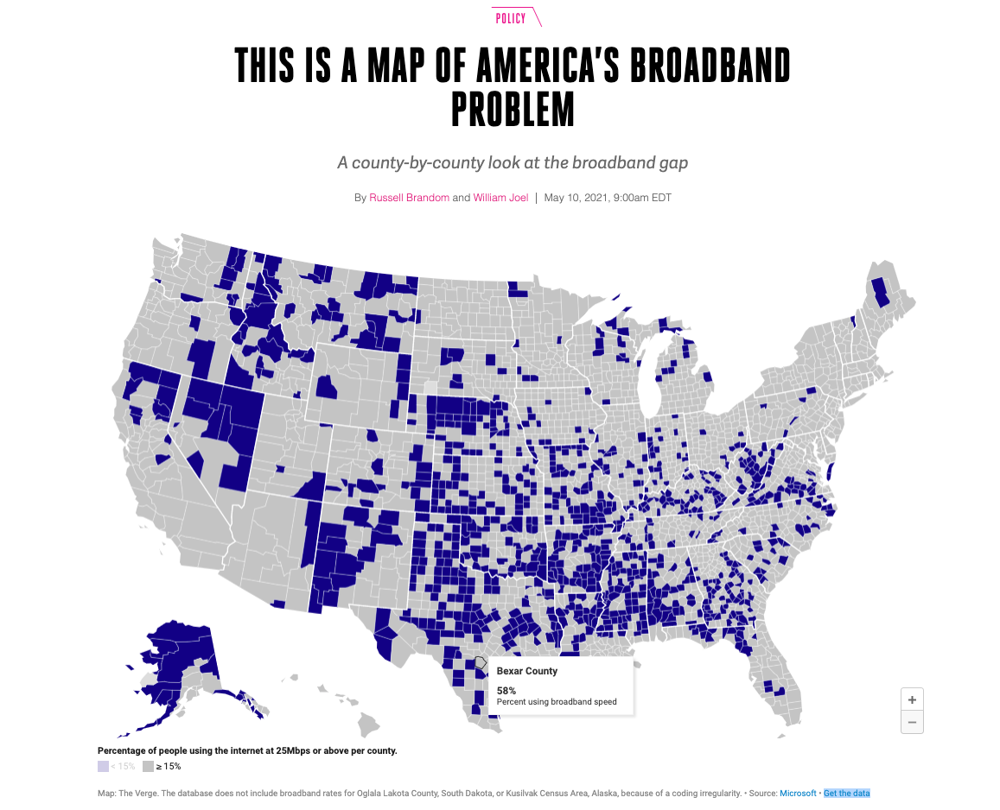

# Internet Access

The data this week comes from [Microsoft](https://github.com/microsoft/USBroadbandUsagePercentages) by way of [The Verge](https://www.theverge.com/22418074/broadband-gap-america-map-county-microsoft-data).

> If broadband access was a problem before 2020, the pandemic turned it into a crisis. As everyday businesses moved online, city council meetings or court proceedings became near-inaccessible to anyone whose connection couldn’t support a Zoom call. Some school districts started providing Wi-Fi hotspots to students without a reliable home connection. In other districts, kids set up in McDonald’s parking lots just to get a reliable enough signal to do their homework. After years of slowly widening, the broadband gap became impossible to ignore.

Note that to map the areas you will likely need to geocode by zipcode, which can be accomplished with the [`{zipcodeR}` package](https://gavinrozzi.github.io/zipcodeR/). The [`{tigris}`](https://github.com/walkerke/tigris) can also help with Census shapefiles.

`zipcodeR`

> `zipcodeR` is an R package that makes working with ZIP codes in R easier. It provides data on all U.S. ZIP codes using multiple open data sources, making it easier for social science researchers and data scientists to work with ZIP code-level data in data science projects using R.
> 
> The latest update to zipcodeR includes new functions for searching ZIP codes at various geographic levels & geocoding.


### Get the data here

```{r}
# Get the Data

# Read in with tidytuesdayR package 
# Install from CRAN via: install.packages("tidytuesdayR")
# This loads the readme and all the datasets for the week of interest

# Either ISO-8601 date or year/week works!

tuesdata <- tidytuesdayR::tt_load('2021-05-11')
tuesdata <- tidytuesdayR::tt_load(2021, week = 20)

broadband <- tuesdata$broadband

# Or read in the data manually

broadband <- readr::read_csv('https://raw.githubusercontent.com/rfordatascience/tidytuesday/master/data/2021/2021-05-11/broadband.csv')

```
### Data Dictionary

# `broadband.csv`

> Data contained in the data table includes counties in the United States

|variable                       |class     |description |
|:------------------------------|:---------|:-----------|
|st                             |character | State |
|county_id                      |double    | County ID |
|county_name                    |character | County Name |
|broadband_availability_per_fcc |character | percent of people per county with access to fixed terrestrial broadband at speeds of 25 Mbps/3 Mbps as of the end of 2017 https://www.fcc.gov/document/broadband-deployment-report-digital-divide-narrowing-substantially-0 |
|broadband_usage                |character | percent of people per county that use the internet at broadband speeds based on the methodology explained above. Data is from November 2019. |


# `broadband_zip.csv`

> Data contained in the zip code data table includes the following fields:

|variable               |class     |description |
|:----------------------|:---------|:-----------|
|st                     |character |  is the 2 letter abbreviation of states in the United States https://www.iso.org/obp/ui/#iso:code:3166:US |
|county_name            |character | County Name  |
|county_id              |double    | 4 to 5 digit code used to represent the county (last 3 digits) and the state (first digit or first 2 digits) https://www.census.gov/geographies/reference-files.html |
|postal_code            |double    | Postal Code |
|broadband_usage        |double    | percent of people per county that use the internet at broadband speeds based on the methodology explained above. Data is from October 2020. |
|error_range_mae        |double    |  mean absolute error (MAE). The non-private broadband coverage estimate will be, on average, within the mean absolute error (MAE) error range |
|error_range_95_percent |double    | 95th percentile error range. For 95% of the time, the non-private broadband coverage estimate for zip codes with a similar number of households will be within 95th percentile error range. |
|msd                    |double    | We also provide the mean signed deviation (MSD). The mean signed deviation offers an estimate of bias introduced by the process. |

### Cleaning Script

No cleaning this week!