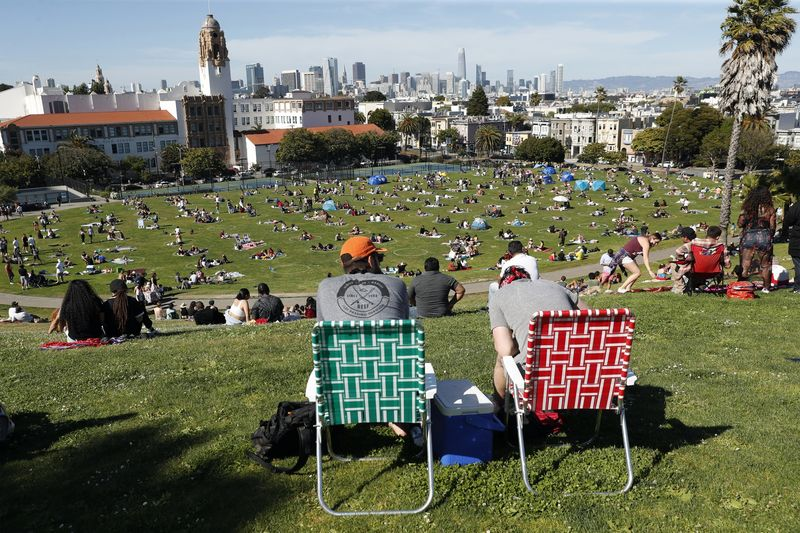

### Please add alt text to your posts

Please add alt text (alternative text) to all of your posted graphics for `#TidyTuesday`. 

Twitter provides [guidelines](https://help.twitter.com/en/using-twitter/picture-descriptions) for how to add alt text to your images.

The DataViz Society/Nightingale by way of Amy Cesal has an [article](https://medium.com/nightingale/writing-alt-text-for-data-visualization-2a218ef43f81) on writing _good_ alt text for plots/graphs.

> Here's a simple formula for writing alt text for data visualization:
> ### Chart type
> It's helpful for people with partial sight to know what chart type it is and gives context for understanding the rest of the visual.
> Example: Line graph
> ### Type of data
> What data is included in the chart? The x and y axis labels may help you figure this out.
> Example: number of bananas sold per day in the last year
> ### Reason for including the chart
> Think about why you're including this visual. What does it show that's meaningful. There should be a point to every visual and you should tell people what to look for.
> Example: the winter months have more banana sales
> ### Link to data or source
> Don't include this in your alt text, but it should be included somewhere in the surrounding text. People should be able to click on a link to view the source data or dig further into the visual. This provides transparency about your source and lets people explore the data.
> Example: Data from the USDA

Penn State has an [article](https://accessibility.psu.edu/images/charts/) on writing alt text descriptions for charts and tables.

> Charts, graphs and maps use visuals to convey complex images to users. But since they are images, these media provide serious accessibility issues to colorblind users and users of screen readers. See the [examples on this page](https://accessibility.psu.edu/images/charts/) for details on how to make charts more accessible.

The `{rtweet}` package includes the [ability to post tweets](https://docs.ropensci.org/rtweet/reference/post_tweet.html) with alt text programatically.

Need a **reminder**? There are [extensions](https://chrome.google.com/webstore/detail/twitter-required-alt-text/fpjlpckbikddocimpfcgaldjghimjiik/related) that force you to remember to add Alt Text to Tweets with media.



# Park Access

The data this week comes from [The Trust for Public Land](https://www.tpl.org/parks-and-an-equitable-recovery-parkscore-report). [Citylab](https://www.bloomberg.com/news/articles/2021-05-27/the-cities-where-people-of-color-can-walk-to-a-park) also wrote an article about park access and these datasets. 

> When the pandemic forced millions of Americans to shelter indoors, parks saw a surge in popularity. Parks in North Carolina received an all-time high of 20 million visitors in 2020, an uptick of one million from the year before. In New York, the number of park-goers topped 78 million. Cities also mobilized their green spaces in the pandemic-fighting effort, using them to distribute PPE, meals and even vaccines. In Memphis, Tennessee, a 360-foot long tent was erected on Liberty Park fairgrounds in April, aiming to administer 21,000 vaccines weekly.  
> 
> But even as green spaces proved to be a crucial element to people's physical and mental well-being — especially for urban dwellers — the pandemic further exposed the disparity in who has access to parks. New data from the Trust for Public Land shows that in the 100 most populated U.S. cities, neighborhoods that are majority nonwhite have, on average, access to 44% less park acreage than majority white neighborhoods. Low-income communities have access to 42% less than high-income neighborhoods. 
> 
> Since 2011, The Trust for Public Land (TPL) has kept track of green space availability across U.S. metros, using the ParkScore index, which measures how well cities are meeting their residents' need for parks based on four metrics: park access, acreage, investment and amenities. This year for the first time, the group added equity as a fifth metric. 
> 
> Its assessment is grounded in the idea that Americans should have park access within a 10-minute walk from their home. Some 100 million Americans do not live within that distance, according to this year's analysis. The equity score builds on that, and compares park acreage and access between neighborhoods of color and those that are mostly white, and between low- and high-income communities.  

Example PDFs can be found in the following format:

https://parkserve.tpl.org/mapping/historic/2020_ParkScoreRank.pdf

You just need to replace the year (ie 2020) with the specific year of interest.

### Get the data here

```{r}
# Get the Data

# Read in with tidytuesdayR package 
# Install from CRAN via: install.packages("tidytuesdayR")
# This loads the readme and all the datasets for the week of interest

# Either ISO-8601 date or year/week works!

tuesdata <- tidytuesdayR::tt_load('2021-06-22')
tuesdata <- tidytuesdayR::tt_load(2021, week = 26)

parks <- tuesdata$parks

# Or read in the data manually

parks <- readr::read_csv('https://raw.githubusercontent.com/rfordatascience/tidytuesday/master/data/2021/2021-06-22/parks.csv')

```
### Data Dictionary

# `parks.csv`

Note that "points" are essentially their yearly normalized values (higher points = better).

|variable                  |class     |description |
|:-------------------------|:---------|:-----------|
|year                      |double    | Year of measurement |
|rank                      |double    | Yearly rank |
|city                      |character | City Name |
|med_park_size_data        |double    | Median park size acres |
|med_park_size_points      |double    | Median park size in points |
|park_pct_city_data        |character | Parkland as percentage of city area |
|park_pct_city_points      |double    | Parkland as % of city area points |
|pct_near_park_data        |character | Percent of residents within a 10 minute walk to park |
|pct_near_park_points      |double    | Percent of residents within a 10 minute walk to park points |
|spend_per_resident_data   |character | Spending per resident in USD |
|spend_per_resident_points |double    | Spending per resident in points |
|basketball_data           |double    | Basketball hoops per 10,000 residents |
|basketball_points         |double    | Basketball hoops per 10,000 residents points |
|dogpark_data              |double    | Dog parks per 100,000 residents|
|dogpark_points            |double    | Dog parks per 100,000 residents points |
|playground_data           |double    | Playgrounds per 10,000 residents |
|playground_points         |double    | Playgrounds per 10,000 residents points |
|rec_sr_data               |double    | Recreation and senior centers per 20,000 residents |
|rec_sr_points             |double    | Recreation and senior centers per 20,000 residents points |
|restroom_data             |double    | Restrooms per 10,000 residents |
|restroom_points           |double    | Restrooms per 10,000 residents points |
|splashground_data         |double    | Splashgrounds and splashpads per 100,000 residents |
|splashground_points       |double    | Splashgrounds and splashpads per 100,000 residents points |
|amenities_points          |double    | Amenities points total (ie play areas) |
|total_points              |double    | Total points (varies in denominator per/year) |
|total_pct                 |double    | Total points as a percentage|
|city_dup                  |character | City duplicated name |
|park_benches              |double    | Number of park benches|

### Cleaning Script


```{r}
library(tidyverse)
library(pdftools)

raw_pdf <- pdftools::pdf_text("https://parkserve.tpl.org/mapping/historic/2020_ParkScoreRank.pdf")

raw_text <- raw_pdf[[1]] %>% 
  str_split("\n") %>% 
  unlist()

table_trimmed <- raw_text %>% 
  .[13:(length(raw_text)-1)] %>% 
  str_trim()

all_col_names <- c(
  "rank",
  "city",
  "med_park_size_data",
  "med_park_size_points",
  "park_pct_city_data",
  "park_pct_city_points",
  "pct_near_park_data",
  "pct_near_park_points",
  "spend_per_resident_data",
  "spend_per_resident_points",
  "basketball_data",
  "basketball_points",
  "dogpark_data",
  "dogpark_points",
  "playground_data",
  "playground_points",
  "rec_sr_data",
  "rec_sr_points",
  "restroom_data",
  "restroom_points",
  "splashground_data",
  "splashground_points",
  "amenities_points",
  "total_points",
  "total_pct",
  "city_dup"
)

tab_names <- fwf_empty(
  table_trimmed,
  col_names = all_col_names
)

park_2020_1 <- table_trimmed %>% 
  read_fwf(
    tab_names
  ) 

park_2020_2 <- raw_pdf[[2]] %>% 
  str_split("\n") %>% 
  unlist() %>% 
  .[1:41] %>% 
  str_trim() %>% 
  str_replace_all("\\s{2,}", "|") %>% 
  read_delim(
    delim = "|", 
    col_names = all_col_names
  )

all_2020 <- bind_rows(park_2020_1, park_2020_2) 

raw_pdf_19 <- pdftools::pdf_text("https://parkserve.tpl.org/mapping/historic/2019_ParkScoreRank.pdf")

raw_pdf_19[[1]] %>% 
  str_split("\n") %>% 
  unlist() %>% 
  .[13:53] %>% 
  str_trim() %>% 
  str_replace_all("\\s{2,}", "|") %>%
  str_replace_all("% ", "|") %>% 
  read_delim(
    delim = "|", 
    col_names = FALSE
  ) %>% 
  set_names(all_col_names[str_detect(all_col_names, "total_pct", negate = TRUE)]) %>% 
  glimpse()

park_2019_2 <- raw_pdf_19[[2]] %>% 
  str_split("\n") %>% 
  unlist() %>% 
  .[1:44] %>% 
  str_trim() %>% 
  str_replace_all("\\s{2,}", "|") %>%
  str_replace_all("% ", "|") %>% 
  read_delim(
    delim = "|", 
    col_names = FALSE
  ) %>% 
  set_names(all_col_names[str_detect(all_col_names, "total_pct", negate = TRUE)]) %>% 
  glimpse()

read_and_clean <- function(year, page2 = TRUE){
  
  raw_pdf_in <- pdftools::pdf_text(glue::glue("https://parkserve.tpl.org/mapping/historic/{year}_ParkScoreRank.pdf"))
  
  df1 <- raw_pdf_in[[1]] %>% 
    str_split("\n") %>% 
    unlist() %>% 
    # .[range1] %>% 
    str_trim() %>% 
    str_subset("^[[:digit:]]+ ") %>% 
    str_subset("Ranking|ParkScore", negate = TRUE) %>% 
    str_replace_all("\\s{2,}", "|") %>%
    str_replace_all("% ", "|") %>% 
    read_delim(
      delim = "|", 
      col_names = FALSE
    ) 
  
  if(isTRUE(page2)){
      df2 <- raw_pdf_in[[2]] %>% 
        str_split("\n") %>% 
        unlist() %>% 
        # .[range2] %>% 
        str_trim() %>% 
        str_subset("^[[:digit:]]+ ") %>% 
        str_subset("Ranking|ParkScore", negate = TRUE) %>% 
        str_replace_all("\\s{2,}", "|") %>%
        str_replace_all("% ", "|") %>% 
        read_delim(
          delim = "|", 
          col_names = FALSE
        ) 
      
      bind_rows(df1, df2)
    } else {
      df1
    }
     
    }

all_2020 <- read_and_clean(2020) %>% 
  set_names(nm = all_col_names) %>% 
  mutate(year = 2020)
all_2019 <- read_and_clean(2019) %>% 
  set_names(all_col_names[str_detect(all_col_names, "total_points", negate = TRUE)]) %>% 
  mutate(year = 2019)
all_2018 <- read_and_clean(2018) %>% 
  set_names(nm = all_col_names) %>% 
  mutate(year = 2018)
all_2017 <- read_and_clean(2017) %>% 
  set_names(nm = all_col_names[c(1:18, 23:26)]) %>% 
  rename(park_benches = total_pct) %>% 
  mutate(year = 2017)
all_2016 <- read_and_clean(2016) %>% 
  set_names(nm = c(all_col_names[c(1:18, 23:26)], "city_dup2")) %>% 
  rename(park_benches = city_dup, city_dup = city_dup2) %>% 
  mutate(year = 2016)
all_2015 <- read_and_clean(2015, FALSE) %>% 
  set_names(nm = c(all_col_names[c(1:18, 23:25)], "park_benches")) %>% 
  mutate(year = 2015)
all_2014 <- read_and_clean(2014, FALSE) %>% 
  set_names(nm = c(all_col_names[c(1:10, 15:16, 25)], "park_benches")) %>% 
  mutate(year = 2014)
all_2013 <- read_and_clean(2013, FALSE) %>% 
  set_names(nm = c(all_col_names[c(1:10, 15:16, 24:25)], "park_benches")) %>% 
  mutate(year = 2013)
all_2012 <- read_and_clean(2012, FALSE) %>% 
  separate(X1, c("rank", "city"), extra = "merge") %>% 
  mutate(rank = as.double(rank)) %>% 
  set_names(nm = c(all_col_names[c(1:10, 15:16, 24:25)], "park_benches")) %>% 
  mutate(year = 2012)

all_data <- bind_rows(list(all_2020, all_2019, all_2018, all_2017, all_2016, all_2015, all_2014, all_2013, all_2012)) %>% 
  select(year, everything())

all_data %>% 
  ggplot(aes(x = year, y = med_park_size_data, group = year)) +
  geom_boxplot()

all_data %>% glimpse()

all_data %>% 
  write_csv("2021/2021-06-22/parks.csv")

update_data_type("parks.csv", ",")
```
