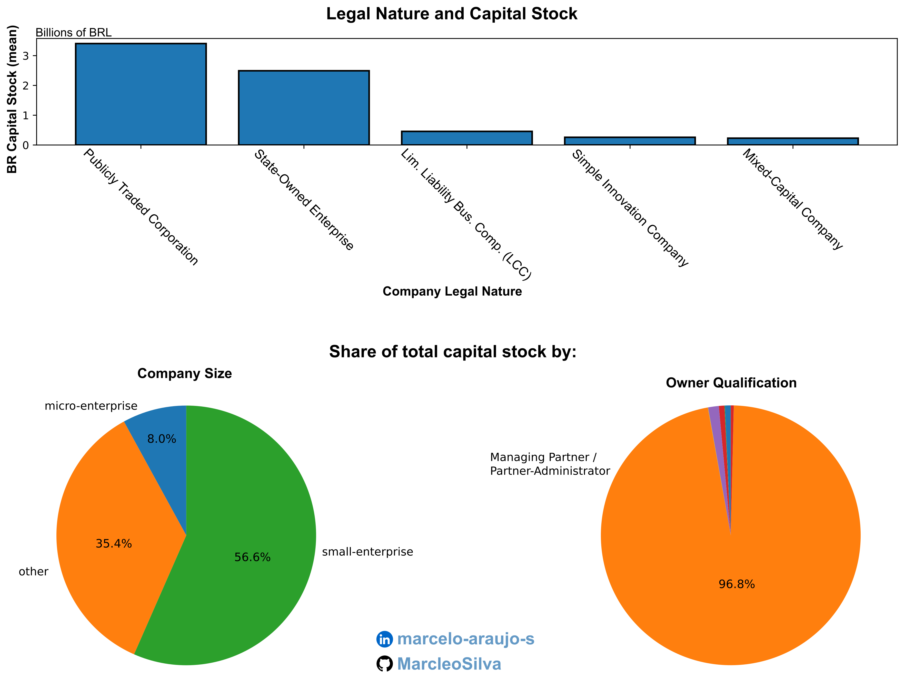

# Brazilian Companies

Brazilian Government has a huge database of enterprises and make it publicly available. Since the original raw data exceeds the file size limit of GitHub, and because is more interesting to deal with continuous variables, I applied a filter to keep only companies with a [share capital](https://en.wikipedia.org/wiki/Share_capital) above above BRL 15,000.00 (approximately  USD 3,000). Notice that the raw dataset (`Empresas0.zip`) is just a set of companies, and may or may not be a representative part of the actual landscape of enterprises in Brazil.



This panel was made with the entire dataset (over 80 MB large). The dataset given here is 23% of the original dataset, with rows removed randomly (pseudo-randomly :p), so I could deliver a 19 MB file.

# The Data

```python
# Using Python
# Imports
import pandas as pd
import numpy as np
import matplotlib.pyplot as plt
import csv

# Input data
companies0 = pd.read_csv("../raw_data/raw_companies.csv", sep=";", encoding="cp1252", header=None)

legal_nature = pd.read_csv('../raw_data/legal_nature.csv', sep=',')

sizes = pd.read_csv("../raw_data/size.csv", sep=",", encoding="cp1252")

qualifications = pd.read_csv("../raw_data/qualifications.csv", sep = ",", encoding="cp1252")

def treat_companies_dataframe(dataframe):
    companies_df_column_name = ["company_id", "company_name","legal_nature", "owner_qualification","capital_stock","company_size","federal_owner"]

    dataframe.columns = companies_df_column_name

    dataframe['capital_stock'] = dataframe['capital_stock'].str.replace(',', '.')
    dataframe['capital_stock'] = pd.to_numeric(dataframe['capital_stock'], errors='coerce')
  
    dataframe_filtered = dataframe[dataframe['capital_stock'] > 150000]
    dataframe_filtered = dataframe_filtered.drop(columns=["federal_owner"])
  
    return dataframe_filtered

def mapper(dataframe, dictionary: dict, column_name: str):
    dataframe[column_name] = dataframe[column_name].map(dictionary)
    return dataframe

def replace_info(dataframe):
    legal_nature_dict = dict(zip(legal_nature['id'], legal_nature['legal_nature']))
    qualification_dict = dict(zip(qualifications['id'], qualifications['owner_qualification']))
    size_dict = dict(zip(sizes['id'], sizes['company_size']))

    dataframe = mapper(dataframe, legal_nature_dict, 'legal_nature')
    dataframe = mapper(dataframe, qualification_dict, "owner_qualification")
    dataframe = mapper(dataframe, size_dict, 'company_size')

    return dataframe

def merge_and_clean(df_top, df_bottom):

    combined_df = pd.concat([df_top, df_bottom], ignore_index=True)
  
    cleaned_df = combined_df.drop_duplicates()
  
    return cleaned_df

filtered_df0 = treat_companies_dataframe(companies0)

filtered_df0 = replace_info(filtered_df0)

with open("../data/companies.csv", mode="w", newline='') as file:
    write = csv.writer(file, delimiter=';')
    write.writerow(filtered_df0.columns) 
    write.writerows(filtered_df0.values.tolist())
```

## Data dictionary

### `companies.csv`

| variable            | class     | description                                                                             |
| :------------------ | :-------- | :-------------------------------------------------------------------------------------- |
| company_id          | integer   | Company identifier (8-digit ID used as the primary key in this dataset).                |
| company_name        | character | Company legal name (as provided in the source registry).                                |
| legal_nature        | character | Company legal nature (e.g., “Limited Liability Business Company (LLC)”).              |
| owner_qualification | character | Owner/partner qualification label (e.g., “Managing Partner / Partner-Administrator”). |
| capital_stock       | numeric   | Declared share capital (**BRL**), numeric.                                        |
| company_size        | character | Company size category (e.g.,`micro-enterprise`, `small-enterprise`, `other`).     |

### `legal_nature.csv` (lookup table)

| variable     | class     | description                                 |
| :----------- | :-------- | :------------------------------------------ |
| id           | integer   | Legal nature code (source registry code).   |
| legal_nature | character | Legal nature label corresponding to `id`. |

### `qualifications.csv` (lookup table)

| variable            | class     | description                                        |
| :------------------ | :-------- | :------------------------------------------------- |
| id                  | integer   | Owner qualification code (source registry code).   |
| owner_qualification | character | Owner qualification label corresponding to `id`. |

### `size.csv` (lookup table)

| variable     | class     | description                                                                                    |
| :----------- | :-------- | :--------------------------------------------------------------------------------------------- |
| id           | integer   | Company size code (source registry code).                                                      |
| company_size | character | Company size label corresponding to `id` (e.g., `micro-enterprise`, `small-enterprise`). |

## How to Participate

[](https://github.com/rfordatascience/tidytuesday/blob/main/data/2026/2026-01-20/readme.md#how-to-participate)

* [Explore the data](https://r4ds.hadley.nz/), watching out for interesting relationships. We would like to emphasize that you should not draw conclusions about **causation**
  in the data. There are various moderating variables that affect all
  data, many of which might not have been captured in these datasets. As
  such, our suggestion is to use the data provided to practice your data
  tidying and plotting techniques, and to consider for yourself what
  nuances might underlie these relationships.
* Create a visualization, a model, a [Quarto](https://quarto.org/) report, a [shiny app](https://shiny.posit.co/), or some other piece of data-science-related output, using R, Python, or another programming language.
* [Share your output and the code used to generate it](https://github.com/rfordatascience/tidytuesday/blob/main/sharing.md) on social media with the #TidyTuesday hashtag.
* [Submit your own dataset!](https://github.com/rfordatascience/tidytuesday/blob/main/pr_instructions.md)

### PydyTuesday: A Posit collaboration with TidyTuesday

[](https://github.com/rfordatascience/tidytuesday/blob/main/data/2026/2026-01-20/readme.md#pydytuesday-a-posit-collaboration-with-tidytuesday)

* Exploring the TidyTuesday data in Python? Posit has some extra resources for you! Have you tried making a [Quarto dashboard](https://quarto.org/docs/dashboards/)? Find videos and other resources in [Posit&#39;s PydyTuesday repo](https://github.com/posit-dev/python-tidytuesday-challenge).
* Share your work with the world using the hashtags #TidyTuesday and
  #PydyTuesday so that Posit has the chance to highlight your work, too!
* Deploy or share your work however you want! If you'd like a super easy way to publish your work, give [Connect Cloud](https://connect.posit.cloud/) a try.

# Source

- [Brazilian Ministry of Finance](https://dados.gov.br/dados/conjuntos-dados/cadastro-nacional-da-pessoa-juridica---cnpj)
  - [Original data description (pt-br)](https://www.gov.br/receitafederal/dados/cnpj-metadados.pdf)
  - [Core data source](https://arquivos.receitafederal.gov.br/dados/cnpj/dados_abertos_cnpj/2025-12/)
