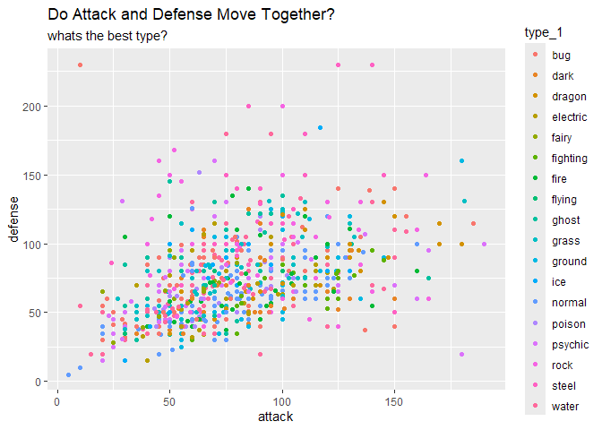
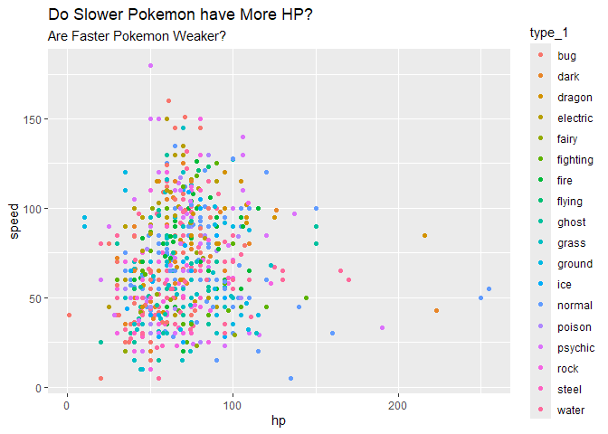
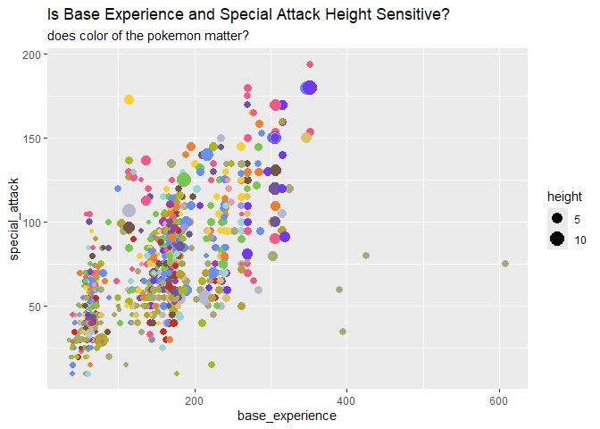
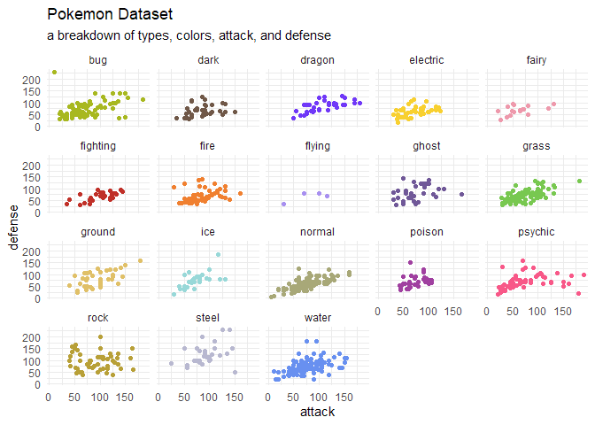

# ‘gotta catch em all?’
fth

I really don’t know much about pokemon!

But as my kids are exposed to this “pikachu” in the store, on posters,
clothing, etc. I started to wonder how many there were? And wondered if
a database existed and how hard it would be to get into R? Is pikachu
the *strongest*, *coolest*, or just has the best *vibes*? I’m not really
sure.

I thought it’d be perfect for a \#tidytuesday, and of course! There’s
already an R library with the exact data I was looking to scrape. But we
still need a short article for \#tidytuesday data submissions, so here
it is.

``` r
library(pokemon)
library(ggplot2)
```

#### Attack & Defense Relationships?

``` r
pokemon::pokemon |>
  ggplot() +
  geom_point(aes(x = attack, y = defense, color = type_1)) +
  labs(title = "Do Attack and Defense Move Together?",
       subtitle = "whats the best type?")
```



#### Hit Points & Speed Relationships?

``` r
pokemon::pokemon |>
  ggplot() +
  geom_point(aes(x = hp, y = speed, color = type_1)) +
  labs(title = "Do Slower Pokemon have More HP?",
       subtitle = "Are Faster Pokemon Weaker?")
```



#### Base Experience, Special Attack, Size, Primary Colors?

``` r
pokemon::pokemon |>
  ggplot() +
  geom_point(aes(x = base_experience, y = special_attack, 
                 size = height, color = I(color_1))) +
  labs(title = "Is Base Experience and Special Attack Height Sensitive?",
       subtitle = "does color of the pokemon matter?")
```



#### ‘Primary Colors’ & ‘Primary Types’ Overlap

``` r
gg_facet <- 
pokemon::pokemon |>
  ggplot() +
  geom_point(aes(x = attack, y = defense, color = I(color_1))) +
  facet_wrap(~type_1) +
  theme_minimal() +
  labs(title = "Pokemon Dataset",
       subtitle = "a breakdown of types, colors, attack, and defense")

gg_facet
```



``` r
ggsave(filename = "pokemon.png", 
       plot     = gg_facet,
       height   = 10,
       width    = 10,
       dpi      = 350)
```
